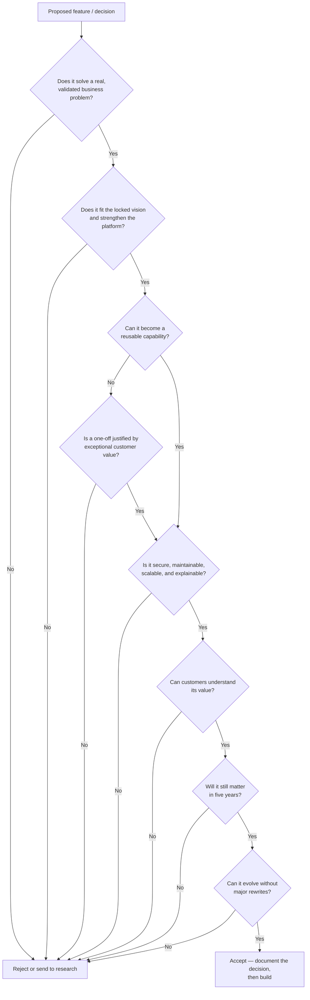
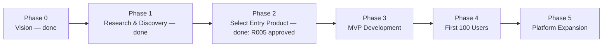

# Project Zero — Foundation & Strategy

| | |
|---|---|
| **Document** | Project Zero Foundation & Strategy |
| **Document Number** | 01 of 06 |
| **Version** | 3.0 |
| **Status** | Master Document — Single Source of Truth |
| **Owner** | Founders |
| **Audience** | Founders, leadership, investors, product managers, architects, every current and future contributor |
| **Supersedes** | Company_Vision_and_Mission (v0.1, v1.0), Company_Constitution (v0.1, v1.0), PROJECT_ZERO_MASTER v0.1, Project_Zero_Playbook (v0.1, v1.0 — strategy chapters), D03 Playbook v0.1, README (vision/mission/principles sections), Research R001–R005 (strategy conclusions), Foundation & Strategy v2.0 |

---

## Revision History

| Version | Description |
|---|---|
| 0.1 | Initial founder drafts: Vision & Mission (D01), Constitution (D02), Playbook (D03), MASTER document. Vision framed as a "Business Operating Platform" managing human and AI workforces. |
| 1.0 | Production drafts of Company Vision & Mission and Company Constitution. Vision refined to "Enterprise Intelligence Platform." Research reports R001–R005 completed and approved. |
| 2.0 | First consolidation of all foundation documents into a single master document. |
| 3.0 | **This document.** Full enterprise rewrite. Merges every foundation-level source — including early founder drafts, locked decisions, rejected directions, research reports, and open questions — into one canonical, self-sufficient reference. Resolves documented inconsistencies and records the reasoning for each resolution. |

---

## Table of Contents

1. [Purpose, Scope, and Audience](#1-purpose-scope-and-audience)
2. [Executive Summary](#2-executive-summary)
3. [The Company Story — Why Project Zero Exists](#3-the-company-story--why-project-zero-exists)
4. [Vision](#4-vision)
5. [Mission](#5-mission)
6. [Company Statement — What We Build and What We Will Not Build](#6-company-statement--what-we-build-and-what-we-will-not-build)
7. [Company Philosophy and Core Beliefs](#7-company-philosophy-and-core-beliefs)
8. [Core Principles](#8-core-principles)
9. [AI Principles](#9-ai-principles)
10. [Security and Privacy Principles](#10-security-and-privacy-principles)
11. [Founder Rules and Permanent Prohibitions](#11-founder-rules-and-permanent-prohibitions)
12. [The Decision Framework](#12-the-decision-framework)
13. [Research Methodology](#13-research-methodology)
14. [Market Analysis](#14-market-analysis)
15. [Target Market and Customer Personas](#15-target-market-and-customer-personas)
16. [Competitive Landscape and Positioning](#16-competitive-landscape-and-positioning)
17. [Business Model](#17-business-model)
18. [Platform Modes](#18-platform-modes)
19. [Business Strategy and Go-to-Market](#19-business-strategy-and-go-to-market)
20. [Success Metrics and the Definition of Success](#20-success-metrics-and-the-definition-of-success)
21. [Strategic Risks](#21-strategic-risks)
22. [Long-Term Vision and Future Direction](#22-long-term-vision-and-future-direction)
23. [Locked Decisions and Rejected Directions](#23-locked-decisions-and-rejected-directions)
24. [Open Strategic Questions](#24-open-strategic-questions)
25. [Culture and Organizational Standards](#25-culture-and-organizational-standards)
26. [Terminology and Glossary](#26-terminology-and-glossary)
27. [Appendix A — Resolved Documentation Conflicts](#appendix-a--resolved-documentation-conflicts)
28. [Appendix B — Document Lineage](#appendix-b--document-lineage)
29. [References](#references)

---

## 1. Purpose, Scope, and Audience

### 1.1 Purpose

This document is the constitutional foundation of Project Zero. It defines who the company is, why it exists, what it builds, what it refuses to build, how it makes decisions, whom it serves, how it competes, and how it earns revenue. Every strategic, product, engineering, design, and operational decision made anywhere in the organization must be traceable back to — and consistent with — the principles in this document.

The document exists to solve a specific problem: over the early months of Project Zero, foundational knowledge was scattered across more than a dozen files — founder drafts, constitutions, playbooks, master trackers, research reports, and README fragments — written at different times, at different levels of maturity, and occasionally in conflict with one another. This document merges all of that material into a single canonical reference so that the original files never need to be consulted again.

### 1.2 Scope

**In scope:** vision, mission, purpose, company philosophy, business strategy, core principles, AI principles, decision frameworks, business model, target market, customer personas, competitive positioning, success metrics, long-term vision, strategic risks, locked decisions, rejected directions, open questions, terminology, and glossary.

**Out of scope:** product requirements (see *Product Bible*), technical architecture (see *Architecture Bible*), user experience and visual design (see *Experience & Design Bible*), engineering standards (see *Engineering Playbook*), and delivery planning (see *Roadmap & Implementation Guide*).

### 1.3 Audience

- **Founders and leadership** — the primary owners; they use this document to test every new strategic idea against locked decisions before committing resources.
- **Product managers** — to ensure every requirement traces to a real business problem and an approved strategic direction.
- **Architects and engineers** — to understand *why* the platform is built the way it is, particularly the provider-agnostic and integrate-before-replace mandates.
- **Designers** — to understand the trust-first, enterprise-first positioning that the experience must communicate.
- **Investors and future employees** — as the definitive orientation to what Project Zero is and is not.

### 1.4 How to Use This Document

Before making any significant decision, check Section 23 (Locked Decisions). A locked decision must never be reopened without new, documented evidence. When a founder-level decision is accepted, this document must be updated in the same change. This working rule was established in the original MASTER v0.1 document and remains permanently in force.

---

## 2. Executive Summary

Project Zero is an **AI-native Enterprise Intelligence Platform** designed to become the trusted intelligence layer for modern organizations. It connects enterprise systems, documents, conversations, code repositories, business data, media, and organizational knowledge into a unified platform capable of producing **explainable, evidence-backed decisions**.

The platform is deliberately *not* another chatbot, ERP, CRM, or workflow tool. Organizations already own those systems. What they lack is a layer that understands the organization as a whole — its context, its history, its decisions — and can reason across all of it with transparency and auditability. Project Zero is that layer.

The company operates under a small set of permanent commitments: **Business Before Technology, Trust Before Intelligence, Integrate Before Replace, API First, Provider Agnostic, Multi-Tenant by Design, Security by Design, Modular Architecture, Cloud Native, AI Native**, and **Evidence Before Assumptions**. These commitments are elaborated throughout this document and are binding on every other master document in the set.

Strategically, Project Zero enters the market through a narrow beachhead — growing B2B SaaS companies of roughly 20–200 employees — with a focused MVP (an AI Workspace with a GitHub connector, organizational memory, and evidence-backed Decision Briefs), then expands outward through a connector ecosystem, vertical packs, a marketplace, and eventually a full human-and-AI workforce coordination platform.

---

## 3. The Company Story — Why Project Zero Exists

### 3.1 The Problem in the World

Modern organizations operate across dozens of disconnected systems: GitHub, Slack, Notion, Jira, Gmail, Outlook, Google Drive, CRMs, ERPs, internal databases, spreadsheets, meeting recordings, and more. Each tool understands its own domain. **No tool understands the organization.**

This fragmentation produces predictable and expensive consequences, identified and validated in the original Business Pain Analysis (research report R001):

- **Lost organizational context.** Knowledge about why decisions were made, what was tried before, and what commitments exist is scattered and effectively irretrievable.
- **Slow decision-making.** Leaders assemble context manually from many systems before every significant decision.
- **Repeated work.** Teams unknowingly redo analysis and rediscover information that already exists elsewhere in the organization.
- **Knowledge silos.** Departments hold context other departments need but never see.
- **Poor cross-department visibility.** No one can see the whole picture, because no system holds the whole picture.
- **Increased operational cost.** Employees act as the *human integration layer* between tools — searching, coordinating, copying, and synchronizing information by hand.

R001's central finding deserves emphasis because it is the founding insight of the company: **employees themselves are the integration layer between tools, and organizations primarily lose productivity because trusted organizational context is fragmented.** A second finding sharpened the opportunity: AI, as currently deployed, improves *individual* tasks far more than it improves *cross-functional coordination* — existing platforms solve parts of the problem, but never the whole.

### 3.2 Why Existing AI Does Not Solve This

Current AI assistants and copilots answer questions, draft text, and summarize documents — but they rarely understand complete organizational context, they seldom explain *why* an answer is correct, and they almost never show the evidence behind a recommendation. Worse, AI adds another layer of complexity to the enterprise stack rather than removing one: every tool now ships its own isolated assistant, deepening fragmentation instead of resolving it.

Traditional enterprise search returns documents; chatbots return plausible text. Neither returns *decisions with evidence*. That gap — explainable, cross-functional, evidence-backed decision support — is the market opening Project Zero occupies (validated in research reports R002 and R003; see Section 16).

### 3.3 The Response

Project Zero exists to provide an intelligence layer that **connects systems instead of replacing them**, builds **permanent organizational memory**, and helps organizations **make better decisions over time**. It unifies enterprise knowledge, preserves governance and data ownership, and augments — never replaces — human judgment.

This was validated deliberately: research report R002 was written for the sole purpose of attempting to *disprove* R001's conclusions. The challenge failed to overturn the thesis; the recorded decision was to continue, with the explicit requirement to differentiate from chatbots and enterprise search, at a stated confidence of "medium — validate with customers." That intellectual honesty — attacking our own conclusions before building on them — is a permanent part of how the company works (see Section 13).

---

## 4. Vision

### 4.1 Canonical Vision Statement

> **Build the world's most trusted Enterprise Intelligence Platform — the Intelligence Operating System for modern organizations — seamlessly connecting people, artificial intelligence, knowledge, and business systems so that every organization can make faster, smarter, evidence-based decisions.**

Project Zero enables organizations to move beyond disconnected tools and isolated data sources by creating a unified intelligence layer capable of understanding structured data, unstructured documents, conversations, code repositories, media, and enterprise knowledge. The platform empowers every decision with transparent AI reasoning, verifiable evidence, organizational memory, and explainable recommendations — while remaining provider-agnostic, cloud-native, and enterprise-ready.

### 4.2 The Locked Vision (Founder Formulation)

The original founder formulation, locked in MASTER v0.1 and still binding, reads:

> **Build the Enterprise Intelligence Platform that coordinates humans, AI employees, and business systems.**

Both formulations describe the same destination. The canonical statement (4.1) emphasizes the *trust* and *decision* qualities customers experience; the locked formulation (4.2) emphasizes the *coordination* capability the platform ultimately provides. Neither may be narrowed without a founder-level decision.

### 4.3 Evolution of the Vision (Preserved History)

The vision matured through three deliberate stages. This history is preserved because it explains scope boundaries that later documents rely on:

| Stage | Formulation | What Changed and Why |
|---|---|---|
| v0.1 (founder draft) | "Project Zero will become a **Business Operating Platform with Enterprise AI Infrastructure**" — enabling businesses to manage both human and AI workers, use Project Zero as their primary platform *or* integrate it with existing ERP/CRM systems, and choose any supported LLM without vendor lock-in. | The founding ambition: a platform for hybrid human/AI workforces. Extremely broad. |
| v1.0 | "Build the world's most trusted **Enterprise Intelligence Platform**." | Research (R001–R005) narrowed the entry point: the wedge is *intelligence and decisions*, not workforce management. The workforce vision was not abandoned — it moved to the long-term horizon (Section 22). |
| v2.0–v3.0 | Enterprise Intelligence Platform **and Intelligence Operating System**. | Consolidation. "Intelligence Operating System" captures how the product should feel and behave (one coordinating layer), while "Enterprise Intelligence Platform" names the category. |

The v0.1 ambition is intentionally larger than the first product. That is by design: *"We are building a company with one long-term vision but one small entry product. Every release must move Project Zero one step closer to the long-term vision"* (Playbook v0.1, Company Philosophy — still in force).

---

## 5. Mission

### 5.1 Canonical Mission Statement

> **Project Zero exists to eliminate information fragmentation, reduce operational complexity, and augment human decision-making through secure, explainable, provider-agnostic AI.**

We empower organizations with an intelligence layer that transforms disconnected data into actionable knowledge — while preserving governance, security, and transparency. Concretely, the mission is to enable organizations to make faster, higher-quality, evidence-backed decisions by combining:

- **Structured business data** — databases, records, metrics.
- **Unstructured enterprise content** — documents, wikis, files, media.
- **Connected business systems** — via the connector ecosystem.
- **Organizational knowledge and memory** — accumulated, versioned, and permanent.
- **Explainable AI reasoning** — evidence, sources, and confidence on every response.
- **Secure multi-tenant architecture** — isolation and governance by construction.

Project Zero is designed to become the central intelligence layer for every business decision, not another isolated application.

### 5.2 The Founding Mission (Preserved History)

The v0.1 founder mission read: *"Enable every business to build, manage, and trust a digital workforce that works alongside humans and integrates seamlessly with existing business systems."* This formulation survives inside the long-term vision (Section 22): once the intelligence layer is established and trusted, coordinated AI workers ("AI employees") become applications built on top of it. The mission was re-sequenced, not rejected: **trust and intelligence first, workforce coordination second.**

---

## 6. Company Statement — What We Build and What We Will Not Build

### 6.1 Company Statement

> We build the trusted intelligence layer for organizations — and, over the long term, the operating platform businesses use to coordinate both human and digital workforces.

### 6.2 What We Build

Each capability below is a permanent platform commitment, originating in the v0.1 founder documents and carried forward through every later version:

| Capability | Description |
|---|---|
| **Enterprise Intelligence Platform** | The core product: a unified, explainable intelligence layer across all connected enterprise systems. |
| **Business Operating Platform** | The long-term destination: the platform on which organizations run coordinated human + AI work (Mode 1, Section 18). |
| **Enterprise AI Infrastructure** | Provider-agnostic AI gateway, routing, evaluation, and governance suitable for enterprise procurement and compliance. |
| **Agentic AI Runtime** | The execution environment for supervised AI agents ("AI employees") built on the platform. |
| **Multi-Agent Orchestration** | Coordination of multiple specialized agents on complex tasks, always under human supervision. |
| **MCP Support** | Support for the Model Context Protocol as a standard mechanism for connecting AI to tools and data sources. |
| **RAG Knowledge System** | Retrieval-augmented generation grounded in organizational content, with citations. |
| **Memory & Planning Engine** | Persistent organizational memory and task planning capabilities for agents and users. |
| **Workflow Engine** | Definition and execution of business workflows that combine human and AI steps. |
| **Integration Layer** | The Connector SDK and connector ecosystem — the bridge to every existing business system. |
| **Governance & Security** | Tenant isolation, RBAC, audit, approvals, explainability — built in, never bolted on. |

### 6.3 What We Will Not Build

These exclusions are permanent. They protect focus and positioning, and every one of them has appeared consistently from v0.1 through the PRD:

- **A generic AI chatbot.** Chat is an interface inside Project Zero, never the product.
- **A ChatGPT wrapper.** A thin layer over one vendor's model contradicts provider-agnosticism and adds no defensible value.
- **A workflow automation clone.** Zapier, Make, and n8n already exist; task plumbing is not the differentiator — intelligence is.
- **An ERP replacement.** Organizations keep their ERP; we integrate with it.
- **A CRM replacement.** Same reasoning.
- **A project management platform.** Same reasoning.
- **A general document editor.** Explicitly excluded from the MVP definition in R005.
- **A vendor-locked AI platform.** Lock-in is prohibited in both directions: we do not depend on a single provider, and we do not trap customers.
- **General AGI.** Project Zero applies AI to business decisions; it does not pursue artificial general intelligence.
- **Autonomous AI actions without approval.** No AI-initiated business action executes without a human approval gate where risk warrants it.
- **Consumer productivity features.** The platform is enterprise-first.

---

## 7. Company Philosophy and Core Beliefs

### 7.1 Philosophy

Project Zero is built as a company with **one long-term vision and one small entry product**. Every release must move the platform one step closer to the long-term vision; any feature that does not is reconsidered by rule (Section 11). The company thinks **in decades, not trends** — technology stacks, model vendors, and hype cycles will change many times over the platform's life, and the architecture, the business model, and this documentation are all designed to survive those changes.

### 7.2 Core Beliefs

These beliefs, first recorded in Playbook v0.1, are the axioms beneath every principle in this document:

1. **Technology changes; business problems remain.** We anchor on durable problems (fragmented context, slow decisions), not on any particular technology wave.
2. **Integrate before forcing migration.** Customers should never have to abandon working systems to gain intelligence over them.
3. **Evidence before assumptions.** In research, in product decisions, and inside the product itself: claims require evidence.
4. **Build reusable platform capabilities.** Every feature should become a capability the whole platform can reuse — never a one-off.
5. **Remain model-agnostic and cloud-agnostic.** Independence from any single vendor is a survival property, not a preference.
6. **Customers before technology; long-term value over short-term gains.** Customer value is the primary success metric.
7. **Trust through transparency.** Trust is earned by showing the work: evidence, sources, confidence, audit trails.
8. **AI augments humans; it does not replace them.** Humans remain accountable for decisions.
9. **Simplicity over unnecessary complexity.** Complexity must be justified by customer value.
10. **Continuous improvement, ownership, and accountability.** Every contributor owns outcomes, not just tasks.

---

## 8. Core Principles

Each principle below is binding across all master documents. For each: what it means, why it exists, and how to apply it.

### 8.1 Business Before Technology

**Meaning.** Every initiative starts from a validated business problem, never from an interesting technology.
**Why.** The founding research showed the market is full of AI capabilities in search of problems; Project Zero inverts that.
**Application.** No epic enters the backlog without a stated business problem and expected customer value. Technology choices are evaluated only after the problem is validated.

### 8.2 Trust Before Intelligence

**Meaning.** Trustworthiness (evidence, explainability, auditability, security) is a prerequisite that ships *before and with* every intelligent capability — never after.
**Why.** Enterprise buyers adopt AI only when they can defend its outputs to auditors, regulators, and their own leadership. An impressive but unexplainable answer is a liability.
**Application.** The Trust Layer (see *Product Bible* and *Architecture Bible*) is mandatory for every AI response: evidence, sources, confidence score, audit trail, prompt version, model used, and approval status where required.

### 8.3 Integrate Before Replace

**Meaning.** Project Zero connects to existing systems; it never requires customers to migrate off them.
**Why.** Forced migration is the single largest barrier to enterprise adoption, and replacement products fight incumbents on their home turf. The intelligence layer wins by sitting *above* the stack.
**Application.** Every capability must work against customer-owned systems of record via connectors. "Never force customer migration" is a permanent founder rule (Section 11).

### 8.4 API First

**Meaning.** Every platform capability is exposed through a documented, versioned API before (or simultaneously with) any UI.
**Why.** APIs make capabilities reusable, testable, integrable, and automatable — and they keep the platform honest about modularity.
**Application.** REST-first, versioned APIs with OpenAPI documentation are an architectural mandate (see *Architecture Bible*, API Design).

### 8.5 Provider Agnostic / Model Agnostic

**Meaning.** No business logic may depend on a specific external vendor — for AI models, storage, cache, queues, email, search, secrets, or anything else. All external dependencies sit behind interfaces.
**Why.** AI vendors change pricing, capabilities, and terms rapidly (a recorded strategic risk); provider independence converts that risk from existential to operational. It is also a customer promise: organizations choose their own AI provider.
**Application.** The provider abstraction interfaces (IAIProvider, IStorageProvider, and the rest) are mandatory (see *Architecture Bible*). A common abstraction covers all LLMs.

### 8.6 Multi-Tenant by Design

**Meaning.** The platform serves many organizations from shared infrastructure with hard isolation between tenants, designed in from the first line of code.
**Why.** Multi-tenancy retrofitted later is the most expensive rewrite in SaaS; isolation retrofitted later is a data breach waiting to happen.
**Application.** Tenant isolation requirements apply to data, embeddings, knowledge graphs, connectors, and configuration (see *Architecture Bible*, Tenant Isolation).

### 8.7 Security by Design / Security by Default

**Meaning.** Security is a construction property, not a feature: least privilege, encryption in transit and at rest, audited actions, secure defaults everywhere.
**Why.** The platform's entire value proposition rests on being trusted with an organization's most sensitive asset — its collective knowledge.
**Application.** Security standards are defined in the *Engineering Playbook* and are non-negotiable in the Definition of Done.

### 8.8 Modular Monolith First / Modular Architecture

**Meaning.** V1 is a single deployable with strong internal module boundaries; modules are designed so they *can* become services later, but are not split prematurely.
**Why.** Microservices from day one impose distributed-systems cost before any customer exists to justify it; a big-ball-of-mud monolith prevents ever splitting. The modular monolith is the deliberate middle path.
**Application.** Module boundary rules and the evolution path are defined in the *Architecture Bible* (Future Architecture Evolution, Phases 1–5).

### 8.9 Cloud Native (with Local Development)

**Meaning.** The platform is containerized, orchestratable, horizontally scalable, and environment-agnostic — while always remaining fully runnable on a developer laptop.
**Why.** Cloud-first was a locked founder decision; local development keeps iteration fast and the free-first strategy viable.
**Application.** Docker for all services; identical topology across development, staging, and production (see *Architecture Bible*, Deployment).

### 8.10 AI Native

**Meaning.** Intelligence is not a feature bolted onto a database application; the platform is designed around AI workloads — retrieval, reasoning, memory, evaluation — as first-class citizens.
**Why.** Products that treat AI as an add-on produce isolated assistants; Project Zero's differentiation is intelligence woven through the whole platform.
**Application.** A dedicated Python AI Engine is a first-class platform component, never a helper library (see *Architecture Bible*, Polyglot Architecture).

### 8.11 Explainable AI

**Meaning.** Every AI output can show its reasoning basis: what evidence was used, from which sources, with what confidence.
**Why.** Explainability is what separates decision intelligence from plausible-sounding text, and it is what enterprise governance requires.
**Application.** Evidence-backed responses are an acceptance criterion, not a stretch goal (see *Product Bible*, Decision Intelligence).

### 8.12 Evidence Before Assumptions

**Meaning.** Both the company and the product operate on evidence. Internally: research precedes building. In-product: recommendations cite sources.
**Why.** The research methodology (Section 13) exists because the founders committed to disproving their own ideas before investing in them.
**Application.** Research → Evidence → Validation → Decision → Development, always.

### 8.13 Configuration over Customization

**Meaning.** Tenant-specific behavior is achieved through configuration (feature flags, tenant settings, vertical packs), never through per-customer code forks.
**Why.** Custom code per customer destroys maintainability and makes the platform unscalable as a business.
**Application.** Feature flags and tenant configuration are architectural capabilities (see *Architecture Bible*); vertical packs add domain configuration, prompts, connectors, and dashboards — never forked logic.

### 8.14 Reusable Capabilities

**Meaning.** Build platform capabilities, not isolated features; every module should serve many future use cases.
**Why.** A locked founder decision: reusable capabilities instead of customer-specific features. This is how a small team compounds effort into a platform.
**Application.** The Connector SDK is the canonical example — one SDK, many connectors — as is the provider abstraction layer.

### 8.15 Documentation First / Documentation as Code

**Meaning.** Significant decisions are documented before implementation; documentation evolves with the platform and is treated as a primary engineering artifact.
**Why.** The platform is built for a 10+ year horizon; undocumented knowledge does not survive that horizon. Documentation is also the primary knowledge source for AI coding assistants working on the platform.
**Application.** Documentation standards and ADR requirements are defined in the *Engineering Playbook*.

---

## 9. AI Principles

These principles govern every AI capability in the platform. They originate in the v0.1 Constitution and research report R004 (AI & Governance), and they bind the AI architecture defined in the *Architecture Bible*.

1. **Human-in-the-loop.** AI supports business decisions; humans remain accountable. Human approval is required for high-risk recommendations and any business action.
2. **Transparency by default.** Users can always see what the AI knew, what it used, and how sure it was.
3. **Evidence-backed responses.** Every substantive response carries supporting evidence and source references.
4. **Confidence scoring.** Every recommendation carries an explicit confidence score so users can calibrate reliance.
5. **Model agnosticism.** A common abstraction covers all LLMs; the platform routes across providers and can fail over between them.
6. **Continuous evaluation.** Model and prompt quality are measured continuously — quality benchmarking, cost monitoring, automated evaluation — not assumed.
7. **Privacy-first processing.** Tenant data is isolated end-to-end through the AI pipeline: retrieval, embeddings, prompts, and memory never cross tenant boundaries.
8. **Prompt governance.** Prompts are version-controlled, tested, approved through workflow, and rollback-capable.
9. **Responsible AI governance.** The platform is designed for regulatory readiness: audit logging, explainability, data ownership, access auditing, and security reviews.
10. **AI risk management.** Known operational risks — hallucination, prompt injection, data leakage, provider outages, model drift — each have named mitigations: retrieval-augmented generation grounded in customer content, source citations, human approval gates, automated evaluation, and security monitoring.

The strategic conclusion of R004 is binding: **AI in Project Zero functions as a trusted decision-support capability with measurable quality, transparent reasoning, and strong governance — not as autonomous decision-making.**

---

## 10. Security and Privacy Principles

Security principles at the foundation level (implementation detail lives in the *Architecture Bible* and *Engineering Playbook*):

- **The customer owns their data.** Permanently and unambiguously. Data ownership is a product promise, a compliance posture, and a sales differentiator.
- **The customer owns their API keys.** Organizations may bring their own AI provider credentials; the platform never forces traffic through keys the customer cannot control.
- **Least-privilege access by default.** Every identity — human, service, or AI agent — receives the minimum permission necessary.
- **Every important action is auditable.** Comprehensive audit logging is a foundational requirement, not a premium feature.
- **Encryption in transit and at rest.** Always.
- **Security is never optional.** No deadline, demo, or customer request justifies disabling a security control.
- **Responsible AI governance and regulatory compliance where applicable.** The platform is built to pass enterprise security review and to be defensible under audit.
- **Secure software development lifecycle.** Security review is part of the Definition of Done (see *Engineering Playbook*).

---

## 11. Founder Rules and Permanent Prohibitions

### 11.1 Founder Rules

Recorded in Constitution v0.1 and permanently in force:

1. **Never chase hype.** Validated business problems outrank trends.
2. **Research before implementation.** No significant build without the methodology in Section 13.
3. **Validate before scaling.** Prove value with real customers before expanding scope.
4. **Never force customer migration.** Integration is the only acceptable adoption path.
5. **Never create vendor lock-in.** In either direction — for us or for customers.
6. **Build for the next 10 years.** Every architectural and strategic decision is evaluated on a decade horizon.
7. **If a feature doesn't strengthen the platform, reconsider it.** Features must compound.

### 11.2 Things We Will Never Do

- **Sell customer data.** Under any circumstances.
- **Force migration.** (Rule 4, restated as an absolute.)
- **Depend on a single AI provider.** Provider abstraction is existential.
- **Build features only because competitors have them.** Competitive parity is not a reason; customer value is.
- **Sacrifice security for convenience.** No exceptions.

---

## 12. The Decision Framework

Every significant decision — strategic, product, or architectural — must pass this framework before commitment. It merges the constitution's decision tests (v0.1 and v1.0) into one canonical checklist.

The full question set, in canonical order:

1. Does it benefit customers / solve a real business problem?
2. Does it fit our vision, and does it strengthen the platform?
3. Can it become a reusable capability?
4. Does it simplify the platform (or at least not complicate it without cause)?
5. Is it maintainable?
6. Is it secure?
7. Is it scalable?
8. Can customers understand its value?
9. Will it still matter in five years?
10. Is it well documented?
11. Can it evolve without major rewrites?

A "no" on any question is not an automatic veto, but it requires an explicit, documented justification — and a "no" on customer value, security, or vision-fit is effectively final.

---

## 13. Research Methodology

### 13.1 The Method

All significant company and product decisions follow one pipeline:

> **Research → Evidence → Validation → Decision → Development**

Every opportunity under research must answer six qualifying questions (Playbook v0.1):

1. Is the problem real?
2. Who experiences it?
3. How painful is it?
4. What are the existing solutions?
5. Can one founder build the MVP?
6. Does it strengthen Project Zero?

A distinctive feature of the method is the **adversarial challenge step**: after a research report reaches a conclusion, a dedicated follow-up report attempts to disprove it before the conclusion may be acted on (R002 challenging R001 is the founding example). Conclusions that survive challenge are recorded with an explicit confidence level and, where confidence is not high, a named follow-up validation (e.g., "medium; validate with customers").

### 13.2 Research Themes

The standing research themes from the founding phase, preserved as the intellectual map of the company:

- **Enterprise Evolution** — how enterprise software stacks are changing under AI.
- **Daily Business Pain** — where organizations actually lose time and money.
- **Customer Personas** — who feels the pain and who buys the solution.
- **Competitor Landscape / Analysis** — who solves what, and what remains unsolved.
- **Doorway (Entry Product)** — the smallest product that opens the path to the platform vision.
- **Context Engineering** — how to assemble trustworthy organizational context for AI reasoning.
- **Organizational Intelligence** — how organizations, not individuals, become smarter.
- **Decision Intelligence** — how decisions are made, supported, and audited.

### 13.3 The Research Record

The completed founding research queue and its outcomes:

| Report | Subject | Outcome |
|---|---|---|
| **R001** — Business Pain Analysis / Market Analysis | Identify the highest-impact enterprise problem | **Finding:** fragmented organizational context is the recurring cross-department pain; employees are the integration layer. Matured into the full Market Analysis (Section 14). |
| **R002** — Challenge R001 / Competitive Analysis | Attempt to disprove R001 | **Decision: Continue.** Differentiate from chatbots and enterprise search. Confidence: medium; validate with customers. Matured into the full Competitive Analysis (Section 16). |
| **R003** — Competitive Gap Analysis / Technology Strategy | Find a realistic market gap | **Finding:** compete on explainable cross-functional decision support, not search. **Decision:** continue with narrow positioning. Matured into the Technology Strategy (see *Architecture Bible*). |
| **R004** — Ideal Customer Profile / AI & Governance | Define the first customer | **Target:** growing B2B SaaS companies (20–200 employees); buyers: Founder/CEO/COO. **Decision:** validate through interviews. Matured into the AI Governance framework (Section 9). |
| **R005** — Product Definition & MVP | Freeze the MVP scope | **APPROVED.** Product defined as an Enterprise Decision Intelligence Platform; MVP scope frozen; architecture and engineering authorized to begin. (Full MVP definition in the *Product Bible*.) |

---

## 14. Market Analysis

### 14.1 Market Problem

Organizations operate across disconnected systems, resulting in fragmented knowledge, duplicated effort, slow decision-making, and limited visibility. Existing AI tools provide isolated capabilities instead of a unified enterprise intelligence layer. (Full problem statement: Section 3.)

### 14.2 Market Opportunities

The market analysis identified eight converging opportunity streams, all of which Project Zero is positioned to capture:

1. **Enterprise AI adoption** — organizations are actively budgeting for AI capability and seeking credible enterprise-grade options.
2. **Knowledge management modernization** — legacy intranets and wikis are being replaced; buyers want intelligence, not storage.
3. **AI-assisted decision support** — demand is shifting from "answer my question" to "help me decide."
4. **Multi-agent workflows** — early but growing appetite for coordinated AI agents on business tasks.
5. **Workflow automation** — established spend that increasingly wants intelligence embedded in the flow.
6. **Cross-system intelligence** — no incumbent owns reasoning *across* the whole stack.
7. **Explainable AI** — governance requirements are becoming procurement requirements.
8. **Provider-agnostic AI platforms** — buyers are actively hedging against model-vendor lock-in.

### 14.3 Market Risks

Recorded strategic market risks (see also Section 21): rapid market evolution, AI provider pricing changes, long enterprise procurement cycles, rising security expectations, and competitive pressure from platform vendors.

### 14.4 Strategic Recommendation (Binding)

The market analysis concluded with a recommendation that now functions as a positioning mandate:

> **Project Zero must position itself as an Enterprise Intelligence Platform that unifies business systems, organizational knowledge, and AI into a secure, explainable, extensible ecosystem — not compete as a standalone chatbot.**

---

## 15. Target Market and Customer Personas

### 15.1 Primary Target (Beachhead)

**Growing B2B SaaS companies, roughly 20–200 employees**, using multiple SaaS tools, with rapidly growing teams.

**Why this segment.** These companies feel the fragmentation pain acutely (they adopt many tools quickly), they buy software fast (short procurement cycles), their leadership is technically literate, and their environments are connector-friendly (GitHub, Slack, Notion, Google Workspace). An earlier working hypothesis targeted 20–100 employees (Playbook v1.0); this was widened to 20–200 as ICP research firmed up.

**A deliberate narrowing — decision record.** The original market analysis (R001) identified a broader primary market: small and medium businesses, technology companies, professional services, digital agencies, and SaaS companies, with large enterprises, healthcare, finance, manufacturing, and education as secondary. The PRD narrowed the *go-to-market entry point* to B2B SaaS companies. This narrowing was intentional beachhead strategy, not an oversight: the broader R001 market remains the expansion target (via vertical packs and enterprise expansion — Sections 17 and 22), while sales, MVP scope, and connector priorities are optimized for the beachhead. This resolves the inconsistency flagged in the V1 Finalization Review (Appendix A, item 4).

### 15.2 Buyer Personas

| Persona | Role in Purchase | What They Care About | What Project Zero Gives Them |
|---|---|---|---|
| **Founder / CEO** | Economic buyer, vision sponsor | Speed and quality of strategic decisions; not losing the company's accumulated knowledge as it scales | Evidence-backed Decision Briefs; organizational memory that outlives any employee |
| **COO** | Operational buyer | Cross-department visibility; operational efficiency; reducing coordination overhead | The cross-system intelligence layer; faster answers with sources |
| **Leadership team** | Daily executive users | Trustworthy answers they can act on and defend | Confidence scores, citations, audit trails |
| **Engineering leaders** | Technical evaluators and users | Integration quality, security posture, no vendor lock-in | Connector SDK, provider-agnostic architecture, tenant isolation |
| **Operations teams & knowledge workers** | End users | Finding context fast; not repeating work | Semantic search, AI Workspace, knowledge reuse |

### 15.3 Secondary and Future Markets

Preserved from R001 and the vertical pack strategy: **large enterprises, healthcare, finance, manufacturing, education**, plus **agencies, legal, and creators** — each reached through vertical packs (domain-specific connectors, prompts, and dashboards on the same platform) rather than through separate products.

### 15.4 User Roles Inside the Customer

Once inside an organization, the platform serves distinct roles — Platform Owner, Organization Administrator, Workspace Administrator, Member, and supervised AI Agents. Full role definitions and permissions live in the *Product Bible* (User Roles).

---

## 16. Competitive Landscape and Positioning

### 16.1 Evaluation Criteria

Competitors are assessed against the dimensions that matter for enterprise intelligence: AI capabilities, knowledge management, integration ecosystem, enterprise security, multi-tenancy, explainability, provider flexibility, deployment options, and scalability.

### 16.2 Competitor Categories

| Category | Representatives | What They Do Well | Where They Fall Short |
|---|---|---|---|
| **AI productivity suites** | Microsoft Copilot, Google Gemini, ChatGPT Enterprise | Distribution, model quality, office-suite integration | Locked to their own vendor stack; weak cross-platform intelligence; shallow explainability |
| **Knowledge platforms** | Notion AI, Confluence / Atlassian Intelligence | Content-adjacent AI inside their own workspace | Intelligence stops at their own walls; fragmented organizational memory |
| **Workflow automation** | Zapier, Make, n8n | Connecting systems for task plumbing | Move data; do not understand or reason over it |
| **Enterprise search** | Glean, Elastic | Retrieval across systems | Return documents, not decisions; limited explanation of *why* |
| **Indirect** | Custom in-house AI solutions, internal knowledge portals, workflow platforms | Tailored fit | Expensive to build, hard to maintain, rarely explainable or governed |

### 16.3 Competitive Gaps (The Opening)

Across all categories, six persistent gaps define Project Zero's opportunity: **vendor lock-in; limited cross-platform intelligence; weak explainability; fragmented organizational memory; limited customization; restricted deployment flexibility.**

### 16.4 Project Zero Differentiators

1. **Provider-agnostic AI** — customers choose and switch AI vendors without code changes.
2. **Unified knowledge layer with organizational memory** — permanent, cross-system, versioned context.
3. **Explainable AI responses** — evidence, sources, confidence on every answer.
4. **Modular enterprise platform** — capabilities licensed and enabled per organization.
5. **Connector SDK** — an extensible integration ecosystem rather than a fixed set.
6. **Multi-agent orchestration** — a roadmap capability competitors' architectures resist.
7. **Enterprise governance and audit-ready architecture** — trust as a structural property.

The core competitive stance, validated in R003: **differentiate through platform intelligence, not AI model quality.** Model quality is a commodity that improves for all competitors simultaneously; organizational context, memory, governance, and integration depth are compounding assets that belong to us.

### 16.5 SWOT Analysis

| | Helpful | Harmful |
|---|---|---|
| **Internal** | **Strengths:** flexible provider-agnostic architecture; strong engineering foundation; enterprise-first design | **Weaknesses:** new market entrant; limited initial ecosystem |
| **External** | **Opportunities:** growing enterprise AI adoption; rising demand for AI governance; multi-agent automation | **Threats:** large platform vendors; rapid AI evolution; pricing pressure |

### 16.6 Strategic Positioning Statement (Binding)

> **Project Zero is positioned as an Enterprise Intelligence Platform that complements existing business systems rather than replacing them — the intelligence layer across the organization's entire technology stack.** It competes on explainable, cross-functional decision support — never on chat, generic search, or raw model quality.

---

## 17. Business Model

### 17.1 Model Overview

The business model, established in Playbook v1.0 and elaborated through the licensing architecture, is a staged expansion:

1. **Free entry** — a genuinely useful free tier drives adoption and community growth with near-zero infrastructure cost (enabled by the free-first provider strategy; see *Architecture Bible*, Free-to-Enterprise Strategy).
2. **Enterprise subscriptions** — the core revenue engine: paid plans unlock capability, capacity, and governance features per organization.
3. **Marketplace** — future revenue share on third-party connectors, prompts, agents, and vertical solutions built on the platform.
4. **White-label** — future licensing of the platform under partner brands (a locked founder decision from MASTER v0.1: white-label is on the long-term path).
5. **Vertical packs** — domain-priced solution bundles (Section 17.3).

### 17.2 Plans and Licensing

Four plan tiers, controlled through feature flags and permissions (this restores the Licensing & Plans definition from Architecture v1.1 that was inadvertently thinned during the v1.2 restructuring — see Appendix A, item 6):

| Plan | Intended Audience | Character |
|---|---|---|
| **Free** | Individuals and very small teams evaluating the platform | Core AI workspace with restricted capacity, community support |
| **Starter** | Small teams adopting seriously | Higher limits, core connectors, standard support |
| **Professional** | The beachhead segment (20–200 employees) | Full connector set, decision intelligence, priority support |
| **Enterprise** | Large organizations and regulated industries | Governance features, tenant configuration (own AI provider, region, retention, security policies), white-label options, premium support |

Licensing is enforced per organization: feature flags gate capabilities (AI, Knowledge, Connectors, Decision Engine, Marketplace, Billing, Licensing, Vertical Packs) and quotas gate capacity. Detailed licensing mechanics live in the *Architecture Bible* (Feature Flags, Tenant Configuration) and *Product Bible* (Licensing module).

### 17.3 Cost Management as a Business Capability

Because AI inference is a real marginal cost, cost management is a first-class business capability, not an afterthought: the platform tracks **token usage, API calls, storage consumption, queue usage, connector usage, and monthly workspace cost** per tenant. This powers pricing, quota enforcement, margin protection, and customer-facing usage transparency. (Restored from Architecture v1.1; technical design in the *Architecture Bible*.)

### 17.4 Vertical Packs as a Revenue Line

Vertical packs — **Business Intelligence, Creator Intelligence, Agency, Healthcare, Education, Legal** — reuse the same platform and add only domain-specific connectors, prompts, and dashboards. They expand the addressable market without forking the product, honoring Configuration over Customization.

---

## 18. Platform Modes

A foundational strategic concept from the v0.1 Vision, preserved because it defines two permanently supported adoption paths:

**Mode 1 — Full Platform.** Startups and SMBs use Project Zero as their complete business platform: identity, workspaces, knowledge, intelligence, and (long-term) workflow coordination all live in Project Zero.

**Mode 2 — Integration Platform.** Existing enterprises keep their current software (ERP, CRM, collaboration suites) while Project Zero provides AI capabilities *through integrations* — the intelligence layer above the stack.

Both modes run on the same codebase and the same architecture; the difference is adoption posture, not product. Mode 2 is the beachhead posture (Integrate Before Replace); Mode 1 grows as customers deepen their reliance on the platform.

---

## 19. Business Strategy and Go-to-Market

### 19.1 The Doorway Strategy

The entry strategy is the **Doorway**: one focused product that solves one painful, validated problem so well that it naturally expands into the full platform. The doorway chosen (per R005) is **evidence-backed decision intelligence for B2B SaaS leadership teams** — connect their tools, build organizational memory, answer business questions with evidence, and recommend next actions.

The doorway must satisfy the standard it was defined by: solve one painful problem completely, and expand naturally into Project Zero without repositioning.

### 19.2 Strategy Sequence

1. **Start with one focused MVP** (scope frozen in R005; full definition in the *Product Bible*).
2. **Validate with real customers** — the first-100-users phase exists to prove decision-time reduction and recommendation acceptance before expansion.
3. **Expand into the platform** — connectors, knowledge depth, decision intelligence, then marketplace, verticals, and workforce coordination.

### 19.3 Growth Motion

Free entry and community growth generate the top of funnel; enterprise subscriptions convert the organizations that adopt deeply; the marketplace and white-label programs compound reach through partners. Enterprise procurement cycles are a recognized risk (Section 21) — the free-first, land-and-expand motion exists specifically to bypass long procurement at entry.

---

## 20. Success Metrics and the Definition of Success

### 20.1 Definition of Success

> Success is achieved when organizations rely on Project Zero as their primary intelligence platform for strategic planning, operational execution, and AI-assisted decision-making — while maintaining complete control over their data, security, and governance.

### 20.2 Customer Value Metrics

- **Reduced information search time** — the founding pain, measured directly.
- **Faster executive decisions** — time from question to confident decision.
- **Recommendation acceptance rate** — the share of AI recommendations users approve; the single most honest measure of trust.
- **Weekly active leadership users** — decision-makers returning weekly signals real reliance.
- **Knowledge reuse** — how often stored organizational memory answers new questions.
- **Reduced context switching / lower operational friction** — the platform absorbs the human-integration-layer work.

### 20.3 Business Metrics

Customer acquisition; customer retention; monthly recurring revenue; enterprise adoption; workspace growth; connector adoption.

### 20.4 Product Metrics

Active users; AI response quality; connector utilization; knowledge reuse; decision acceptance rate; explainability and trust improvements.

### 20.5 Engineering Metrics

API availability; response latency; deployment frequency; mean time to recovery; test coverage. (Targets and enforcement in the *Engineering Playbook* and *Architecture Bible*.)

### 20.6 Strategic Objectives Behind the Metrics

- **Product:** build a provider-agnostic AI platform; deliver enterprise-grade intelligence; create reusable platform capabilities; enable rapid product evolution.
- **Engineering:** maintain Clean Architecture; prioritize maintainability; automate repetitive work; build cloud-native systems.
- **Customer success:** reduce decision-making time; increase knowledge accessibility; improve operational efficiency; deliver measurable business value.

---

## 21. Strategic Risks

The consolidated risk register at the strategy level. (Delivery-level risks and mitigations are tracked in the *Roadmap & Implementation Guide*, Risk Register.)

| Risk | Description | Strategic Mitigation |
|---|---|---|
| **AI provider changes** | Vendors change models, pricing, or terms without notice | Provider abstraction; multi-LLM routing; customer-owned keys |
| **Rising inference / context costs** | Token costs scale with usage and context size | Cost management capability; caching; model routing to cheaper providers where quality permits |
| **Connector API changes** | Third-party APIs break or restrict access | Connector SDK isolates each integration; sync retries; monitoring |
| **Security threats** | The platform concentrates sensitive knowledge | Security by design; tenant isolation; audit; least privilege |
| **Trust deficit** | Enterprises may not trust AI recommendations | The Trust Layer is the product's core differentiator, not an option |
| **Customer adoption** | The category is new; behavior change is required | Doorway strategy; free entry; measurable time savings |
| **Context quality** | Bad retrieval produces bad recommendations | Evidence-first pipeline; evaluation engine; feedback loop |
| **Data governance** | Enterprise data obligations vary by customer and region | Tenant configuration: retention, region, policies |
| **Competitive pressure** | Large platform vendors can bundle | Compete on cross-platform intelligence and governance they structurally cannot offer |
| **Market timing** | Enterprise AI budgets and expectations shift quickly | Free-first entry; rapid iteration; research methodology keeps positioning honest |
| **Enterprise procurement cycles** | Long sales cycles for the segment above the beachhead | Land-and-expand via free tier and the SMB beachhead |

---

## 22. Long-Term Vision and Future Direction

### 22.1 The 10+ Year Vision

Project Zero evolves into the **intelligence operating layer for modern enterprises** — Enterprise Intelligence Infrastructure integrating AI, business applications, organizational knowledge, and autonomous assistants into a single trusted ecosystem. The components of that horizon, locked in the founding documents:

- **Human + AI Workforce** — organizations manage hybrid teams where AI employees work alongside humans, securely, under supervision, across any business system.
- **Organizational Intelligence** — the organization itself becomes smarter over time: memory compounds, decisions improve, lessons persist.
- **Enterprise Integrations** — the connector ecosystem spans every system a business runs.
- **Decision Intelligence** — every significant business decision is supported by evidence, reasoning, and audit.
- **Continuous Learning** — feedback loops improve recommendations, prompts, and models continuously.
- **Business Optimization** — from describing and deciding to proactively improving how the business runs.
- **Enterprise Intelligence Infrastructure** — Project Zero as the substrate other intelligence applications are built on.

### 22.2 Future Directions on the Recorded Horizon

Preserved future ideas, each of which remains intentional (none are commitments with dates; all are directional):

- **Agentic AI and multi-agent collaboration** — coordinated specialized agents on complex business tasks.
- **MCP connectors** — Model Context Protocol as a connector substrate.
- **Context engineering** as a discipline — systematic construction of trustworthy organizational context.
- **Marketplace and ecosystem** — third parties building connectors, prompts, agents, and verticals.
- **White-label platform** — partners operating branded instances.
- **Vertical solutions** — healthcare, education, legal, agency, creator intelligence.
- **Mobile and desktop applications** — beyond the web experience.
- **Voice interface and real-time collaboration** — new interaction surfaces.
- **Spatial knowledge graphs and advanced visualization** — new comprehension surfaces.
- **Future robotics integration** — recorded in MASTER v0.1 explicitly as *vision only*: if AI employees eventually acquire physical embodiment, Project Zero's coordination layer is where they would be managed. No product commitment exists or is implied.

### 22.3 What the Long Term Must Preserve

However far the platform evolves, four properties are non-negotiable at any scale: **security, explainability, tenant isolation, and provider independence.** Any future direction that would compromise one of these is rejected by rule.

---

## 23. Locked Decisions and Rejected Directions

### 23.1 Locked Founder Decisions

From MASTER v0.1, permanently binding unless reopened with documented evidence:

| # | Decision | Meaning |
|---|---|---|
| 1 | **Integration Before Migration** | Connect to customer systems; never require migration |
| 2 | **Multi-LLM Strategy** | Multiple AI providers behind one abstraction; no single-vendor dependence |
| 3 | **Closed Source** | The platform is proprietary; not an open-source project |
| 4 | **API First** | Every capability exposed via documented APIs |
| 5 | **Multi-Tenant Architecture** | One platform, many isolated organizations |
| 6 | **Cloud First (local development allowed)** | Built for cloud deployment; fully runnable locally |
| 7 | **Plugin/Connector Architecture** | Integrations via a standard SDK, extensible by design |
| 8 | **White-label in future** | Partner-branded deployments are on the roadmap |
| 9 | **Reusable capabilities over customer-specific features** | No bespoke forks |
| 10 | **Research → Evidence → Decision → Development** | The methodology is mandatory |

### 23.2 Rejected Directions

Recorded rejections, preserved so they are never accidentally revisited without evidence:

- **Do not build random AI wrappers.** Thin model wrappers create no durable value.
- **Do not migrate customer systems first; integrate first.** Migration-led adoption was explicitly rejected.
- **Do not chase hype over validated business problems.** Trend-chasing is a rejected mode of operation, not merely discouraged.

### 23.3 Working Rules for This Document

Carried forward from MASTER v0.1:

1. Always check this document before making new strategic decisions.
2. Never reopen a locked decision without evidence.
3. Update this document whenever a founder decision is accepted.

---

## 24. Open Strategic Questions

Preserved from the founding documents. Some have since been answered — the answer and its source are recorded; the rest remain genuinely open and tracked here so they are never lost.

| Question | Status | Answer / Notes |
|---|---|---|
| What is the best entry product (the Doorway)? | **Answered** | Evidence-backed decision intelligence for B2B SaaS leadership (R005, approved). |
| Who is the first ideal customer (Customer #1)? | **Partially answered** | Segment defined: B2B SaaS, 20–200 employees, Founder/CEO/COO buyers (R004). The specific first design partner is still to be secured — validate through interviews. |
| Which business pain do we solve first? | **Answered** | Fragmented organizational context and slow, unevidenced decisions (R001, confirmed by R002). |
| What is the missing enterprise layer? | **Answered** | The trusted intelligence layer above existing systems — cross-system, explainable, with memory. |
| How does Project Zero differentiate from existing platforms? | **Answered** | Explainable cross-functional decision support; platform intelligence over model quality (R003; Section 16). |
| What is the first public MVP? | **Answered** | Frozen in R005; full scope in the *Product Bible*. |
| What is the competitive wedge? | **Answered** | Explainability + provider-agnosticism + organizational memory (Section 16.4). |
| Pricing strategy? | **Open (directional)** | Four-tier plan structure defined (Section 17.2); specific price points not yet set — requires customer validation. |
| Go-to-market strategy? | **Open (directional)** | Free-first, land-and-expand, doorway-led (Section 19); channel specifics and launch plan not yet finalized. |
| Will customers pay for this? | **Open** | The core commercial hypothesis; to be proven in the first-customers phase. |
| Target date for first customer demo? | **Open** | Flagged in the pre-development checklist; must be set and checked against epic ordering (see *Roadmap & Implementation Guide*). |

---

## 25. Culture and Organizational Standards

Every team member — and this explicitly includes AI coding assistants contributing to the platform — is expected to:

- **Act with integrity.** No shortcuts on security, honesty, or customer commitments.
- **Communicate openly.** Problems are surfaced early; information is shared, not hoarded.
- **Share knowledge.** Documentation and teaching are part of the job, not extra credit.
- **Respect architectural standards.** The boundaries in the *Architecture Bible* are not suggestions.
- **Continuously learn.** The field moves fast; complacency is a risk.
- **Deliver high-quality work.** Quality is defined by the Definition of Done, not by effort.
- **Take ownership of outcomes.** Own the result, not just the task.
- **Prioritize maintainability and prefer simple solutions.** Future contributors inherit today's choices.
- **Document important decisions and automate repetitive work.**

Project Zero is committed to building a world-class enterprise intelligence platform through disciplined engineering, responsible AI, and relentless focus on customer value.

---

## 26. Terminology and Glossary

Canonical terminology for the entire documentation set. All master documents use these terms with exactly these meanings.

| Term | Definition |
|---|---|
| **AI Employee / AI Agent** | A supervised digital worker built on the platform, capable of research, reasoning, summarization, classification, document understanding, and workflow assistance — always under human supervision. AI Employees are *applications built on the platform*, not the platform itself. |
| **AI Gateway** | The platform module that routes all AI requests: provider abstraction, model routing, prompt management, usage/cost tracking. |
| **AI Workspace** | The primary interaction surface where users work with the platform's single AI identity (see *Experience & Design Bible*). |
| **Beachhead** | The deliberately narrow first market segment: growing B2B SaaS companies, 20–200 employees. |
| **Connector** | An integration between Project Zero and an external system (e.g., GitHub, Slack), built on the Connector SDK. |
| **Connector SDK** | The standard framework (authentication, sync, contracts, scheduling) through which all connectors are implemented. |
| **Context Builder** | The component that assembles relevant organizational context for a given AI request. |
| **Decision Brief** | A structured, evidence-backed output for a business decision: recommendation, evidence, sources, confidence, audit trail. |
| **Decision Intelligence** | The platform capability that transforms retrieved knowledge into explainable recommendations. |
| **Doorway** | The entry product: the smallest product that solves one painful problem and expands naturally into the platform vision. |
| **Evidence-backed response** | An AI response that includes supporting evidence, source references, and a confidence score. |
| **Feature flag** | A configuration switch enabling/disabling a platform capability per organization; the licensing enforcement mechanism. |
| **Intelligence Operating System** | The experiential framing of Project Zero: one coordinating intelligence layer, not a set of disconnected tools. |
| **Knowledge Graph** | The structured representation of organizational entities and relationships extracted from connected content. |
| **Mode 1 / Mode 2** | The two adoption postures: full platform (Mode 1) vs. integration layer over existing systems (Mode 2). |
| **Modular Monolith** | A single deployable application with strict internal module boundaries, designed for later service extraction. |
| **Multi-tenant** | One platform instance serving many organizations with hard isolation between them. |
| **Organization** | The top-level tenant entity; owns workspaces, users, configuration, and licensing. |
| **Organizational Memory** | The permanent, accumulated, retrievable knowledge of an organization built from its connected systems and interactions. |
| **Provider Abstraction** | The architectural rule that all external services are accessed through interfaces, never vendor SDKs directly. |
| **RAG (Retrieval-Augmented Generation)** | Grounding AI responses in retrieved organizational content rather than model memory alone. |
| **Trust Layer** | The mandatory envelope around every AI response: evidence, sources, confidence, audit trail, prompt version, model used, approval status where required. |
| **Vertical Pack** | A domain-specific bundle (connectors, prompts, dashboards) on the shared platform — e.g., Healthcare, Legal, Agency, Education, Creator, Business Intelligence. |
| **Workspace** | A collaboration space within an organization; the unit of team-level isolation and configuration. |

---

## Appendix A — Resolved Documentation Conflicts

The V1 Finalization Review identified inconsistencies across the 21-document set. Each is resolved here (or in the named master document), with reasoning. These resolutions are final unless reopened with evidence.

| # | Conflict | Resolution | Reasoning |
|---|---|---|---|
| 1 | **MVP connector scope** — PRD listed five MVP connectors (GitHub, Slack, Gmail, Drive, Notion); Backlog and README listed GitHub only | **MVP = GitHub only.** Slack, Gmail, Google Drive, and Notion are the immediate fast-follow set in the Connector phase | The Backlog, README, v2.0 masters, and the pre-development checklist all converged on GitHub-first; building the SDK generically for many connectors before proving it on one was explicitly identified as a trap. R005's original integration list (Slack/Jira/Notion/GitHub) is preserved as history in the *Product Bible*. Recorded in *Product Bible* and *Roadmap*. |
| 2 | **Epic numbering** — README showed 6 epics (0–5); Backlog showed 12 epics (1–12) | **The 12-epic structure is canonical**, renumbered from Epic 0 (Foundation) for continuity with the README convention | The README list was an outdated simplified summary. The full epic set (including Organizations, Workspaces, Admin, Notifications, Billing, Observability) is required for V1. Canonical list in the *Roadmap & Implementation Guide*. |
| 3 | **Roadmap phases** — PRD had 6 phases (Connectors and Knowledge separate); R005 had 5 phases (Connectors inside Knowledge) | **Canonical structure: Phase 0 Foundation → 1 Identity → 2 AI Gateway → 3 Connector Framework → 4 Knowledge Platform → 5 Decision Intelligence → Future Expansion** | Connectors and Knowledge are distinct engineering efforts with distinct risks; keeping them as separate phases (per PRD/v2.0 Roadmap) is more honest for planning. A mapping to both older structures is preserved in the *Roadmap*. |
| 4 | **Target customer narrowing** — R001's broad market vs. PRD's narrow B2B SaaS focus | **Intentional beachhead narrowing, now documented** (Section 15.1) | Standard beachhead strategy; the broad market remains the expansion path via vertical packs. |
| 5 | **Incomplete documentation index** — README listed only 5 of the document set | **Superseded by this six-document master library** (Appendix B) | The master library *is* the complete, authoritative index now. |
| 6 | **Silently dropped content** — Licensing & Plans tiers, Cost Management, and Trust Layer sections existed in Architecture v1.1 but vanished as dedicated sections in v1.2 | **All three restored**: Licensing & Plans (Section 17.2), Cost Management (Section 17.3 and *Architecture Bible*), Trust Layer (Section 9, *Product Bible*, *Architecture Bible*) | Confirmed as unintentional loss during restructuring, not a decision. Nothing else from v1.1 was found missing. |
| 7 | **Lower-priority open items** — tenant isolation strategy detail, .NET↔Python contract detail, connector OAuth token model, quota/rate-limit behavior | **Addressed in the *Architecture Bible*** (tenant isolation, internal API contract, connector security) and tracked in the *Roadmap* risk/debt register where design work remains | These were gaps, not conflicts; each now has a documented design or a tracked owner. |

---

## Appendix B — Document Lineage

### B.1 The Master Library (Current, Authoritative)

| # | Document | Contents |
|---|---|---|
| 01 | **Foundation & Strategy** (this document) | Vision, mission, philosophy, principles, decision framework, market, personas, competition, business model, long-term vision, glossary |
| 02 | **Product Bible** | Requirements, features, modules, user stories, acceptance criteria, functional/non-functional requirements, future features |
| 03 | **Architecture Bible** | System architecture, ADRs, backend/frontend/AI engine, infrastructure, security, provider abstraction, knowledge/RAG, deployment, scaling |
| 04 | **Experience & Design Bible** | UX philosophy, brand, design language, tokens, color, typography, motion, particle AI identity, components, accessibility |
| 05 | **Engineering Playbook** | Coding standards, structure, workflow, testing, CI/CD, git strategy, reviews, security/performance standards, Definition of Done |
| 06 | **Roadmap & Implementation Guide** | Backlog, epics, milestones, phases, sprints, dependencies, releases, migration, technical debt, risk register |

### B.2 Superseded Sources Absorbed by This Document

Founder era: Document 01 Vision & Mission v0.1; Document 02 Constitution v0.1; D03 Playbook v0.1; PROJECT_ZERO_MASTER v0.1; Playbook v1.0.
Production era: Company_Vision_and_Mission_v1.0; Company_Constitution_v1.0; README v1.0/v2.0 (strategy sections); PRD v1.0 (positioning/market sections); Research R001–R005 (both draft and production versions); Foundation & Strategy v2.0.

After this v3.0 library is accepted, the originals are historical artifacts only. No decision may be justified by appeal to a superseded document.

---

## References

- *Project Zero Product Bible* — product requirements and module definitions.
- *Project Zero Architecture Bible* — technical realization of every principle in this document.
- *Project Zero Experience & Design Bible* — how trust and intelligence are communicated visually.
- *Project Zero Engineering Playbook* — how the principles become daily engineering practice.
- *Project Zero Roadmap & Implementation Guide* — how the strategy becomes a delivery sequence.

---

*End of Project Zero Foundation & Strategy v3.0 — Master Document 01 of 06.*
