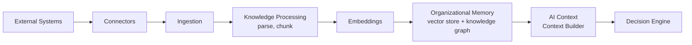
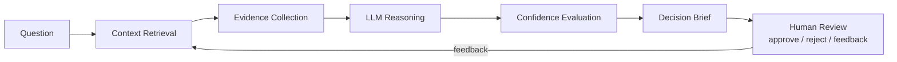

# Project Zero — Product Bible

| | |
|---|---|
| **Document** | Project Zero Product Bible |
| **Document Number** | 02 of 06 |
| **Version** | 3.0 |
| **Status** | Master Document — Single Source of Truth |
| **Owner** | Product Management (Founders) |
| **Audience** | Product managers, founders, engineers, designers, QA, sales engineering, customer success |
| **Supersedes** | PRD_Project_Zero v1.0 (Parts 1–5 and docx draft), Research R005 Product Definition & MVP, Backlog v1.0 (feature and acceptance-criteria content), README (product sections), Design System v1.0 (AI experience requirements), Product Bible v2.0 |

---

## Revision History

| Version | Description |
|---|---|
| 0.1 | Product intent scattered across founder documents; MVP undefined. |
| 1.0 | R005 froze the MVP definition ("APPROVED — architecture and engineering may begin"). PRD v1.0 produced as the production product requirements document. |
| 2.0 | First consolidated Product Bible. |
| 3.0 | **This document.** Full enterprise rewrite merging the PRD, R005, backlog feature definitions, AI-experience requirements, and all product-scope decisions into one canonical product reference. Resolves the MVP connector-scope conflict with a documented decision. |

---

## Table of Contents

1. [Purpose, Scope, and Audience](#1-purpose-scope-and-audience)
2. [Product Overview](#2-product-overview)
3. [Problem Statement](#3-problem-statement)
4. [Product Positioning](#4-product-positioning)
5. [Product Goals](#5-product-goals)
6. [Product Principles](#6-product-principles)
7. [Target Customers and Buyers](#7-target-customers-and-buyers)
8. [User Roles](#8-user-roles)
9. [User Journey and Core Workflows](#9-user-journey-and-core-workflows)
10. [Module Catalog — Overview](#10-module-catalog--overview)
11. [Identity, Organizations, Workspaces, and RBAC](#11-identity-organizations-workspaces-and-rbac)
12. [AI Workspace](#12-ai-workspace)
13. [AI Gateway](#13-ai-gateway)
14. [Connector Platform](#14-connector-platform)
15. [Knowledge Platform](#15-knowledge-platform)
16. [Supported Intelligence and Content Types](#16-supported-intelligence-and-content-types)
17. [Decision Intelligence](#17-decision-intelligence)
18. [Trust Layer](#18-trust-layer)
19. [Notifications](#19-notifications)
20. [Administration](#20-administration)
21. [Billing and Licensing](#21-billing-and-licensing)
22. [Marketplace](#22-marketplace)
23. [Vertical Packs](#23-vertical-packs)
24. [MVP Scope](#24-mvp-scope)
25. [Functional Requirements](#25-functional-requirements)
26. [Non-Functional Requirements](#26-non-functional-requirements)
27. [User Stories and Acceptance Criteria](#27-user-stories-and-acceptance-criteria)
28. [Security and AI Governance Requirements](#28-security-and-ai-governance-requirements)
29. [Integration Strategy](#29-integration-strategy)
30. [Success Metrics](#30-success-metrics)
31. [Product Risks](#31-product-risks)
32. [Future Features and Long-Term Evolution](#32-future-features-and-long-term-evolution)
33. [Appendix A — MVP Scope Decision Record](#appendix-a--mvp-scope-decision-record)
34. [Appendix B — Requirements Traceability](#appendix-b--requirements-traceability)
35. [References](#references)

---

## 1. Purpose, Scope, and Audience

### 1.1 Purpose

This document is the complete and authoritative definition of *what Project Zero is as a product*: every module, capability, requirement, user role, workflow, and scope boundary. It exists so that any product, engineering, design, QA, or go-to-market question of the form "does the product do X?", "who is X for?", or "what does done mean for X?" can be answered here without consulting any earlier document.

### 1.2 Scope

**In scope:** product requirements; features and capabilities; all platform modules (AI Workspace, Knowledge Platform, Decision Intelligence, Marketplace, Licensing, Connector Platform, Vertical Packs, and supporting modules); user roles, stories, and acceptance criteria; functional and non-functional requirements; MVP scope; integration strategy; product-level success metrics; future features.

**Out of scope:** why the product exists and whom it serves strategically (*Foundation & Strategy*); how the product is technically built (*Architecture Bible*); how it looks, feels, and moves (*Experience & Design Bible*); how it is engineered day-to-day (*Engineering Playbook*); when things ship (*Roadmap & Implementation Guide*).

### 1.3 Audience

Product managers own this document. Engineers use it as the requirements source for every epic. Designers use it to know what each surface must accomplish. QA derives test plans from its acceptance criteria. Sales engineering and customer success use it as the truthful description of current and future capability.

---

## 2. Product Overview

Project Zero is an **AI-native Enterprise Intelligence Platform** — an organization's **Intelligence Operating System**. The product unifies enterprise systems, documents, repositories, conversations, business data, media, and organizational knowledge into a single intelligence layer. Rather than replacing existing software, it integrates with it and augments decision-making through explainable AI.

In one sentence for every audience:

> **Project Zero connects the tools an organization already uses, builds a permanent organizational memory from them, and answers business questions with evidence-backed, auditable recommendations.**

The platform delivers this through five core product capabilities that the rest of this document elaborates module by module:

1. **Connect** — the Connector Platform links business systems (GitHub first, then Slack, Gmail, Google Drive, Notion, and beyond) through one standard SDK.
2. **Remember** — the Knowledge Platform ingests, indexes, embeds, and relates content into durable organizational memory and a knowledge graph.
3. **Answer** — the AI Workspace lets users ask business questions and receive responses grounded in their organization's real content.
4. **Decide** — Decision Intelligence turns retrieved knowledge into Decision Briefs: explainable recommendations with evidence, sources, and confidence.
5. **Govern** — the Trust Layer, RBAC, audit history, and licensing keep every capability secure, explainable, and controllable per organization.

---

## 3. Problem Statement

Modern organizations operate across dozens of disconnected systems — GitHub, Slack, Notion, Jira, Gmail, Outlook, Google Drive, CRMs, ERPs, databases, documents, meetings, and internal tools. Business knowledge fragments across these systems, causing:

- **Lost organizational context** — the "why" behind past decisions becomes irretrievable.
- **Slow decision-making** — leaders manually assemble context from many systems before deciding.
- **Repeated work** — teams redo analysis that already exists somewhere else.
- **Knowledge silos** — departments cannot see what other departments know.
- **Poor visibility across departments** — no system holds the whole picture.
- **Increased operational cost** — employees function as the integration layer between tools.

Current AI assistants answer questions but rarely understand complete organizational context — and traditional enterprise search and chatbots return *information* without explaining *why answers are correct or how decisions should be made*. Project Zero addresses this by building a trusted intelligence layer instead of another isolated application.

---

## 4. Product Positioning

### 4.1 What Project Zero Is Not

The product is explicitly **not**: a ChatGPT wrapper; a CRM replacement; an ERP replacement; a project management tool; a generic enterprise search engine; a general document editor; a consumer productivity app; an autonomous agent acting without approval; or a vendor-locked platform.

### 4.2 What Project Zero Is

An **Enterprise Decision Intelligence Platform** — equivalently describable as an Enterprise Intelligence Platform, an Organizational Memory Platform, a Decision Intelligence Platform, an AI Workspace, and an Integration Platform — focused on connecting systems, preserving organizational memory, and producing explainable recommendations.

### 4.3 Differentiation

Project Zero differentiates through: **organizational memory; explainable AI; evidence-backed responses; provider-agnostic architecture; the Trust Layer; multi-tenant platform design; the reusable connector framework; the AI Workspace; decision intelligence; and deep enterprise integration instead of standalone chat.** The competitive analysis and positioning mandate live in *Foundation & Strategy* (Sections 14–16); this document implements them.

---

## 5. Product Goals

The six core product goals, frozen at R005/PRD v1.0 and unchanged since:

1. **Connect enterprise systems.** Reliable, secure, standardized integrations.
2. **Build organizational memory.** Durable, versioned, retrievable knowledge that compounds over time.
3. **Answer business questions with evidence.** Grounded responses with citations, never unsupported text.
4. **Recommend next actions.** Move beyond answering to decision support.
5. **Learn continuously from user feedback.** Approval/rejection signals improve future recommendations.
6. **Maintain explainability and auditability.** Every intelligent output can be inspected and defended.

---

## 6. Product Principles

Binding product-level principles (the platform-wide principle set is in *Foundation & Strategy*, Section 8):

| Principle | Product Consequence |
|---|---|
| **Business before Technology** | Features exist to solve validated business problems, never to showcase AI |
| **Trust before Intelligence** | The Trust Layer ships with the first intelligent feature, not after it |
| **Integrate before Replace** | Every capability works against customer-owned systems of record |
| **API First** | Every product capability is available via documented API |
| **Multi-Tenant by Design** | Every feature respects organization and workspace isolation from day one |
| **Model Agnostic** | No feature may depend on a specific AI vendor's behavior |
| **Security by Design** | Security requirements are feature requirements |
| **Evidence before Assumptions** | Responses cite sources; roadmap items cite validation |
| **Modular Architecture** | Features land inside module boundaries; capabilities are licensable independently |
| **Explainable AI** | If a response cannot show its evidence, it does not ship |
| **Solve real business problems; prioritize usability and accessibility; preserve customer data ownership; design for enterprise scale** | Constitution product principles, applied to every requirement in this document |

---

## 7. Target Customers and Buyers

**Primary market (beachhead):** growing B2B SaaS companies, roughly 20–200 employees, using multiple SaaS applications, with rapidly growing teams.

**Primary buyers:** Founder, CEO, COO, and the leadership team. **Primary users:** leadership plus engineering leaders, operations teams, and knowledge workers.

**Long-term expansion:** agencies, education, healthcare, legal, creators, finance, manufacturing, and large enterprises — reached through vertical packs on the same platform. Full market analysis, personas, and the beachhead-narrowing decision record are in *Foundation & Strategy* (Section 15).

---

## 8. User Roles

Five roles span the platform. Each role's description below is the requirement for what that role must be able to do.

### 8.1 Platform Owner

The operator of the Project Zero platform itself (initially the founding team; in white-label futures, the partner). Capabilities: global platform configuration; licensing management across all organizations; feature management (global flags and per-organization enablement); provider configuration (which AI/storage/email providers are available platform-wide).

### 8.2 Organization Administrator

The customer-side owner of a tenant. Capabilities: organization settings and branding; workspace management (create, configure, archive); user provisioning and deprovisioning; security policies (authentication requirements, retention, region); connector configuration at the organization level; subscription and license visibility.

### 8.3 Workspace Administrator

The manager of a team's working space. Capabilities: workspace configuration; team management and member invitations; AI permissions (which AI capabilities members may use); knowledge management (what content is ingested, retained, or removed at workspace level).

### 8.4 Member

The everyday user. Capabilities: AI Chat in the AI Workspace; knowledge search; the decision workspace (asking questions, reviewing Decision Briefs, giving feedback); file upload; using configured connectors.

### 8.5 AI Agents

Digital workers built on the platform — capable of research, reasoning, summarization, classification, document understanding, and workflow assistance — **always under human supervision**. AI Agents are governed identities: their permissions are scoped like any member's, their actions are audited, and high-risk actions require human approval. (Principle source: *Foundation & Strategy*, Sections 6 and 9.)

---

## 9. User Journey and Core Workflows

### 9.1 The Canonical User Journey

The ten-step journey from first contact to compounding value:

1. **Organization Registration** — a new tenant is created; isolation begins here.
2. **Workspace Creation** — the first team space is configured.
3. **User Invitation** — members join with role-appropriate permissions.
4. **Connector Configuration** — business systems are linked (GitHub first).
5. **Knowledge Ingestion** — content flows in and is processed asynchronously.
6. **AI Context Building** — embeddings, indexes, and the knowledge graph form organizational memory.
7. **AI Conversation** — users ask real business questions in the AI Workspace.
8. **Evidence-backed Decision Brief** — the platform produces recommendations with evidence, sources, and confidence.
9. **User Feedback** — users approve/reject recommendations and rate responses.
10. **Continuous Learning** — feedback improves retrieval, prompts, and future recommendations.

### 9.2 Workspace Onboarding Workflow

Create organization → create workspace → configure authentication → invite members → connect business systems. Onboarding must be completable by a non-technical Organization Administrator without support intervention. The empty "zero state" before any connector is linked is a designed experience, not a blank screen — see *Experience & Design Bible* (Onboarding & Zero State), addressing the gap flagged in the pre-development checklist.

### 9.3 Knowledge Flow

### 9.4 Decision Workflow

Every stage of this workflow is observable and auditable; the Human Review stage is mandatory for high-risk recommendations (Section 28).

---

## 10. Module Catalog — Overview

The complete module set. "Phase" refers to the canonical roadmap phases (see *Roadmap & Implementation Guide*).

| Module | Purpose | Phase |
|---|---|---|
| Identity & Organizations | Tenancy, authentication, users | 1 |
| Workspaces | Team spaces and isolation | 1 |
| RBAC | Roles, permissions, policies | 1 |
| AI Gateway | All AI traffic: routing, prompts, usage, cost | 2 |
| AI Workspace | The primary user surface for intelligence | 2–5 |
| Connector Platform | SDK + integrations to external systems | 3 |
| Knowledge Platform | Ingestion, memory, search, knowledge graph | 4 |
| Decision Intelligence | Chat, Decision Briefs, confidence, feedback | 5 |
| Trust Layer | Evidence, audit, approvals on every AI output | 2–5 (cross-cutting) |
| Notifications | Email, in-app, scheduled, alerts | V1 |
| Administration | Platform/org/user/license admin, flags, audit | V1 |
| Billing & Licensing | Plans, metering, invoices, quotas | V1 |
| Marketplace | Third-party connectors, prompts, agents, verticals | V2 |
| Vertical Packs | Domain solutions on the shared platform | V2 |

---

## 11. Identity, Organizations, Workspaces, and RBAC

### 11.1 Purpose and Why It Exists

Everything in Project Zero belongs to somebody: every document, embedding, conversation, and decision is owned by an organization, scoped to a workspace, and accessed by an authenticated, authorized identity. This module family is Phase 1 because nothing else can safely exist without it. Multi-tenant isolation is the single highest-consequence requirement in the product: a cross-tenant leak would be existential (see *Architecture Bible*, Tenant Isolation).

### 11.2 Identity Capabilities

- **User registration** with email verification.
- **Authentication** via JWT access tokens with refresh tokens; OAuth 2.0 / OpenID Connect support; multi-factor authentication (future).
- **Password reset** with secure token flows.
- **Session management** — active session visibility and revocation.
- **User management** — profiles, deactivation, deletion respecting data-retention policy.

### 11.3 Organizations

- Create/update organizations; organization settings; **branding** (applied dynamically per tenant); subscription details; **tenant isolation** (hard boundary for all data and configuration).
- **Tenant configuration:** each organization can configure its AI provider, branding, storage provider, notification provider, security policies, data retention, region, and licensing.

### 11.4 Workspaces

- Multiple workspaces per organization; team management; member invitations; workspace settings; workspace-level permissions. Workspaces are the unit of team collaboration and the second isolation boundary (WorkspaceId scopes tenant data — see *Architecture Bible*).

### 11.5 RBAC

- Role-based access control with policy-based authorization layered on top; least-privilege defaults; role enforcement on every API; permissions scoped organization → workspace → resource.

---

## 12. AI Workspace

### 12.1 Purpose

The AI Workspace is the **primary interaction model** of the entire product. Users do not manage a database application with an AI feature attached; they supervise one unified AI identity inside a Mission Control experience (see *Experience & Design Bible* for the experiential specification). The workspace is where questions become evidence-backed answers and decisions.

### 12.2 Capabilities

- **AI Chat** — conversational interface with streaming responses, markdown rendering, and syntax highlighting.
- **Research and multi-source retrieval** — answers grounded in connected content across all systems the user may access.
- **Evidence-backed answers** — every substantive response carries citations and confidence (Trust Layer, Section 18).
- **Decision Briefs** — structured recommendation outputs (Section 17).
- **Contextual reasoning** — the Context Builder assembles relevant organizational context per request.
- **Conversation history** — persistent, searchable, auditable.
- **Suggested prompts** — guidance for new users and empty states.
- **Response actions** — copy, regenerate, cite, share into decisions.
- **Feedback controls** — approve/reject/rate on every response.
- **File upload** — ad-hoc documents enter the knowledge pipeline directly from the workspace.
- **Future: multi-agent collaboration** — visible coordination of specialized agents on complex tasks.

### 12.3 The Workspace Answer Pipeline

The user-visible reasoning sequence (specified in the Experience & Motion documents and binding on implementation):

> **Question → Context → Knowledge Search → Evidence → Reasoning → Confidence → Decision Brief → Final Answer**

Each stage may surface progress to the user (see *Experience & Design Bible*, Motion System) — the product requirement is that the pipeline is real, inspectable, and honest, not decorative.

---

## 13. AI Gateway

### 13.1 Purpose

Every AI request in the platform flows through one gateway. This is what makes provider-agnosticism real: business modules never talk to an AI vendor; they talk to the gateway.

### 13.2 Capabilities

- **Multi-LLM provider support** — OpenAI, Azure OpenAI, Anthropic Claude, Google Gemini, OpenRouter, and local models.
- **Provider routing / model routing** — requests are routed by configuration, cost, capability, and availability; failover between providers.
- **Prompt management** — versioned, tested, approvable, rollback-capable prompts (prompt governance — Section 28).
- **Model configuration** — per-organization provider/model selection (tenant configuration).
- **Usage tracking and cost monitoring** — token usage, API calls, and per-workspace monthly cost (feeds Billing, Section 21).
- **Response streaming** — for interactive surfaces.
- **AI request logging** — complete audit of requests, model used, prompt version, and response metadata.

### 13.3 Acceptance Criteria (Module Level)

- AI requests are routed through the unified gateway — no direct vendor calls anywhere in the codebase.
- Provider switching requires **no code changes** — configuration only.
- Usage metrics are recorded for every request.

---

## 14. Connector Platform

### 14.1 Purpose

Connectors are how Project Zero fulfills Integrate Before Replace. The Connector Platform consists of the **Connector SDK** (the reusable framework) and the individual **connectors** built on it. One SDK, many connectors: authentication, synchronization, contracts, scheduling, and provider abstraction are implemented once and reused by every integration — avoiding vendor lock-in and per-connector security surprises.

### 14.2 Connector SDK Capabilities

- **Standard `IConnector` contract** — every connector implements the same interface.
- **OAuth 2.0 foundation** — encrypted token storage, refresh token support, revocation support (connector security requirements; see *Architecture Bible*).
- **Scheduled synchronization** — periodic sync with configurable cadence.
- **Webhook support** — real-time updates where the source system offers them.
- **Reliability** — connector failures are retried automatically; failures alert (Notifications).
- **Sync status visibility** — users can see connector health at all times (Dashboard widget; connector cards).

### 14.3 Connector Catalog

| Tier | Connectors | Status |
|---|---|---|
| **MVP** | **GitHub** | The proving connector for the SDK |
| **Fast-follow (Phase 3)** | Slack, Gmail, Google Drive, Notion | Immediately after GitHub validates the SDK |
| **Future** | Discord, Outlook, Jira, Confluence, Microsoft Teams, YouTube, LinkedIn, Instagram, TikTok, Salesforce, HubSpot, and future enterprise systems | Prioritized by customer demand |

**Decision record:** earlier documents conflicted on whether MVP included five connectors or one. The resolved decision is **GitHub only in MVP**, with the four fast-follow connectors as the immediate Phase 3 continuation. Full reasoning in Appendix A. The historical R005 integration list (Slack/Jira/Notion/GitHub) is preserved there as well.

### 14.4 Why GitHub First

GitHub exercises every part of the SDK (OAuth, pagination, webhooks, large content volumes, rich entity types), the beachhead segment (B2B SaaS) universally uses it, and code-plus-issues content is immediately valuable for real leadership questions (velocity, risk, technical decisions).

---

## 15. Knowledge Platform

### 15.1 Purpose

The Knowledge Platform turns connected content into **organizational memory** — the compounding asset that differentiates Project Zero from stateless chat tools. It ingests documents, repositories, conversations, media, databases, and enterprise content; processes them into retrievable, related, versioned knowledge; and serves grounded context to the AI.

### 15.2 Capabilities

- **Document ingestion** — from connectors and direct upload.
- **File parsing** — all supported formats (Section 16).
- **Text chunking** — content divided into retrieval-optimal segments.
- **Embedding generation** — asynchronous, at scale.
- **Vector storage and semantic search** — meaning-based retrieval across everything the caller is permitted to see.
- **Knowledge indexing** — full-text and semantic indexes maintained asynchronously.
- **Organizational memory** — durable accumulation with **version awareness** (updated documents supersede stale knowledge without losing history).
- **Knowledge graph** — entities and relationships extracted from content, enabling relationship queries and graph exploration in the UI.
- **Context Builder** — assembles the most relevant organizational context for each AI request.
- **Evidence collection** — retrieval retains source references so every answer can cite its basis.

### 15.3 Acceptance Criteria (Module Level)

- Documents are searchable through AI after ingestion.
- Knowledge updates are processed asynchronously (no user-blocking ingestion).
- Source references are retained end-to-end — from ingestion through retrieval to citation.

---

## 16. Supported Intelligence and Content Types

### 16.1 The Intelligence Layer

The product commits to ten intelligence capabilities, delivered by the AI Engine (technical design in the *Architecture Bible*):

| Intelligence | What It Understands |
|---|---|
| **Text Intelligence** | Natural-language content: messages, wikis, notes |
| **Document Intelligence** | Structured documents: contracts, specs, reports, presentations |
| **Vision Intelligence** | Images: OCR, diagrams, screenshots, charts, UI captures, handwriting |
| **Audio Intelligence** | Speech, meetings, voice notes — transcription and understanding |
| **Video Intelligence** | Transcription, speaker detection, summaries, action items |
| **Source Code Intelligence** | Repositories: code, commits, issues, pull requests |
| **Database Intelligence** | Structured business data and schemas |
| **Knowledge Graph** | Entities and relationships across all of the above |
| **Memory** | Persistent organizational and conversational memory |
| **Decision Engine** | Reasoning from knowledge to recommendations |

### 16.2 Supported Content Formats

**Documents:** PDF, DOCX, PPTX, XLSX, TXT, Markdown, HTML, CSV, JSON, XML, YAML.
**Images:** OCR, diagrams, screenshots, charts, UI captures, handwriting.
**Audio:** speech, meetings, voice notes.
**Video:** transcription, speaker detection, summaries, action items.
**Code & data:** repositories and databases.

The interface must present all of these through a unified viewing experience (see *Experience & Design Bible*, Supported Content Experience).

---

## 17. Decision Intelligence

### 17.1 Purpose

Decision Intelligence is the product's reason for existing: it transforms retrieved knowledge into **explainable recommendations**. Where search returns documents and chat returns text, Decision Intelligence returns *a defensible basis for action*.

### 17.2 Capabilities

- **AI Chat** — the conversational entry point (Section 12).
- **Decision Briefs** — the flagship output: a structured document containing the question, the recommendation, supporting evidence, source citations, confidence score, assumptions, and the reasoning path.
- **Evidence-backed recommendations** — no recommendation without retrievable evidence.
- **Confidence scoring** — every response and brief carries an explicit confidence measure.
- **Executive dashboards** — decision queues, recent decisions, and organizational health at a glance (Phase 5; see *Experience & Design Bible*, Dashboard).
- **Conversation and decision history** — a permanent, searchable, auditable record.
- **Feedback collection** — approve/reject on recommendations; ratings on responses; feedback demonstrably improves future recommendations.
- **Continuous learning** — the feedback loop is a product requirement, not an aspiration: acceptance rates must be measurable and improving.

### 17.3 Acceptance Criteria (Module Level)

- Every response includes evidence.
- Decision history is auditable.
- Feedback improves future recommendations (measured via acceptance-rate trend).

---

## 18. Trust Layer

### 18.1 Purpose

The Trust Layer is the cross-cutting product capability that makes every AI output defensible. It is mandatory on every AI response in every module — it is what "Trust Before Intelligence" means in practice.

### 18.2 Requirements

Every AI response must include:

| Element | Description |
|---|---|
| **Evidence** | The retrieved content the response is grounded in |
| **Sources** | Citations to the original systems/documents, navigable by the user |
| **Confidence score** | Explicit, calibrated confidence |
| **Audit trail** | Who asked, when, what was retrieved, what was answered |
| **Model information** | Which model/provider produced the response |
| **Prompt version** | Which versioned prompt was used |
| **Approval status** | Where applicable: pending / approved / rejected, by whom |

**Human approval is required for high-risk recommendations and business actions.** The product never executes an autonomous action without an approval gate.

---

## 19. Notifications

**Purpose:** keep users informed without demanding attention. **Capabilities:** email notifications; in-app notifications; scheduled notifications; AI task completion alerts; connector failure alerts. **Acceptance criteria:** notifications are delivered reliably; user notification preferences are respected.

---

## 20. Administration

**Purpose:** operate the platform and each tenant safely. **Capabilities:** platform administration; organization management; user management; license management; feature flags (configurable per organization); audit logs (searchable); system health dashboard. **Acceptance criteria:** administrators can manage all platform resources; audit history is searchable; feature flags are configurable per organization.

---

## 21. Billing and Licensing

### 21.1 Purpose

Monetization and capacity governance. Licensing controls *what* an organization can use (features); billing controls *how much* (quotas, metering, invoicing).

### 21.2 Capabilities

- **Subscription plans** — Free, Starter, Professional, Enterprise (tier definitions in *Foundation & Strategy*, Section 17.2).
- **License assignment** — per organization; feature flags enforce entitlements (AI, Knowledge, Connectors, Decision Engine, Marketplace, Billing, Licensing, Vertical Packs).
- **Usage metering** — token usage, API calls, storage, queue usage, connector usage, monthly workspace cost (the Cost Management capability).
- **Invoice generation** and **payment integration**.
- **Organization quotas** — enforced limits with defined behavior at the limit: users receive clear in-product notice as quotas approach; at the hard limit, AI requests are queued or declined with an upgrade path — never silent failure. (This resolves the open quota/rate-limit behavior question flagged in the V1 review; billing-side details are tracked in the *Roadmap* until fully designed.)

### 21.3 Acceptance Criteria (Module Level)

- Subscription limits are enforced.
- Usage is accurately tracked.
- Licensing is configurable per organization.

---

## 22. Marketplace

**Purpose:** turn the platform into an ecosystem. The Marketplace (Version 2.0 scope) lets third parties publish and monetize connectors, prompt packs, AI agents, and vertical solutions built on the platform's SDKs. **Product requirements (directional, to be detailed before the V2 cycle):** publisher onboarding and review; listing, discovery, and installation per organization; entitlement enforcement via the licensing system; revenue share; security review for published components. The Marketplace depends on the Connector SDK, feature flags, and licensing — all deliberately designed as reusable capabilities to make this possible.

---

## 23. Vertical Packs

**Purpose:** expand into new markets without forking the product. A vertical pack bundles **domain-specific connectors, prompts, and dashboards** on the same platform — never custom code forks (Configuration over Customization).

**Defined packs (from Architecture v1.1, preserved in full):** Business Intelligence, Creator Intelligence, Agency, Healthcare, Education, Legal.

Each pack is enabled per organization via feature flags and licensing. Healthcare and Legal packs will additionally carry compliance-specific configuration (retention, region, audit depth) — requirements to be detailed when those packs are scheduled (V2; see *Roadmap*).

---

## 24. MVP Scope

### 24.1 Included (Functional Scope — MVP)

**Identity:** organizations, workspaces, authentication, JWT, RBAC, user management.
**AI Gateway:** multi-LLM routing, prompt management, usage tracking, provider abstraction.
**Connectors:** **GitHub** (the single MVP connector — Appendix A).
**Knowledge:** document ingestion, search, organizational memory, context builder.
**Decision Intelligence:** AI Chat, Decision Briefs, evidence-backed responses, confidence scores, audit history.
**Platform:** provider abstraction, multi-tenant foundation, explainable AI.

The MVP one-liner: **Authentication + Organizations + RBAC + GitHub Connector + AI Workspace + Knowledge + Decision Briefs + Evidence-backed Responses.**

### 24.2 Excluded from MVP

ERP replacement; CRM replacement; project management platform; autonomous AI actions without approval; vendor-specific implementation; consumer productivity features; general document editor.

### 24.3 MVP Goals (from R005, APPROVED)

1. Connect company tools. 2. Build organizational memory. 3. Answer business questions with evidence. 4. Recommend next actions. 5. Learn from user feedback.

### 24.4 Release Milestones Beyond MVP

| Release | Adds |
|---|---|
| **MVP** | Platform Foundation, Identity, Organizations, Workspaces, AI Gateway, GitHub Connector, Knowledge Platform, AI Chat |
| **Version 1.0** | Decision Intelligence (full), Billing, Licensing, Notifications, Administration |
| **Version 2.0** | Marketplace, Vertical Solutions, Advanced AI Agents, Mobile Applications, Desktop Applications |

(Full sequencing, dependencies, and sprints: *Roadmap & Implementation Guide*.)

---

## 25. Functional Requirements

Consolidated, numbered, and binding. Each requirement is testable; module-level details appear in Sections 11–23.

| ID | Requirement |
|---|---|
| FR-01 | The platform shall support multiple isolated organizations (tenants) on shared infrastructure. |
| FR-02 | The platform shall authenticate users via JWT access tokens with refresh tokens, and support OAuth 2.0 / OpenID Connect. |
| FR-03 | The platform shall enforce role-based access control with policy-based authorization at organization, workspace, and resource scope. |
| FR-04 | Organizations shall support multiple workspaces, each with independent membership and permissions. |
| FR-05 | Organizations shall be configurable for AI provider, branding, storage provider, notification provider, security policies, retention, region, and licensing. |
| FR-06 | All AI requests shall flow through the AI Gateway; provider switching shall require configuration changes only. |
| FR-07 | Prompts shall be versioned, testable, approvable, and rollback-capable. |
| FR-08 | AI usage (tokens, API calls, cost) shall be tracked per request, per workspace, per organization. |
| FR-09 | The platform shall provide a Connector SDK with a standard contract, OAuth foundation (encrypted tokens, refresh, revocation), scheduled sync, webhook support, and automatic retry. |
| FR-10 | The platform shall provide a GitHub connector at MVP, followed by Slack, Gmail, Google Drive, and Notion. |
| FR-11 | The platform shall ingest documents from connectors and direct upload, parse all supported formats, chunk, embed, and index asynchronously. |
| FR-12 | The platform shall provide semantic search across all content the caller is authorized to access. |
| FR-13 | The platform shall maintain organizational memory with version awareness and a knowledge graph of entities and relationships. |
| FR-14 | The platform shall provide AI Chat with streaming, markdown rendering, conversation history, suggested prompts, response actions, and feedback controls. |
| FR-15 | The platform shall produce Decision Briefs containing recommendation, evidence, sources, confidence, and reasoning. |
| FR-16 | Every AI response shall include the Trust Layer envelope: evidence, sources, confidence score, audit trail, model information, prompt version, and approval status where applicable. |
| FR-17 | High-risk recommendations and business actions shall require human approval before execution. |
| FR-18 | Users shall be able to approve/reject recommendations and rate responses; feedback shall feed the learning loop. |
| FR-19 | The platform shall deliver email, in-app, and scheduled notifications, including AI task completion and connector failure alerts, respecting user preferences. |
| FR-20 | Administrators shall manage organizations, users, licenses, feature flags, and audit logs; audit history shall be searchable. |
| FR-21 | The platform shall enforce subscription plans, quotas, and usage metering, with clear user-facing behavior at limits. |
| FR-22 | Feature availability shall be controllable per organization via feature flags (AI, Knowledge, Connectors, Decision Engine, Marketplace, Billing, Licensing, Vertical Packs). |
| FR-23 | All platform capabilities shall be exposed through versioned, documented REST APIs. |

---

## 26. Non-Functional Requirements

| ID | Category | Requirement |
|---|---|---|
| NFR-01 | Security | Enterprise security: encryption in transit and at rest, secret management, least privilege, tenant isolation (see Section 28 and *Architecture Bible*) |
| NFR-02 | Availability | High availability; API availability target 99.9%+ |
| NFR-03 | Performance | Average non-AI API response < 300 ms; typical AI response < 10 seconds |
| NFR-04 | Scalability | Horizontal scalability at application, data, and AI layers |
| NFR-05 | Provider independence | Provider-agnostic design across every external dependency |
| NFR-06 | Auditability | Full audit logging and activity history |
| NFR-07 | Explainability | Every AI output explainable per the Trust Layer |
| NFR-08 | Observability | Logging, metrics, tracing, and performance monitoring built in |
| NFR-09 | Recoverability | Disaster-recovery readiness: automated backups, point-in-time recovery |
| NFR-10 | Modularity | Modular deployment; capabilities independently enable-able |
| NFR-11 | Data ownership | Customer owns their data and API keys; configurable retention |
| NFR-12 | Accessibility | WCAG 2.2 AA across the product (see *Experience & Design Bible*) |
| NFR-13 | Deployability | Cloud deployment and full local development support |

---

## 27. User Stories and Acceptance Criteria

Representative user stories per epic, with their binding acceptance criteria. (The complete epic/feature breakdown, sized and sequenced, lives in the *Roadmap & Implementation Guide*; the criteria below are the product-level definition of "works.")

### Epic — Platform Foundation
*As a developer, I can build and run the entire platform locally so that development iterates quickly.*
**Acceptance:** project builds successfully; local Docker environment operational; CI pipeline passes; health endpoints available; API documentation generated.

### Epic — Identity & Access
*As a user, I can register, verify my email, sign in, refresh my session, and reset my password securely.*
*As an admin, I can assign roles that actually restrict what users can do.*
**Acceptance:** secure authentication flow; protected APIs; role enforcement; token refresh supported.

### Epic — Organization Management
*As an organization administrator, I can create and configure my organization with our branding and settings.*
**Acceptance:** organizations fully isolated; configuration stored per tenant; branding applied dynamically.

### Epic — Workspace Management
*As an organization administrator, I can create multiple workspaces and control who belongs to each.*
**Acceptance:** multiple workspaces per organization; workspace-level permissions enforced.

### Epic — AI Gateway
*As a platform owner, I can switch an organization's AI provider without any code change.*
*As an administrator, I can see exactly what AI usage costs per workspace.*
**Acceptance:** unified gateway routing; provider switching without code changes; usage metrics recorded.

### Epic — Connector Platform
*As an organization administrator, I can connect our GitHub securely and see sync status at all times.*
**Acceptance:** connectors authenticate securely (OAuth, encrypted tokens); synchronization is reliable; failures retry automatically.

### Epic — Knowledge Platform
*As a member, I can search everything our organization has connected and find answers by meaning, not just keywords.*
**Acceptance:** documents searchable through AI; knowledge updates processed asynchronously; source references retained.

### Epic — Decision Intelligence
*As a leader, I can ask a business question and receive a recommendation I can defend — with evidence, sources, and confidence.*
*As a leader, I can approve or reject recommendations and see the system improve.*
**Acceptance:** every response includes evidence; decision history is auditable; feedback improves future recommendations.

### Epic — Administration
**Acceptance:** administrators can manage all platform resources; audit history searchable; feature flags per organization.

### Epic — Notifications
**Acceptance:** reliable delivery; preferences respected.

### Epic — Billing & Licensing
**Acceptance:** subscription limits enforced; usage accurately tracked; licensing configurable by organization.

### Epic — Observability
**Acceptance:** platform health visible in real time; failures detectable within minutes; performance metrics retained for analysis.

---

## 28. Security and AI Governance Requirements

### 28.1 Identity & Access
JWT authentication; RBAC; organization isolation; workspace isolation; least-privilege permissions.

### 28.2 Data Protection
Encryption in transit; encryption at rest; secure API communication; secret management; tenant data isolation across storage, embeddings, knowledge graph, and memory.

### 28.3 Compliance
Audit logging; activity history; data ownership by customer; configurable retention policies.

### 28.4 AI Governance (Product Requirements)

- **Prompt governance:** version-controlled prompts; approval workflow; prompt testing; prompt rollback.
- **Model governance:** provider abstraction; model evaluation; cost monitoring; quality benchmarking.
- **Data governance:** tenant isolation; encryption; access controls; audit trails; retention policies.
- **Risk mitigations:** RAG grounding, source citations, human approval gates, automated evaluation, and security monitoring — mapped against hallucination, prompt injection, data leakage, provider outages, and model drift.
- **Binding stance:** AI is decision support with measurable quality and transparent reasoning — never unsupervised autonomous decision-making.

---

## 29. Integration Strategy

All integrations are implemented through the common Connector SDK to avoid vendor lock-in (Section 14). Initial connector: GitHub. Fast-follow: Slack, Gmail, Google Drive, Notion. Future: Discord, Outlook, Jira, Confluence, Microsoft Teams, YouTube, LinkedIn, Instagram, TikTok, Salesforce, HubSpot. MCP (Model Context Protocol) support is a recorded platform commitment for the connector substrate's future (see *Foundation & Strategy*, Section 6.2).

Integration priorities are set by (1) beachhead-customer demand, (2) knowledge value density of the source, and (3) SDK generalization value — each new connector should make the next one cheaper.

---

## 30. Success Metrics

**Customer value:** reduced information search time; faster executive decisions; weekly active leadership users; recommendation acceptance rate; connector adoption; knowledge reuse; lower operational friction; reduced context switching.

**Business:** customer acquisition; retention; MRR; enterprise adoption; workspace growth.

**Product:** active users; AI response quality; connector utilization; knowledge reuse; decision acceptance rate; explainability/trust improvement.

**Engineering (product-visible):** API availability; response latency; deployment frequency; MTTR; test coverage.

(Metric ownership and targets: *Foundation & Strategy* Section 20; *Engineering Playbook* for engineering enforcement.)

---

## 31. Product Risks

Product-level view of the consolidated risk register (strategy-level analysis in *Foundation & Strategy* Section 21; delivery tracking in the *Roadmap*):

AI provider changes; rising inference costs; connector API changes; security threats; customer adoption; context quality; data governance; competitive pressure. The single largest **product** risk is Trust Layer UX: presenting evidence, confidence, and audit without overwhelming users is the hardest experience problem in the product — flagged in the pre-development checklist with the requirement to **prototype one end-to-end evidence-backed answer against a real LLM response before Decision Intelligence development begins** (tracked in the *Roadmap*).

---

## 32. Future Features and Long-Term Evolution

Every future idea recorded anywhere in the source corpus, preserved and organized. None carry dates; sequencing lives in the *Roadmap*.

**Platform expansion:** Marketplace; white-label platform; vertical packs (Business Intelligence, Creator Intelligence, Agency, Healthcare, Education, Legal); mobile applications; desktop applications.

**Intelligence expansion:** advanced AI agents and multi-agent orchestration; agent communication visualization; workflow intelligence; advanced reasoning pipelines; continuous model evaluation at scale; MCP connector substrate.

**Experience expansion:** voice interface; real-time collaboration; spatial knowledge graph; 3D particle engine; custom AI avatars/themes; immersive analytics; enterprise collaboration workspaces.

**Infrastructure expansion (product-visible):** multi-region deployment; enterprise observability; Elasticsearch-backed search; advanced governance controls.

**Long-term product identity:** Project Zero evolves into Enterprise Intelligence Infrastructure — coordinating humans, AI employees, business systems, organizational knowledge, and intelligent workflows through a secure, provider-agnostic platform (full long-term vision: *Foundation & Strategy*, Section 22).

---

## Appendix A — MVP Scope Decision Record

**Context.** Three source documents disagreed on MVP connector scope:
- PRD v1.0 Part 2 §9 listed five MVP connectors: GitHub, Slack, Gmail, Google Drive, Notion.
- Backlog v1.0 Part 3 and README v1.0 Part 2 listed **GitHub only**, with the rest as future.
- R005 (the original approved MVP definition) listed an initial integration set of **Slack, Jira, Notion, GitHub**.

**Decision.** **MVP = GitHub only.** Slack, Gmail, Google Drive, and Notion are the fast-follow set within the Connector phase. Jira moves to the future catalog (it remains recorded and prioritized by demand).

**Reasoning.**
1. The pre-development checklist explicitly identified building the SDK generically for many connectors before proving it on one as a common trap: *"Pick the single MVP connector and defer the other 10."*
2. The Backlog, README, v2.0 master documents, and conversation summary all converged on GitHub-first; the PRD list was the outlier and predated the convergence.
3. GitHub maximizes SDK learning (OAuth, webhooks, pagination, volume) and beachhead value (B2B SaaS companies).
4. The R005 list reflected pre-architecture thinking; it is preserved here as the historical record of intent — the *set* was right, the *sequencing* was refined.

**Consequences.** PRD-derived scope statements in this document (Section 24) reflect GitHub-only MVP. The *Roadmap* sequences the fast-follow four immediately after GitHub validates the SDK.

---

## Appendix B — Requirements Traceability

| Master Source | Where It Lives Now |
|---|---|
| PRD v1.0 Parts 1–5 | Sections 2–9, 24–30 (all content absorbed; MVP connector scope resolved per Appendix A) |
| R005 Product Definition & MVP | Sections 5, 24, Appendix A |
| Backlog v1.0 features & acceptance criteria | Sections 11–23 (module capabilities), 27 (acceptance criteria); full delivery breakdown in *Roadmap* |
| Design System v1.0 Part 4 (AI experience) | Sections 12, 17; experiential detail in *Experience & Design Bible* |
| Architecture v1.1 (licensing, cost, trust, verticals) | Sections 18, 21, 23 |
| Intelligence layer & supported content lists | Section 16 |
| Conversation summary (product direction) | Sections 2, 4, 14, 23 |
| Product Bible v2.0 | Superseded in full by this document |

---

## References

- *Foundation & Strategy* — vision, market, personas, business model, glossary.
- *Architecture Bible* — technical realization of every module here.
- *Experience & Design Bible* — the experiential specification of the AI Workspace, dashboards, and Trust Layer UX.
- *Engineering Playbook* — quality gates behind every acceptance criterion.
- *Roadmap & Implementation Guide* — sequencing, sprints, and delivery of everything above.

---

*End of Project Zero Product Bible v3.0 — Master Document 02 of 06.*
