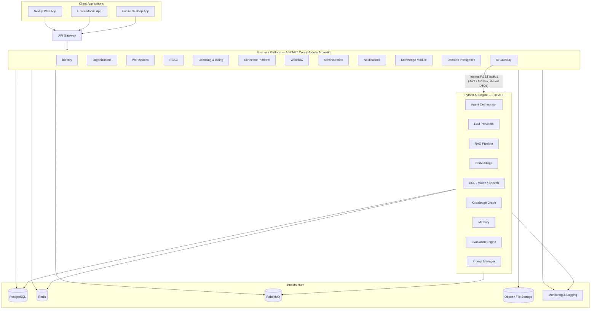
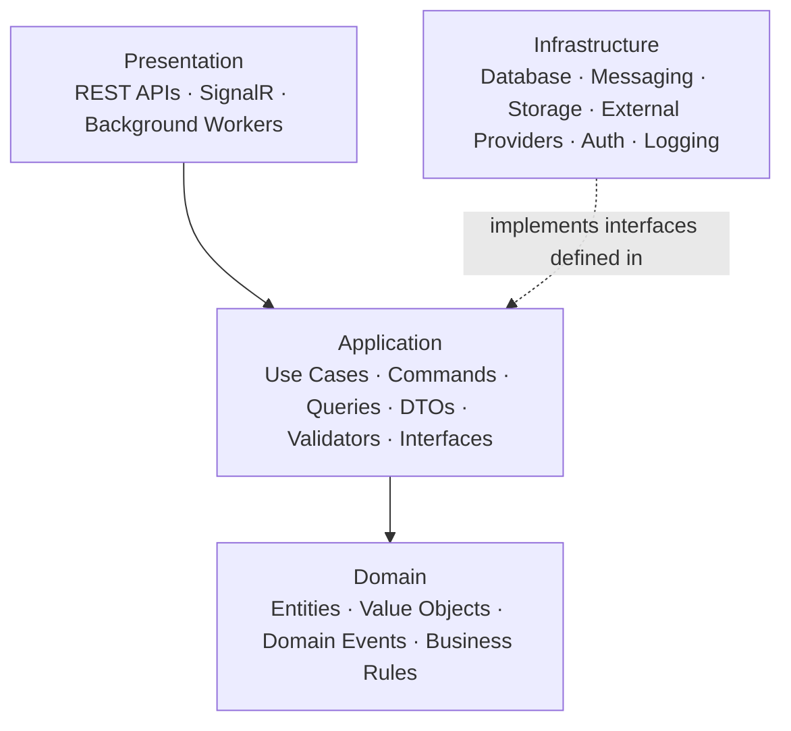
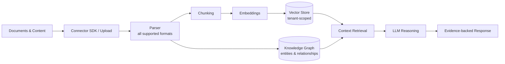
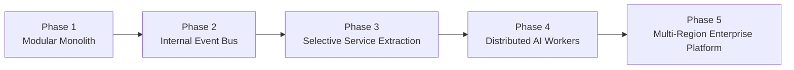

# Project Zero — Architecture Bible

| | |
|---|---|
| **Document** | Project Zero Architecture Bible |
| **Document Number** | 03 of 06 |
| **Version** | 3.0 |
| **Status** | Master Document — Single Source of Truth |
| **Owner** | Architecture (Founders / Lead Architect) |
| **Audience** | Architects, backend/frontend/AI engineers, DevOps, security reviewers, AI coding assistants |
| **Supersedes** | Architecture_Project_Zero v1.0/v1.1/v1.2 (all copies and parts), Architecture fragments in Rough Docs, Research R003 Technology Strategy, README (technology sections), Conversation Summary (technical decisions), Pre-Development Checklist (architecture gaps), Architecture Bible v2.0 |

---

## Revision History

| Version | Description |
|---|---|
| 1.0 | Initial architecture: Clean Architecture, modular monolith, core stack. |
| 1.1 | Added provider abstraction, free→paid migration strategy, feature flags, vertical packs, tenant configuration, licensing & plans, cost management, Connector SDK, AI governance & trust layer. |
| 1.2 | Added the AI Intelligence Layer (Python) — the polyglot split, .NET↔Python contract, tenant isolation, connector security, environment strategy, testing strategy. Restructured into six parts. (Note: one v1.2 file retained a stale "Version: 1.1" header — corrected here; see Appendix B.) |
| 2.0 | First consolidated Architecture Bible. |
| 3.0 | **This document.** Full enterprise rewrite. Merges every architecture source; restores content dropped between v1.1 and v1.2 (licensing, cost management, trust layer); closes the open design gaps flagged pre-development (tenant isolation strategy, internal API contract, connector OAuth model); records all architecture decisions as ADRs. |

---

## Table of Contents

1. [Purpose, Scope, and Audience](#1-purpose-scope-and-audience)
2. [Executive Summary](#2-executive-summary)
3. [Architecture Goals](#3-architecture-goals)
4. [Architectural Principles](#4-architectural-principles)
5. [High-Level System Architecture](#5-high-level-system-architecture)
6. [Technology Stack](#6-technology-stack)
7. [Architecture Decision Records (ADRs)](#7-architecture-decision-records-adrs)
8. [Clean Architecture](#8-clean-architecture)
9. [Domain-Driven Design and the Modular Monolith](#9-domain-driven-design-and-the-modular-monolith)
10. [The Polyglot Architecture — .NET Business Platform + Python AI Engine](#10-the-polyglot-architecture--net-business-platform--python-ai-engine)
11. [The .NET ↔ Python API Contract](#11-the-net--python-api-contract)
12. [Provider Abstraction](#12-provider-abstraction)
13. [Free-to-Enterprise Migration Strategy](#13-free-to-enterprise-migration-strategy)
14. [Feature Flags](#14-feature-flags)
15. [Tenant Configuration](#15-tenant-configuration)
16. [Multi-Tenancy and Tenant Isolation](#16-multi-tenancy-and-tenant-isolation)
17. [Data Architecture](#17-data-architecture)
18. [Caching Architecture — Redis](#18-caching-architecture--redis)
19. [Messaging Architecture — RabbitMQ](#19-messaging-architecture--rabbitmq)
20. [AI Architecture](#20-ai-architecture)
21. [Prompt Architecture](#21-prompt-architecture)
22. [Knowledge Pipeline — RAG, Embeddings, Memory, Knowledge Graph](#22-knowledge-pipeline--rag-embeddings-memory-knowledge-graph)
23. [Connector Architecture](#23-connector-architecture)
24. [API Design](#24-api-design)
25. [Security Architecture](#25-security-architecture)
26. [Trust Layer and AI Governance](#26-trust-layer-and-ai-governance)
27. [Event-Driven Architecture](#27-event-driven-architecture)
28. [Background Processing](#28-background-processing)
29. [Observability](#29-observability)
30. [Error Handling and Resilience](#30-error-handling-and-resilience)
31. [Cost Management](#31-cost-management)
32. [Licensing and Plans (Architectural View)](#32-licensing-and-plans-architectural-view)
33. [Vertical Packs (Architectural View)](#33-vertical-packs-architectural-view)
34. [Deployment Architecture](#34-deployment-architecture)
35. [Scalability Strategy](#35-scalability-strategy)
36. [Disaster Recovery](#36-disaster-recovery)
37. [Performance Targets](#37-performance-targets)
38. [Future Architecture Evolution](#38-future-architecture-evolution)
39. [Architecture Governance](#39-architecture-governance)
40. [Appendix A — Reference Architecture](#appendix-a--reference-architecture)
41. [Appendix B — Resolved Architecture Issues and Open Items](#appendix-b--resolved-architecture-issues-and-open-items)
42. [References](#references)

---

## 1. Purpose, Scope, and Audience

### 1.1 Purpose

This document is the complete technical architecture of Project Zero: every structural decision, every technology choice with its reasoning, every cross-cutting mechanism (tenancy, security, provider abstraction, observability), and the evolution path from the V1 modular monolith to a globally scalable platform. It is written so that a competent engineer who has never seen the codebase can understand *why the system is shaped the way it is* and extend it without violating its constraints.

### 1.2 Scope

**In scope:** system architecture; architecture decisions (ADRs); Clean Architecture and DDD application; backend (.NET), frontend (Next.js), and the Python AI Engine; infrastructure (PostgreSQL, Redis, RabbitMQ, Docker); authentication, authorization, and security; provider abstraction; knowledge graph, memory, RAG, embeddings; prompt architecture; connectors; deployment; monitoring; scaling.

**Out of scope:** what the product does (*Product Bible*); day-to-day engineering practice, code style, and CI/CD workflow detail (*Engineering Playbook*); visual/interaction design (*Experience & Design Bible*); delivery sequencing (*Roadmap*).

### 1.3 Audience

Architects and senior engineers own and evolve this document. Every engineer — human or AI coding assistant — must follow it. DevOps uses Sections 34–37; security reviewers use Sections 16, 25–26.

---

## 2. Executive Summary

Project Zero is an Enterprise Intelligence Platform built to connect humans, AI employees, and business systems through a **provider-agnostic architecture**. The platform combines **ASP.NET Core** for business capabilities with a dedicated **Python AI Engine** for intelligence workloads — a deliberate polyglot split that lets AI innovation move at ecosystem speed without destabilizing enterprise business modules.

The system is designed for **long-term evolution from a modular monolith into independently deployable services without changing business logic**. Every external dependency sits behind a provider interface; every tenant is isolated by construction; every AI response carries evidence and audit metadata; and the whole platform runs identically on a developer laptop (free-tier providers) and in enterprise cloud environments (managed providers) — the free-to-enterprise strategy.

The architecture emphasizes maintainability, scalability, security, explainability, and long-term evolution — in that spirit: **rapid delivery today, without disruptive rewrites tomorrow.**

---

## 3. Architecture Goals

Each goal is a permanent evaluation criterion for any proposed change:

1. **Enterprise-first** — built to pass enterprise security review and procurement from day one.
2. **API First** — every capability behind a versioned, documented API.
3. **Provider Agnostic** — no vendor dependency in business logic, ever.
4. **Multi-Tenant** — many organizations, one platform, hard isolation.
5. **Modular by Design** — strong module boundaries; capabilities independently enable-able.
6. **Secure by Default** — the safe configuration is the default configuration.
7. **Explainable AI** — architecture guarantees evidence, audit, and traceability for AI outputs.
8. **Cloud Native** — containerized, orchestratable, environment-agnostic.
9. **Horizontally Scalable** — scale by adding instances, not by growing one machine.

---

## 4. Architectural Principles

The binding principle set, merged from every architecture source:

- **Clean Architecture** — dependencies point inward; the domain is pure (Section 8).
- **Domain-Driven Design** — business boundaries define module boundaries (Section 9).
- **Modular Monolith** for V1 — one deployable, strict internal seams (Section 9).
- **CQRS where beneficial** — commands and queries separated when it clarifies, not dogmatically everywhere.
- **Event-Driven Integration** — modules integrate through events where coupling would otherwise grow (Section 27).
- **Dependency Inversion** — high-level policy never depends on low-level detail.
- **Provider Abstraction** — all external services behind interfaces (Section 12).
- **Configuration over Customization** — tenant variability through configuration, never code forks.
- **Business Before Technology / Trust by Design / Security by Design / Multi-Tenant by Design** — inherited from *Foundation & Strategy* and enforced structurally here.
- **Feature Flags** — optional capabilities are independently toggleable (Section 14).

Design principles applied throughout: single responsibility; separation of concerns; loose coupling; high cohesion; interface-based integrations; immutable domain rules; testable components; observable systems.

---

## 5. High-Level System Architecture



**Reading the diagram.** Clients speak only to the API Gateway. The Business Platform owns all business state and rules. The AI Engine owns all intelligence workloads and is reached *only* through the AI Gateway module via the internal contract (Section 11). Infrastructure services are shared but always accessed through provider interfaces (Section 12).

---

## 6. Technology Stack

| Layer | Technology | Notes |
|---|---|---|
| **Frontend** | Next.js, TypeScript, Tailwind CSS, Framer Motion | See *Experience & Design Bible* for how motion is used |
| **Backend** | ASP.NET Core (.NET), Clean Architecture, Modular Monolith | The business platform |
| **AI Engine** | Python, FastAPI (recommended), LangGraph, LangChain / LlamaIndex where appropriate, Hugging Face, SentenceTransformers, and other AI-native libraries | A first-class platform component, never a helper library |
| **AI Providers** | OpenRouter (development), Azure OpenAI / OpenAI / Anthropic Claude / Google Gemini / local models (production options) | Behind IAIProvider |
| **Database** | PostgreSQL | Primary datastore. (SQL Server Express was recorded as a possible local alternative early on; PostgreSQL is the decided standard — ADR-05) |
| **Cache** | Redis | Section 18 |
| **Messaging** | RabbitMQ | Section 19 |
| **Object storage** | Local files (dev) → S3-compatible / Azure Blob / MinIO | Behind IStorageProvider |
| **Search** | PostgreSQL full-text (V1) → Elasticsearch (future) | Behind ISearchProvider |
| **Logging** | Serilog (structured) | Section 29 |
| **Containers** | Docker; Docker Compose (dev); Kubernetes (staging/production) | Section 34 |
| **CI/CD** | GitHub Actions | Pipeline detail in *Engineering Playbook* |

---

## 7. Architecture Decision Records (ADRs)

Every significant decision, with context and reasoning. New decisions of this magnitude **must** be added here (governance — Section 39).

| ADR | Decision | Context & Reasoning | Status |
|---|---|---|---|
| **ADR-01** | **Clean Architecture as the foundation** | Business rules must outlive frameworks, vendors, and UI paradigms over a 10-year horizon. Dependency-inverted layers make the domain testable and portable. | Accepted |
| **ADR-02** | **Domain-Driven Design for business boundaries** | Module boundaries must follow business capability seams so modules can become services later without re-slicing. | Accepted |
| **ADR-03** | **Modular monolith before microservices** | Microservices day-one imposes distributed cost with zero customers. A disciplined monolith with module seams gives monolith simplicity now, service extraction later. | Accepted |
| **ADR-04** | **ASP.NET Core for business services; Python for AI workloads** | .NET provides enterprise-grade identity, tooling, and performance for business logic. The AI ecosystem (LangGraph, Hugging Face, embeddings, OCR) is Python-native. Bridging via a stable internal contract beats fighting either ecosystem. | Accepted |
| **ADR-05** | **PostgreSQL as primary datastore** | Open-source (no licensing lock-in), first-class Docker support, strong full-text search (delaying Elasticsearch), JSON support, pgvector-style extensibility for embeddings, managed offerings on every cloud. SQL Server Express was considered for local development and rejected to keep one engine everywhere. | Accepted |
| **ADR-06** | **Redis for caching** | Section 18 gives the full expansion. | Accepted |
| **ADR-07** | **RabbitMQ for asynchronous messaging** | Section 19 gives the full expansion. | Accepted |
| **ADR-08** | **Provider-agnostic integrations (interfaces for every external service)** | Locked founder decision; survival property against vendor changes; enables free-to-enterprise migration. | Accepted |
| **ADR-09** | **JWT authentication with refresh tokens; OAuth 2.0 / OIDC** | Stateless, horizontally scalable authentication suited to API-first architecture. | Accepted |
| **ADR-10** | **Shared-schema row-level tenant isolation for V1** (WorkspaceId/OrganizationId on all tenant data) | Considered: database-per-tenant (strongest isolation, operationally heavy at SMB scale), schema-per-tenant (migration complexity × tenants), row-level (one schema, mandatory tenant keys + query filters). Row-level chosen for V1: operationally simple, migration-friendly, enforceable centrally. Enterprise tier may later offer database-per-tenant as a premium option. Closes the isolation-strategy gap flagged pre-development. | Accepted |
| **ADR-11** | **Internal REST (/api/v1) between .NET and Python; gRPC later if profiling justifies** | REST + shared DTOs is debuggable, tooling-rich, and versionable; gRPC adds performance at the cost of operational complexity — deferred until evidence demands it. | Accepted |
| **ADR-12** | **OpenRouter as development AI provider** | Free-tier development keeps iteration cost near zero; provider abstraction makes the swap to enterprise providers configuration-only. | Accepted |
| **ADR-13** | **Cloud-native deployment model; Docker everywhere; Kubernetes beyond dev** | Locked founder decision (Cloud First, local dev allowed); reproducible environments. | Accepted |
| **ADR-14** | **PostgreSQL full-text for V1 search; Elasticsearch behind ISearchProvider when scale demands** | Avoid operating a search cluster before search volume justifies it. | Accepted |
| **ADR-15** | **Feature flags gate all major capabilities** | Enables licensing, safe rollout, per-tenant enablement, and vertical packs. | Accepted |

---

## 8. Clean Architecture

### 8.1 The Layers



**Domain** — entities, value objects, domain events, business rules. Pure: no framework, no I/O, no vendor types. This is the layer that must survive every technology change.

**Application** — use cases, commands, queries (CQRS where beneficial), DTOs, validators, and the *interfaces* that infrastructure must implement. Orchestrates the domain; owns transactions and authorization checks at the use-case level.

**Infrastructure** — database access, messaging, storage, external providers, authentication mechanics, logging. Implements Application-layer interfaces. All provider implementations (Section 12) live here.

**Presentation** — REST APIs, SignalR hubs (real-time updates to the UI), and background workers. Thin: translates transport concerns to use-case calls.

### 8.2 The Dependency Rule

Dependencies point inward only. The domain references nothing; application references domain; infrastructure and presentation reference application. Violations are rejected at code review and, where possible, enforced by project references and static analysis (see *Engineering Playbook*).

---

## 9. Domain-Driven Design and the Modular Monolith

### 9.1 Why This Shape

DDD supplies the boundaries; the modular monolith supplies the packaging. Each module is a bounded context owning **its domain model, application services, infrastructure, and APIs**. Modules communicate through published contracts and events — never by reaching into another module's tables or internals. This is what makes Phase-3 service extraction (Section 38) possible without rewriting business logic.

### 9.2 Core Modules

Identity; Organizations; Workspaces; Users; RBAC; AI Gateway; Connectors; Knowledge; Decision Intelligence; Billing; Licensing; Notifications; Administration. (Foundation, Trust Layer, Knowledge Graph, Organizational Memory, Marketplace, and Vertical Packs are capabilities realized across these modules — the *Product Bible* maps the product view.)

### 9.3 Module Rules

1. A module owns its data; no cross-module table access.
2. Cross-module calls go through public application-layer contracts.
3. Cross-module *reactions* go through events (Section 27).
4. Every module is independently testable.
5. Module boundaries are architecture-governance protected (Section 39): changing one requires an ADR.

---

## 10. The Polyglot Architecture — .NET Business Platform + Python AI Engine

### 10.1 The Decision (ADR-04)

Business logic remains inside ASP.NET Core. AI capabilities are isolated in a dedicated Python AI Engine. Communication occurs through stable internal HTTP contracts (gRPC-ready). This keeps the platform aligned with the rapidly evolving Python AI ecosystem while preserving a robust enterprise backend — rapid AI innovation without destabilizing business modules.

### 10.2 Responsibility Split

| ASP.NET Core Business Platform | Python AI Engine |
|---|---|
| Identity, Organizations, Workspaces, RBAC | Agent Orchestrator |
| Connectors (sync orchestration, OAuth, scheduling) | LLM integration (all providers) |
| Workflows and business logic | RAG pipeline |
| API Gateway to clients | Embeddings |
| Licensing, billing, quotas | Memory |
| Notifications, administration, audit | Vision, OCR, Speech |
| Persistence of business state | Evaluation engine |
| | Prompt management execution |
| | Knowledge graph processing |

**Rule:** the AI Engine is a **first-class platform component, not a helper library**. It has its own lifecycle, tests, observability, and deployment. Conversely, it holds no business rules: authorization, quotas, and tenancy decisions are made by the business platform before requests reach it.

---

## 11. The .NET ↔ Python API Contract

This contract is the riskiest integration point in the platform and is therefore fully specified (closing the gap flagged in the pre-development checklist and V1 review):

- **Transport:** internal REST APIs under `/api/v1` on the AI Engine. Versioned from day one; breaking changes require a new version and a migration window.
- **Authentication:** JWT or API-key authentication on every internal call — the AI Engine trusts no unauthenticated traffic, even on internal networks (defense in depth).
- **Contracts:** **shared DTOs** maintained in the `shared/` contracts area of the repository, consumed by both sides; contract changes are reviewed as API changes, with contract tests on both sides of the boundary (see *Engineering Playbook*, Testing).
- **Tenancy propagation:** every request carries OrganizationId/WorkspaceId; the AI Engine scopes all retrieval, embeddings, and memory operations to them (Section 16).
- **Response metadata:** every AI response returns model used, prompt version, token usage, and evidence references — feeding the Trust Layer (Section 26) and Cost Management (Section 31).
- **Future:** gRPC support if profiling shows REST overhead matters (ADR-11); streaming responses pass through the gateway to clients.

---

## 12. Provider Abstraction

### 12.1 Purpose

Provider abstraction is the architectural embodiment of two locked decisions: never depend on a single vendor, and never force one on a customer. **All external services are accessed through interfaces. Business logic never depends on a vendor implementation.**

### 12.2 The Interfaces

| Interface | Abstracts | Development Default | Enterprise Options |
|---|---|---|---|
| `IAIProvider` | LLM completion, chat, embeddings entry | OpenRouter (free) | Azure OpenAI, OpenAI, Anthropic Claude, Google Gemini, local models |
| `IStorageProvider` | Object/file storage | Local files | Azure Blob, Amazon S3, MinIO |
| `ICacheProvider` | Caching | Redis | Azure Cache for Redis |
| `IQueueProvider` | Messaging | RabbitMQ | Azure Service Bus |
| `IEmailProvider` | Email delivery | Gmail SMTP | SendGrid |
| `ISearchProvider` | Search/indexing | PostgreSQL full-text | Elasticsearch |
| `INotificationProvider` | Notification channels | In-app + email | Enterprise channels |
| `ISecretProvider` | Secrets | appsettings (dev only) | Azure Key Vault |
| `IConnectorProvider` | Connector integrations | Connector SDK implementations | Same SDK, all connectors |

### 12.3 Architecture

Interfaces are defined in the Application layer; implementations live in Infrastructure; selection is configuration-driven per environment and per tenant (Section 15) through dependency injection. No business-layer file may import a vendor SDK — enforced at code review and by static analysis.

### 12.4 Advantages

Vendor independence; per-tenant provider choice (an Enterprise-tier selling point); free-first development; testability (in-memory fakes per interface); migration without business-logic change; resilience (failover across AI providers).

### 12.5 Tradeoffs (Acknowledged)

An abstraction can only expose the common denominator of its providers — vendor-unique features need deliberate extension points; each new provider implementation carries test and maintenance cost; abstractions leak if designed carelessly (timeouts, rate limits, and error semantics differ per vendor and must be normalized in the infrastructure layer, never handled in business logic).

### 12.6 Implementation Guidance and Example

Adding a provider: implement the interface in Infrastructure → add configuration binding → register in DI behind the configuration switch → add contract-conformance tests (same test suite runs against every implementation of an interface) → document in this section.

Example — `IAIProvider` conceptual shape:

```csharp
public interface IAIProvider
{
    Task<AIResponse> CompleteAsync(AIRequest request, CancellationToken ct);
    IAsyncEnumerable<AIResponseChunk> StreamAsync(AIRequest request, CancellationToken ct);
    Task<EmbeddingResult> EmbedAsync(EmbeddingRequest request, CancellationToken ct);
}
// AIRequest carries: tenant context, prompt reference + version, model preferences, budget.
// AIResponse carries: content, model used, token usage, finish reason — Trust Layer inputs.
```

### 12.7 Future Providers

The interface set is expected to grow (e.g., vector-store provider, telephony/voice provider for the voice-interface future). New interfaces follow the same pattern and require an ADR entry.

---

## 13. Free-to-Enterprise Migration Strategy

The platform runs end-to-end on free services for development and early operation, and migrates to enterprise services **without changing core business logic** — only configuration and provider registration change.

| Concern | Free / Development | Enterprise / Production |
|---|---|---|
| AI | OpenRouter (free tier) | Azure OpenAI / OpenAI / Claude / Gemini |
| Storage | Local files | Azure Blob / Amazon S3 / MinIO |
| Cache | Redis (self-hosted) | Azure Cache for Redis |
| Queue | RabbitMQ (self-hosted) | Azure Service Bus |
| Email | Gmail SMTP | SendGrid |
| Search | PostgreSQL full-text | Elasticsearch |
| Secrets | appsettings (dev only) | Azure Key Vault |
| Monitoring | Serilog (+ local stack) | Azure Monitor / enterprise observability |

**The binding rule:** *no business logic changes during migration.* If a migration would require touching business code, the abstraction is wrong and must be fixed first.

---

## 14. Feature Flags

All major platform capabilities are independently enable-able per organization: **AI, Knowledge, Connectors, Decision Engine, Marketplace, Billing, Licensing, Vertical Packs** (the early "Social Pack" concept evolved into vertical packs and connector tiers).

Flags serve four architectural purposes: **licensing enforcement** (plans = flag bundles — Section 32); **progressive rollout** (dark-launch capabilities per tenant); **operational kill-switches** (degrade gracefully by disabling a capability platform-wide); and **vertical packaging** (Section 33). Flag state is tenant configuration, cached (Section 18), audited on change, and evaluated in the application layer — never scattered as ad-hoc conditionals in domain logic.

---

## 15. Tenant Configuration

Each organization can configure: **AI provider; branding; storage provider; notification provider; security policies; data retention; region; licensing.** Configuration is stored per tenant, versioned, audited on change, and applied dynamically (no redeploys). Provider choices resolve through the DI-level provider selection (Section 12.3); security policies and retention feed the security architecture (Section 25) and data lifecycle; region selection prepares multi-region deployment (Section 38, Phase 5).

---

## 16. Multi-Tenancy and Tenant Isolation

### 16.1 The Requirement

No cross-tenant access, ever — across **documents, embeddings, connectors, knowledge, memory, configuration, and audit data**. Multi-tenant + RAG is precisely where data leaks between customers happen if isolation is not designed up front (the pre-development checklist's sharpest warning).

### 16.2 The Design (ADR-10)

**V1: shared-schema, row-level isolation.**

- Every tenant-scoped table carries **OrganizationId and WorkspaceId**; both are mandatory, non-null, and indexed.
- Tenant context is established at authentication, carried through every layer (including into the AI Engine — Section 11), and applied as global query filters at the data layer, so an unfiltered query is impossible by default rather than by discipline.
- **Vector/embedding isolation:** embeddings are stored and queried with tenant keys; a retrieval query without tenant scope is a defect of the highest severity.
- **Knowledge graph isolation:** graph nodes/edges carry tenant keys; traversals are tenant-bounded.
- **File storage isolation:** per-tenant path prefixes (or containers), with access mediated by IStorageProvider.
- **Cache isolation:** tenant-prefixed cache keys (Section 18).
- Isolation is covered by dedicated automated tests (attempted cross-tenant reads must fail) — a release gate, not an optional suite (see *Engineering Playbook*).

### 16.3 Future Options

Enterprise-tier customers may later be offered stronger physical isolation (database-per-tenant) as a premium deployment shape; the row-level design does not preclude it because all data access already flows through tenant-scoped repositories.

---

## 17. Data Architecture

- **Primary database: PostgreSQL** — business entities, tenant configuration, audit, and (V1) full-text search. One engine across all environments (ADR-05).
- **Caching: Redis** (Section 18). **Messaging: RabbitMQ** (Section 19).
- **Object storage:** local (dev) → S3-compatible / Azure Blob via IStorageProvider — original documents, media, artifacts.
- **Search index:** PostgreSQL full-text now; Elasticsearch later behind ISearchProvider (ADR-14).
- **Vector storage:** embeddings in the AI Engine's store, tenant-scoped (Section 16.2), behind the engine's storage abstraction so the vector technology can evolve without contract changes.
- **Data layer practices:** optimized indexing as a standing discipline; read replicas when read load demands (Section 35); partitioning as a future scaling tool; migrations with rollback strategy (see *Engineering Playbook*, Deployment).

---

## 18. Caching Architecture — Redis

*(The full expansion the source note "Use Redis" requires.)*

**Why Redis.** Sub-millisecond in-memory reads; rich data structures (strings, hashes, sets, sorted sets) covering caching, counters, and rate-limiting in one service; ubiquitous managed offerings (Azure Cache for Redis) preserving the free-to-enterprise path; battle-tested at every scale the platform will reach.

**Where it is used.**

| Use | Detail |
|---|---|
| Session/token support | Refresh-token bookkeeping, revocation lists |
| Tenant configuration & feature flags | Hot-path reads on every request — cached aggressively |
| RBAC/permission resolution | Computed permission sets per user/workspace |
| AI response caching | Identical grounded queries within a validity window (Section 35, AI layer) |
| Embedding/query caching | Avoid recomputing embeddings for repeated content |
| Connector sync state | Cursors, back-off state, rate-limit budgets |
| Rate limiting & quotas | Counters powering API rate limits and tenant quota checks |
| General hot-entity caching | Frequently read, rarely written entities |

**Caching strategy.** Cache-aside as the default pattern (read → miss → load → set). Keys are namespaced and **always tenant-prefixed** (`{org}:{ws}:domain:key`) — cache keys without tenant scope are an isolation defect (Section 16).

**Expiration.** Every key has a TTL appropriate to its volatility (short for permissions, moderate for configuration, query-window for AI responses). No immortal keys: Redis is a cache, not a datastore — the system must function (slower) with a cold cache.

**Invalidation.** Event-driven: domain events (Section 27) trigger targeted invalidation (e.g., role change → invalidate that user's permission set; configuration change → invalidate tenant config). TTLs are the safety net for missed invalidations.

**Scalability.** Redis scales via managed tiers and clustering; because all access flows through ICacheProvider, moving from single-node to clustered or managed Redis is configuration, not code.

**Implementation approach.** ICacheProvider exposes get/set/remove/pattern-invalidate; serialization centralized; cache failures degrade gracefully to source-of-truth reads (never user-facing errors).

**Future improvements.** Response-cache hit-rate metrics in dashboards (Section 29); distributed locking where duplicate work suppression is worth it; cache warming for predictable hot paths.

---

## 19. Messaging Architecture — RabbitMQ

**Why RabbitMQ.** Mature, operationally well-understood message broker with strong routing (exchanges/queues), delivery guarantees, dead-letter support, and a clean local-dev story via Docker; migration to Azure Service Bus is preserved through IQueueProvider.

**Where it is used.** RabbitMQ carries the platform's **asynchronous communication between modules** (Section 27) and feeds **background processing** (Section 28): document processing, embedding generation, connector synchronization, notification delivery, AI evaluation, scheduled jobs, cleanup.

**Design rules.** Messages are versioned contracts (shared DTOs); consumers are **idempotent** (at-least-once delivery is assumed); failed messages retry with exponential back-off and land in **dead-letter queues** with alerting (Section 30); queue depth and consumer lag are first-class metrics (Section 29).

---

## 20. AI Architecture

### 20.1 Core Components

| Component | Responsibility |
|---|---|
| **AI Gateway** (.NET module) | The single entry point for all AI requests; authorization, quota, tenancy, routing to the engine |
| **Prompt Manager** | Versioned prompt storage, retrieval, governance (Section 21) |
| **Agent Orchestrator** | Coordinates multi-step agent work; future multi-agent orchestration |
| **Context Builder** | Assembles relevant organizational context per request |
| **Embedding Service** | Generates embeddings at ingestion and query time |
| **Vector Store** | Tenant-scoped semantic retrieval |
| **Memory Service** | Persistent organizational and conversational memory |
| **Evaluation Engine** | Automated quality evaluation of responses, prompts, models |
| **Model Router** | Chooses provider/model per request: configuration, cost, capability, availability, failover |

### 20.2 Supported Providers

OpenAI, Azure OpenAI, Anthropic Claude, Google Gemini, OpenRouter, local models — all behind IAIProvider, all selectable per tenant.

### 20.3 Multimodal Intelligence

The engine owns the ten intelligence capabilities defined in the *Product Bible* (text, document, vision/OCR, audio, video, code, database, knowledge graph, memory, decision engine) and processes the full supported-content matrix (PDF/DOCX/PPTX/XLSX/TXT/Markdown/HTML/CSV/JSON/XML/YAML; images incl. OCR, diagrams, screenshots, charts, handwriting; audio incl. meetings and voice notes; video incl. transcription, speaker detection, summaries, action items; repositories; databases).

---

## 21. Prompt Architecture

Prompts are **governed artifacts**, not string literals:

- **Versioned** — every prompt has an identity and version; every AI response records the prompt version used (Trust Layer).
- **Tested** — prompt changes run against evaluation sets before promotion (Evaluation Engine).
- **Approved** — an approval workflow gates production prompt changes.
- **Rollback-capable** — reverting a prompt is instant and safe.
- **Structured** — prompts are assembled from templates + Context Builder output + tenant context; no ad-hoc concatenation in business code.

This implements the prompt-governance requirements of R004 and the *Product Bible* (Section 28.4).

---

## 22. Knowledge Pipeline — RAG, Embeddings, Memory, Knowledge Graph

### 22.1 The Pipeline



**Stages.** Parsing normalizes every supported format to processable text/structure. Chunking divides content into retrieval-optimal segments preserving source references. Embedding generation runs asynchronously (background workers — Section 28). The vector store serves tenant-scoped semantic retrieval. Context retrieval combines vector search, knowledge-graph relationships, full-text search, and memory. LLM reasoning is grounded in retrieved context (RAG — the primary hallucination mitigation). Every response carries its evidence (Section 26).

### 22.2 Organizational Memory

Memory is the compounding asset: ingested knowledge, extracted relationships, conversation history, decisions, and feedback accumulate per tenant with **version awareness** — updated content supersedes stale knowledge without losing history. Memory is retrievable by the Context Builder and always tenant-scoped.

### 22.3 Knowledge Graph

Entities (people, projects, systems, documents, decisions) and their relationships are extracted during processing into a tenant-scoped graph. The graph powers relationship queries ("what depends on X?"), evidence enrichment, and the exploration/visualization surfaces in the UI (*Experience & Design Bible*). Future: spatial knowledge graph experiences.

---

## 23. Connector Architecture

### 23.1 The Connector SDK

One standardized SDK implements: **authentication (OAuth 2.0), synchronization, contracts, scheduling, and provider abstraction** — every connector reuses them. Connectors implement the standard `IConnector` contract and plug into the sync engine.

### 23.2 Connector Security (Closing the Flagged Gap)

- **OAuth 2.0** for all user-authorized connectors.
- **Encrypted token storage** — access and refresh tokens encrypted at rest via ISecretProvider-managed keys.
- **Refresh support** — automatic token refresh with failure alerting.
- **Revocation support** — disconnecting a connector revokes tokens upstream where the provider supports it and always destroys stored credentials.
- **Scope minimalism** — request the least scopes the connector needs.
- Designed **once in the SDK**, inherited by all connectors — the reason the SDK exists.

### 23.3 Synchronization

Scheduled sync with per-connector cadence; webhooks where sources support them; cursor/state tracking in Redis; automatic retry with back-off; failure alerts through Notifications; sync status surfaced to users (connector cards, dashboard widget).

### 23.4 Catalog

GitHub (MVP) → Slack, Gmail, Google Drive, Notion (fast-follow) → Discord, Outlook, Jira, Confluence, Microsoft Teams, YouTube, LinkedIn, Instagram, TikTok, Salesforce, HubSpot, future enterprise systems. MCP support is on the long-term connector-substrate horizon. (Scope decision record: *Product Bible*, Appendix A.)

---

## 24. API Design

- **REST first**, resource-oriented, JSON.
- **Versioned APIs** (`/api/v1/...`) — breaking changes require a new version.
- **OpenAPI documentation** generated and published for every API.
- **JWT authentication** on every endpoint; RBAC enforcement at the use-case layer.
- **Consistent error contracts** — one error envelope everywhere (Section 30).
- **Idempotent operations** — clients can safely retry; idempotency keys on mutating endpoints where relevant.
- **Pagination and filtering** — standardized parameters on all collection endpoints.
- **Rate limiting** — per-identity and per-tenant (backed by Redis counters; quota behavior defined in *Product Bible* Section 21.2).

---

## 25. Security Architecture

### 25.1 Authentication

JWT access tokens (short-lived) + refresh tokens (rotating, revocable); OAuth 2.0 and OpenID Connect; multi-factor authentication (future, Enterprise-tier priority); session management with revocation.

### 25.2 Authorization

Role-Based Access Control layered with policy-based authorization; tenant isolation and workspace isolation as authorization boundaries (Section 16); least-privilege defaults for every identity, including AI agents and internal services.

### 25.3 Data Security

TLS everywhere (no plaintext hop, including internal .NET↔Python traffic); encryption at rest (database, object storage, embeddings, tokens); secret management via ISecretProvider (Key Vault in production — secrets never in code or images); secure configuration (safe defaults, validated at startup); comprehensive audit logging (who did what, when, to what, from where).

### 25.4 Secure Development

Input validation, output encoding, dependency monitoring, and regular security reviews are engineering-standard requirements enforced through the *Engineering Playbook* and CI pipeline (security scan stage).

---

## 26. Trust Layer and AI Governance

The Trust Layer is an **architectural capability**, not a UI feature. Structurally guaranteed for every AI response:

| Element | Architectural Source |
|---|---|
| Evidence | Retrieval pipeline retains chunks used (Section 22) |
| Sources | Chunks carry source references end-to-end |
| Confidence score | Evaluation Engine scoring |
| Audit trail | AI Gateway request logging (immutable) |
| Model used | Provider response metadata (Section 11) |
| Prompt version | Prompt Manager (Section 21) |
| Approval status | Approval workflow state machine, where required |

Mandatory governance capabilities (merged from every source): tenant isolation, RBAC, audit logging, approval workflows, least-privilege access, customer-owned data, provider-independent secrets, evidence-backed responses, confidence scoring, prompt versioning, model tracking, explainable AI. Model governance additionally requires continuous evaluation, cost monitoring, and quality benchmarking. Risk mitigations (hallucination → RAG + citations; prompt injection → input handling + evaluation; data leakage → isolation architecture; provider outage → model failover; model drift → continuous evaluation) are implemented at the layers named above.

---

## 27. Event-Driven Architecture

Modules integrate through domain events published on RabbitMQ. Core platform events:

`OrganizationCreated` · `WorkspaceCreated` · `UserInvited` · `ConnectorConfigured` · `DocumentIndexed` · `KnowledgeUpdated` · `AIRequestCompleted` · `DecisionGenerated`

Each event carries tenant context and a versioned schema. Typical flows: `ConnectorConfigured` → sync scheduling begins; `DocumentIndexed` → embedding generation queued; `KnowledgeUpdated` → cache invalidation + notification; `AIRequestCompleted` → usage metering + audit; `DecisionGenerated` → decision queue + notifications. Events are the preferred integration mechanism wherever synchronous coupling is not strictly required — this is also the seam that makes future service extraction clean (Section 38).

---

## 28. Background Processing

Dedicated workers (Presentation-layer hosts) consume queues for: **document processing; embedding generation; connector synchronization; notification delivery; AI evaluation; scheduled jobs; cleanup tasks.** Worker requirements: idempotent handlers; retry with back-off; dead-letter with alerting; horizontal scalability per queue; health-checked and observable like any service.

---

## 29. Observability

- **Logging:** structured logging via Serilog; correlation IDs on every request, propagated across .NET → queue → Python boundaries.
- **Metrics:** API performance; AI latency; queue health/depth; cache performance (hit rates); database performance; token/cost metrics.
- **Monitoring stack:** OpenTelemetry instrumentation; Prometheus collection; Grafana dashboards (AI performance dashboards included); Azure Monitor as the enterprise migration target.
- **Tracing:** distributed request tracing across the full path (client → gateway → module → queue → worker → AI engine).
- **Alerting:** failures detectable within minutes; queue backlogs, connector failures, AI provider errors, and quota anomalies alert operators (and users where appropriate via Notifications).

---

## 30. Error Handling and Resilience

- **Global exception middleware** — no unhandled exception reaches a client raw.
- **Standard error responses** — one envelope: code, message, correlation ID, safe details.
- **Retry policies** — transient faults retried with exponential back-off + jitter (HTTP, DB, queue, AI providers).
- **Circuit breakers** — around every external dependency, most importantly AI providers; open circuits trigger model failover (Section 20.1).
- **Dead-letter queues** — poisoned messages isolated and alerted, never silently dropped.
- **Health checks** — liveness/readiness per service, aggregated in the system health dashboard.
- **Graceful degradation** — capability-level kill switches (Section 14); cache-miss fallbacks; queued AI requests under provider pressure. The platform degrades feature-by-feature, never all-at-once.

---

## 31. Cost Management

Restored from Architecture v1.1 as a first-class architectural capability. The platform tracks, per tenant and per workspace: **token usage; API calls; storage consumption; queue usage; connector usage; monthly workspace cost.**

Implementation: the AI Gateway meters every AI request (tokens, model, provider price signals); storage and queue usage are sampled by background jobs; metering events flow to Billing for quota enforcement (behavior at limits defined in *Product Bible* Section 21.2) and to dashboards for customer-facing transparency. Cost data also feeds the Model Router: cost-aware routing is how rising inference costs (a recorded strategic risk) are managed operationally.

---

## 32. Licensing and Plans (Architectural View)

Plans — **Free, Starter, Professional, Enterprise** (tier definitions in *Foundation & Strategy* Section 17.2) — are implemented as **feature-flag bundles + quota sets** enforced per organization. Enforcement points: feature flags gate module capabilities (Section 14); quotas gate capacity through metering (Section 31); tenant configuration gates provider/region/policy options (Section 15). Licensing checks happen in the application layer — the same place authorization happens — so entitlement is enforced on every use case, not just in the UI.

---

## 33. Vertical Packs (Architectural View)

Vertical packs (**Business Intelligence, Creator Intelligence, Agency, Healthcare, Education, Legal**) are pure configuration-and-content bundles: domain connectors, prompt packs, and dashboards enabled per organization via flags and licensing. **They add no forked business logic by rule** (Configuration over Customization). Architecturally, a pack = flag set + prompt library entries + connector enablement + dashboard definitions.

---

## 34. Deployment Architecture

### 34.1 Environment Strategy

Three environments — **Development, Staging, Production** — identical in topology, differing in scale and provider bindings (the promotion path flagged as missing pre-development is defined in the *Engineering Playbook*, Deployment Standards).

| | Development | Staging | Production |
|---|---|---|---|
| Orchestration | Docker Compose | Kubernetes cluster | Multi-node Kubernetes, load balancer, auto-scaling |
| Services | ASP.NET Core API, Python AI Engine, PostgreSQL, Redis, RabbitMQ, local object storage | Managed PostgreSQL, Redis, RabbitMQ | Managed database, distributed cache, object storage |
| Observability | Local logs | Centralized logging + monitoring stack | Full monitoring, alerting |
| Data protection | — | Backup rehearsal | Automated backup & disaster recovery |

### 34.2 Principles

Containerized deployment via Docker; CI/CD through GitHub Actions (build → test → scan → package → deploy; full pipeline in the *Engineering Playbook*); reproducible, configuration-driven environments; versioned releases with rollback support; feature flags decouple deploy from release.

---

## 35. Scalability Strategy

**Application layer:** stateless APIs (JWT, no server session) → horizontal scaling; connection pooling; background workers scale per queue.

**Data layer:** optimized indexing (standing discipline); read replicas when read load demands; database partitioning as a future tool; caching strategy (Section 18) absorbs hot-path load.

**AI layer:** provider routing spreads load and cost across providers; request queueing smooths bursts (with honest UX feedback — see *Experience & Design Bible*); model failover on provider degradation; response caching for repeated grounded queries.

---

## 36. Disaster Recovery

Automated database backups; point-in-time recovery; **backup verification** (a backup that has never been restored is not a backup); infrastructure as code (environments rebuildable from source); multi-region readiness (Phase 5); recovery runbooks maintained and rehearsed. RTO/RPO targets to be formalized as Enterprise-tier commitments (tracked in the *Roadmap*).

---

## 37. Performance Targets

| Metric | Target |
|---|---|
| API availability | **99.9%+** |
| Average non-AI API response | **< 300 ms** |
| Typical AI response | **< 10 seconds** |
| Background jobs | Fault-tolerant, retry-capable, idempotent |
| Failure detection | Within minutes (Section 29) |

Targets are enforced through performance validation in the release process (*Engineering Playbook*) and monitored continuously (Section 29).

---

## 38. Future Architecture Evolution

The five-phase evolution, preserved exactly and binding:



**Phase 1 — Modular Monolith.** Current. One deployable, strict seams.
**Phase 2 — Internal Event Bus.** Event-driven integration becomes the dominant inter-module mechanism, hardening the seams.
**Phase 3 — Selective Service Extraction.** Modules whose scale/team/deployment needs justify it are extracted along their existing boundaries — *selective*, never wholesale.
**Phase 4 — Distributed AI Workers.** AI workloads scale out across worker fleets (per-capability scaling for embeddings, agents, evaluation).
**Phase 5 — Multi-Region Enterprise Platform.** Regional deployments for data residency, latency, and global scale (tenant region configuration — Section 15 — is the preparation).

This evolution minimizes operational complexity while enabling long-term scalability. Also on the recorded horizon: marketplace and licensing expansion, multi-agent orchestration, realtime collaboration, voice interfaces, advanced reasoning pipelines, enterprise observability, and global-scale deployment.

---

## 39. Architecture Governance

All architectural changes must:

1. **Preserve module boundaries** (Section 9).
2. **Maintain provider abstraction** (Section 12) — no vendor types in business logic.
3. **Protect tenant isolation** (Section 16) — the highest-consequence invariant.
4. **Follow security standards** (Section 25).
5. **Include observability** (Section 29) — unobservable features are incomplete.
6. **Be documented through ADRs** (Section 7) before implementation.

Review authority: architecture owner (founders/lead architect). Changes violating these rules are rejected regardless of urgency.

---

## Appendix A — Reference Architecture

**Core platform services** (module view): Identity Service; Organization Service; Workspace Service; AI Gateway; Connector Platform; Knowledge Platform; Decision Intelligence; Administration; Billing & Licensing.

**Shared infrastructure:** PostgreSQL; Redis; RabbitMQ; Object Storage; Monitoring; Logging; Configuration.

**Repository structure:**

```text
ProjectZero/
│
├── backend/          # ASP.NET Core modular monolith (Clean Architecture per module)
├── frontend/         # Next.js application
├── ai-engine/        # Python FastAPI AI Engine
├── shared/           # Shared contracts (DTOs for the .NET ↔ Python boundary)
├── docker/           # Compose files, container assets
├── infrastructure/   # IaC, Kubernetes manifests
└── docs/             # The six master documents and ADRs
```

---

## Appendix B — Resolved Architecture Issues and Open Items

| Item | Status | Resolution |
|---|---|---|
| v1.2 file carried a stale "Version: 1.1" header | **Resolved** | Version lineage corrected in the Revision History; the polyglot AI Intelligence Layer content that defined v1.2 is fully incorporated (Sections 10–11) |
| Is AI a Python service from day one, or bolted on later? | **Resolved — day one** | ADR-04; Phase 0 includes the Python AI Engine and the .NET↔Python contract (see *Roadmap*) |
| Tenant isolation strategy unspecified (schema vs row-level vs database-per-tenant) | **Resolved** | ADR-10: row-level shared schema for V1; database-per-tenant as future Enterprise option |
| .NET↔Python contract named but not detailed | **Resolved** | Section 11: REST /api/v1, JWT/API-key auth, shared DTOs, versioning, gRPC future |
| Connector OAuth token storage/refresh/revocation unspecified | **Resolved** | Section 23.2: SDK-level OAuth 2.0, encrypted tokens, refresh, revocation, minimal scopes |
| Licensing & Plans / Cost Management / Trust Layer dropped in v1.1→v1.2 restructuring | **Restored** | Sections 31, 32, 26 respectively |
| Tenant quota/rate-limit UX and billing behavior | **Defined at product level; billing detail tracked** | *Product Bible* Section 21.2; remaining billing design tracked in *Roadmap* debt register |
| Trust Layer end-to-end prototype against a real LLM | **Open — de-risking task** | Required before Decision Intelligence build; tracked in *Roadmap* |
| RTO/RPO formalization | **Open** | Enterprise-tier commitment; tracked in *Roadmap* |

---

## References

- *Foundation & Strategy* — locked decisions this architecture implements; glossary.
- *Product Bible* — the modules and requirements this architecture realizes.
- *Engineering Playbook* — coding, testing, CI/CD, and operational standards enforcing this architecture.
- *Experience & Design Bible* — the experience this architecture must serve (streaming, real-time status, motion tied to system state).
- *Roadmap & Implementation Guide* — the build sequence (Phase 0 lays this document's foundations).

---

*End of Project Zero Architecture Bible v3.0 — Master Document 03 of 06.*
