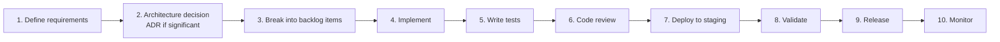

# Project Zero — Engineering Playbook

| | |
|---|---|
| **Document** | Project Zero Engineering Playbook |
| **Document Number** | 05 of 06 |
| **Version** | 3.0 |
| **Status** | Master Document — Single Source of Truth |
| **Owner** | Engineering (Founders / Engineering Lead) |
| **Audience** | Every engineer — human and AI coding assistant — plus QA, DevOps, and security reviewers |
| **Supersedes** | Project_Zero_Playbook v1.0 Parts 1–3 (engineering chapters), D03 Playbook v0.1 (engineering content), Backlog v1.0 (development rules), Pre-Development Checklist (process items), Conversation Summary (engineering decisions), Engineering Playbook v2.0 |

---

## Revision History

| Version | Description |
|---|---|
| 0.1 | Founder-era engineering intent inside the Playbook and Constitution drafts. |
| 1.0 | Project Zero Playbook v1.0: engineering, product, architectural, and operational standards. |
| 2.0 | First consolidated Engineering Playbook. |
| 3.0 | **This document.** Full enterprise rewrite merging all engineering standards, workflow rules, testing strategy, security standards, operational practice, and the Definition of Done into one canonical engineering reference — with the testing strategy and environment-promotion gaps (flagged pre-development) closed. |

---

## Table of Contents

1. [Purpose, Scope, and Audience](#1-purpose-scope-and-audience)
2. [Engineering Vision](#2-engineering-vision)
3. [Engineering Principles](#3-engineering-principles)
4. [Solution and Folder Structure](#4-solution-and-folder-structure)
5. [Architecture Rules](#5-architecture-rules)
6. [Coding Standards](#6-coding-standards)
7. [Development Workflow](#7-development-workflow)
8. [Git Strategy and Branching](#8-git-strategy-and-branching)
9. [Code Review Process](#9-code-review-process)
10. [Testing Strategy](#10-testing-strategy)
11. [CI/CD Pipeline](#11-cicd-pipeline)
12. [Deployment Standards and Environment Promotion](#12-deployment-standards-and-environment-promotion)
13. [Security Standards](#13-security-standards)
14. [Performance Standards](#14-performance-standards)
15. [AI Development Guidelines](#15-ai-development-guidelines)
16. [Documentation Standards](#16-documentation-standards)
17. [Operations Standards](#17-operations-standards)
18. [Incident Management](#18-incident-management)
19. [Definition of Done](#19-definition-of-done)
20. [Release Process](#20-release-process)
21. [Engineering Culture](#21-engineering-culture)
22. [References](#references)

---

## 1. Purpose, Scope, and Audience

### 1.1 Purpose

The Engineering Playbook defines the **permanent technical standards** for Project Zero — the engineering, architectural-compliance, quality, security, and operational practices that govern all development. Every developer, **AI coding assistant**, and future contributor follows these practices so the platform remains maintainable, secure, scalable, provider-agnostic, and enterprise-ready from MVP to enterprise scale.

This document is deliberately written to be executable by an AI coding assistant: its rules are specific enough to follow without tribal knowledge.

### 1.2 Scope

**In scope:** coding standards; folder structure; architecture rules (compliance view); development workflow; testing; CI/CD; git strategy and branching; review process; documentation standards; security standards; performance standards; Definition of Done; engineering principles; deployment process; operations and incident standards.

**Out of scope:** *why* the architecture is shaped as it is (*Architecture Bible*); what to build (*Product Bible*, *Roadmap*); visual standards (*Experience & Design Bible*).

### 1.3 Audience

Every contributor, without exception. QA owns Sections 10 and 19 jointly with engineering; DevOps owns Sections 11–12 and 17–18 jointly with engineering; security reviewers audit against Section 13.

---

## 2. Engineering Vision

The platform is being built for a **10+ year horizon** by a deliberately small team augmented by AI assistants. That combination only works with unusually high standards for consistency, documentation, and automation: the codebase must always be understandable by a contributor (human or AI) with zero context beyond these six documents. Quality is enforced by pipeline and process, not by heroics.

---

## 3. Engineering Principles

The binding principle set, merged from every source:

1. **Business Before Technology** — engineering serves validated business problems.
2. **Research Before Implementation** — significant work follows Research → Evidence → Validation → Decision → Development.
3. **Clean Architecture** — dependency rule enforced (see *Architecture Bible* §8).
4. **Modular Monolith First / Strong Module Boundaries** — no cross-module reach-ins, ever.
5. **API First** — capabilities are APIs before they are screens.
6. **Provider Abstraction** — business logic never touches vendor SDKs.
7. **Configuration over Customization** — no per-customer code forks.
8. **Security by Design / Trust by Design / Multi-Tenant by Design** — cross-cutting invariants in every change.
9. **Evidence Before Assumptions** — measure, don't guess (performance, quality, adoption).
10. **Test Before Release** — untested code is unfinished code.
11. **Documentation as Code / Documentation-First Mindset** — docs evolve with the platform, in the same PRs.
12. **Automation by Default / Automation Everywhere** — anything done twice by hand is a candidate for automation.
13. **SOLID, DRY, KISS** — with KISS breaking ties: prefer the simplest design that meets the requirement.

---

## 4. Solution and Folder Structure

The repository structure is fixed (matching *Architecture Bible* Appendix A):

```text
ProjectZero/
│
├── backend/          # ASP.NET Core modular monolith
│   └── <Module>/     #   each module: Domain / Application / Infrastructure / Presentation
├── frontend/         # Next.js + TypeScript + Tailwind + Framer Motion
├── ai-engine/        # Python FastAPI AI Engine
├── shared/           # Shared contracts (.NET ↔ Python DTOs)
├── docker/           # Compose files and container assets
├── infrastructure/   # IaC and Kubernetes manifests
└── docs/             # The six master documents + ADRs
```

Rules: modules remain independent with clearly defined interfaces and minimal coupling; each backend module contains its own Clean Architecture layers; shared contracts change only through reviewed API-change PRs; nothing lives outside this structure without an ADR.

---

## 5. Architecture Rules

Mandatory standards — the engineering-compliance view of the *Architecture Bible*:

- **Clean Architecture** layer discipline: business logic belongs in the domain layer; infrastructure depends on abstractions.
- **Domain-Driven Design** boundaries respected in every change.
- **Modular Monolith:** a module owns its data; cross-module access only through public contracts and events.
- **Provider Abstraction:** every external service — AI, storage, cache, queue, email, search, secrets, notifications, connectors — is accessed through its provider interface. **Business logic must never depend directly on external vendors.** Violations are review-blocking regardless of urgency.
- **Event-Driven Integration** where coupling would otherwise grow; versioned message contracts; idempotent consumers.
- **API Versioning** on all public and internal APIs.
- **Dependency Injection** everywhere; no service-locator patterns, no static singletons for stateful services.
- **Feature flags** gate optional capabilities and prepare licensing.
- **Tenant isolation** (OrganizationId/WorkspaceId scoping) present in every tenant-facing change — missing tenant scope is a critical defect.
- Every significant architectural decision is **documented as an ADR before implementation** (*Architecture Bible* §7).

---

## 6. Coding Standards

### 6.1 Universal Rules

- Code must be **readable, consistent, self-documenting**, and follow language-specific conventions (.NET conventions in backend, PEP 8 in ai-engine, idiomatic TypeScript/React in frontend).
- **Meaningful naming** — names describe intent; abbreviations and cleverness lose to clarity.
- **Avoid:** unnecessary complexity; duplicate logic; hidden dependencies; premature optimization.
- **Prefer:** dependency injection; interfaces; asynchronous programming (async/await end-to-end — no blocking on async); immutable models where appropriate.
- **Automated formatting** — formatters run in CI; formatting debates are settled by tooling, not opinion.
- **Static analysis** — analyzers/linters enforced in CI; warnings are errors in protected branches.
- Comments state *constraints and why*, never *what the next line does*.

### 6.2 Quality Gates in Code

SOLID principles; DRY; KISS; unit tests accompany business logic (Section 10); no dead code or commented-out blocks in merged PRs; TODOs must reference a tracked item (see technical-debt rules, *Roadmap*).

---

## 7. Development Workflow

The canonical workflow for every feature:



Expanded lifecycle (merged from all sources): **Research → Evidence → Validation → Decision → Architecture → Development → Testing → Code Review → Documentation → Deployment → Customer Feedback → Iteration.** Decisions are evidence-driven and documented before implementation.

Working rules (from the original backlog, permanently in force):

- Only build features that support the product vision.
- **Complete one epic before starting the next unless blocked.**
- Every completed task must be tested.
- Keep the architecture modular and provider-independent.

---

## 8. Git Strategy and Branching

- **Model:** GitFlow-inspired feature branching. `main` remains **stable and deployable at all times**; feature branches for all development.
- **Protected main:** direct pushes prohibited; merges only through reviewed pull requests; CI must pass.
- **Pull requests required** for every change — including founders and AI assistants.
- **Commit messages describe intent, not implementation** ("Prevent cross-tenant retrieval in vector search," not "update query").
- **Semantic versioning** where practical for releases and shared contracts.
- No long-lived divergent branches: integrate early, integrate often.

---

## 9. Code Review Process

- **Code reviews are mandatory** for every PR — no self-merge without review.
- Reviewers check, in order of severity: tenant isolation and security; architecture-rule compliance (Section 5); correctness and tests; readability and naming; documentation updates.
- Review feedback is about the code, never the author; authors respond to every comment (fix or reasoned pushback).
- AI-generated code receives the **same review rigor** as human code — authorship changes nothing about standards.

---

## 10. Testing Strategy

*(Closes the testing-strategy gap flagged in the pre-development checklist: levels, ownership, and gates are now explicit.)*

### 10.1 Required Test Levels

| Level | Validates | Notes |
|---|---|---|
| **Unit tests** | Business rules in isolation | Domain and application layers; fast, deterministic; the bulk of the pyramid |
| **Integration tests** | Module communication, provider abstractions, connector behavior, data access | Every provider interface has a contract-conformance suite run against each implementation |
| **API tests** | Endpoint contracts, auth, error envelopes | Versioned-contract regression protection |
| **End-to-end tests** | Complete user workflows | The critical paths: onboarding, connect → ingest → ask → decision |
| **Performance tests** | Targets in *Architecture Bible* §37 | Baseline validated per release |
| **Security tests** | AuthZ enforcement, tenant isolation, dependency vulnerabilities | **Cross-tenant access attempts must fail — a permanent, non-skippable suite** |

### 10.2 Quality Gates

- All tests pass — no merges over red builds.
- No critical vulnerabilities (dependency and code scanning).
- **Coverage maintained** — coverage must not decrease on protected branches; business-logic-heavy modules target high coverage rather than chasing a single global number.
- Performance baseline validated before release.
- Regression testing required before releases.

### 10.3 Special Test Obligations

- **.NET ↔ Python contract tests** on both sides of the boundary (shared DTOs — *Architecture Bible* §11).
- **Idempotency tests** for queue consumers.
- **Trust Layer tests** — AI responses must carry the full evidence/audit envelope.

---

## 11. CI/CD Pipeline

The deployment pipeline (GitHub Actions), stages in order:

1. **Build** — all services (backend, frontend, ai-engine).
2. **Static analysis** — linters, analyzers, formatting checks.
3. **Unit tests**
4. **Integration tests**
5. **Package** — container images built and tagged.
6. **Security scan** — dependency and image scanning.
7. **Deploy to staging** — automatic on main.
8. **Acceptance validation** — E2E suite + manual validation where required.
9. **Deploy to production** — on release approval.
10. **Production verification** — health checks, smoke tests, monitoring review.

Automated builds, tests, linting, container creation, deployment, logging, monitoring, health checks, and rollback support are managed through Docker and GitHub Actions. Environments remain reproducible and configuration-driven.

---

## 12. Deployment Standards and Environment Promotion

*(Closes the staging/production promotion-path gap flagged pre-development.)*

- **Promotion path:** Development (Docker Compose, free providers) → **Staging** (Kubernetes, production-like topology, managed services) → **Production** (multi-node Kubernetes). No change reaches production without passing staging.
- **Versioned releases** — every production deploy is a tagged, reproducible version.
- **Rollback requirements:** automated rollback support; **database migration rollback strategy** for every migration (a migration without a tested down-path or documented forward-fix is incomplete); backup verification before risky releases.
- **Feature flags decouple deploy from release** — dark launches allowed and encouraged.
- Configuration through environment/tenant configuration, never rebuilt images.

---

## 13. Security Standards

Mandatory in every change; audited in review and CI:

- **JWT authentication** and **Role-Based Access Control** on every endpoint; policy checks at the use-case layer.
- **Least-privilege permissions** for users, services, agents, and pipeline identities.
- **Tenant isolation** in every query, cache key, file path, embedding, and graph operation.
- **Encryption in transit** (TLS everywhere, including internal traffic) and **at rest**.
- **Secret management** — secrets only via ISecretProvider/vault; never in code, config files in git, logs, or images.
- **Input validation and output encoding** at every trust boundary.
- **Audit logging** for every important action.
- **Dependency monitoring** — automated vulnerability alerts, patched promptly.
- **Regular security reviews** — scheduled, plus per-release review as a gate (Section 20).
- **Customer data ownership and explainable AI** are mandatory platform requirements engineering must never regress.
- Secure coding practices per language; security findings outrank feature work.

---

## 14. Performance Standards

- Targets (binding, from *Architecture Bible* §37): API availability 99.9%+; non-AI API average < 300 ms; typical AI response < 10 s; background jobs fault-tolerant, retry-capable, idempotent.
- **Performance verified** per release (pipeline stage) and monitored continuously.
- Optimize on evidence: profile before optimizing; no premature optimization; no unmeasured regressions.
- Frontend: rendering performance, lazy loading, minimal layout shift (*Experience & Design Bible* §28), motion within budget.

---

## 15. AI Development Guidelines

Engineering rules specific to AI capabilities:

1. **Prompt versioning** — prompts are artifacts with versions; no inline prompt strings in business code.
2. **Prompt evaluation** — changes validated against evaluation sets before promotion; approval workflow for production prompts.
3. **Provider abstraction** — all model access via IAIProvider; provider-specific behavior normalized in infrastructure.
4. **Human approval for critical actions** — approval gates are engineering requirements, not UI suggestions.
5. **Evidence-backed responses** — the Trust Layer envelope (evidence, sources, confidence, audit trail, model, prompt version, approval status) recorded where appropriate on every response.
6. **Confidence scoring** — surfaced honestly, including low confidence.
7. **AI request auditing** — every request/response logged with correlation IDs.
8. **Continuous model evaluation** — quality benchmarking and cost monitoring as standing jobs.
9. The AI Engine owns prompt orchestration, RAG, embeddings, evaluation, multimodal intelligence, memory, OCR, speech, vision, and reasoning pipelines — business logic stays out of it, and it stays out of business logic.

---

## 16. Documentation Standards

**Every feature must include:** business purpose; architecture notes (ADR where significant); API documentation (OpenAPI); database changes; configuration; deployment notes; testing evidence.

**Every module, connector, migration, and public contract must be documented.** Documentation evolves with the platform and is the primary knowledge source for developers and AI coding assistants — stale documentation is a defect with an owner.

Documentation lives in `docs/` and in the six master documents; changes that alter behavior described in a master document must update that document in the same change (the *Foundation & Strategy* working rule, applied to engineering).

---

## 17. Operations Standards

**Monitoring (per *Architecture Bible* §29):** centralized logging; distributed tracing with correlation IDs; infrastructure monitoring; AI performance monitoring; queue monitoring; database monitoring; alerting and incident response.

**Operational ownership:** every service has health checks; every alert has a runbook; every queue has depth alerts; every scheduled job reports success/failure.

---

## 18. Incident Management

- **Severity classification** on every incident (impact × scope).
- **Root cause analysis** for significant incidents — blameless, evidence-based.
- **Post-incident reviews** with corrective actions tracked to completion.
- **Knowledge base updates** — every incident teaches; runbooks and docs updated as part of closure.

---

## 19. Definition of Done

A task is complete **only** when all of the following are satisfied:

- [ ] Requirements satisfied (acceptance criteria from the *Product Bible* / backlog item)
- [ ] Implementation complete — no placeholder code
- [ ] Tests passing at all required levels (Section 10)
- [ ] Documentation updated (Section 16)
- [ ] Logging and error handling in place
- [ ] Security reviewed (tenant isolation, authZ, secrets, validation)
- [ ] Performance verified against standards
- [ ] Code reviewed and approved
- [ ] No critical defects open
- [ ] Deployment successful (staging validated; production where released)
- [ ] **Temporary workarounds documented with clear follow-up actions** — tracked as technical debt with planned resolution (*Roadmap*, Technical Debt register)

---

## 20. Release Process

1. **Feature complete** — Definition of Done met for all included items.
2. **QA validation** — full regression on staging.
3. **Security review** — release-scoped review of changes.
4. **Performance validation** — baselines confirmed.
5. **Release approval** — explicit sign-off.
6. **Production deployment** — versioned, rollback-ready.
7. **Monitoring** — heightened observation window post-release.
8. **Post-release verification** — smoke tests, metric review, customer-impact check.

---

## 21. Engineering Culture

Every contributor is expected to: prioritize maintainability; prefer simple solutions; document important decisions; automate repetitive work; respect architectural boundaries; continuously improve code quality; share knowledge with the team; act with integrity; communicate openly; and take ownership of outcomes.

Adherence to this playbook ensures consistency, quality, security, and long-term sustainability across every component of the Project Zero ecosystem — from MVP to enterprise scale.

---

## References

- *Architecture Bible* — the architecture these standards enforce (ADRs, layers, tenancy, providers).
- *Product Bible* — acceptance criteria and requirements behind the Definition of Done.
- *Experience & Design Bible* — frontend quality, accessibility, and motion standards.
- *Roadmap & Implementation Guide* — epic sequencing, technical-debt register, release milestones.
- *Foundation & Strategy* — principles, decision framework, and culture this playbook operationalizes.

---

*End of Project Zero Engineering Playbook v3.0 — Master Document 05 of 06.*
