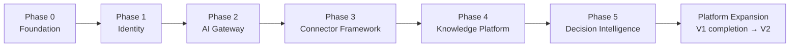
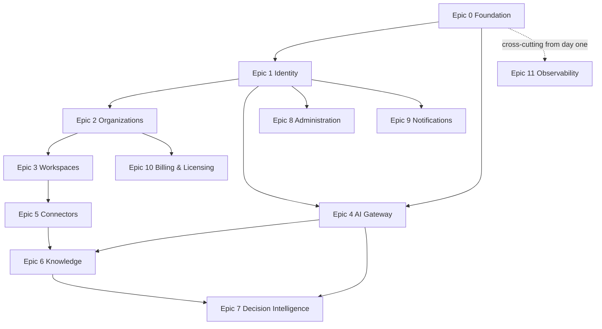

# Project Zero — Roadmap & Implementation Guide

| | |
|---|---|
| **Document** | Project Zero Roadmap & Implementation Guide |
| **Document Number** | 06 of 06 |
| **Version** | 3.0 |
| **Status** | Master Document — Single Source of Truth |
| **Owner** | Founders / Engineering Lead |
| **Audience** | Founders, engineering, product management, and anyone planning or tracking delivery |
| **Supersedes** | Project_Zero_Backlog v1.0 (Parts 1–3 and docx draft), README (development workflow/epics), PRD §22 (roadmap), Research R005 (roadmap structure), Conversation Summary (roadmap & next steps), Pre-Development Checklist, V1 Finalization Review (tracking items), Roadmap & Implementation Guide v2.0 |

---

## Revision History

| Version | Description |
|---|---|
| 0.1 | Founder-era roadmap: Vision → Research → Entry Product → MVP → First 100 Users → Expansion. |
| 1.0 | Backlog v1.0 with 12 epics, acceptance criteria, and release milestones; PRD and R005 roadmap phases (with structural conflicts). |
| 2.0 | First consolidated Roadmap & Implementation Guide; phases 0–5 + milestones 1–8. |
| 3.0 | **This document.** Full enterprise rewrite. Canonical phase structure and epic list (conflicts resolved with decision records); complete backlog with acceptance criteria; sprint guidance; dependency map; migration plans; technical-debt and risk registers; de-risking plan. |

---

## Table of Contents

1. [Purpose, Scope, and Audience](#1-purpose-scope-and-audience)
2. [Execution Principles](#2-execution-principles)
3. [The Development Lifecycle](#3-the-development-lifecycle)
4. [Company-Level Phases](#4-company-level-phases)
5. [Canonical Implementation Phases](#5-canonical-implementation-phases)
6. [The Canonical Epic List](#6-the-canonical-epic-list)
7. [The Complete Backlog](#7-the-complete-backlog)
8. [Dependency Map](#8-dependency-map)
9. [Sprint Planning](#9-sprint-planning)
10. [Milestones](#10-milestones)
11. [Release Plan](#11-release-plan)
12. [De-Risking Plan](#12-de-risking-plan)
13. [Migration Plans](#13-migration-plans)
14. [Future Roadmap — Platform Expansion](#14-future-roadmap--platform-expansion)
15. [Technical Debt Register](#15-technical-debt-register)
16. [Risk Register](#16-risk-register)
17. [Definition of Completion](#17-definition-of-completion)
18. [Progress Tracking](#18-progress-tracking)
19. [Appendix A — Roadmap Structure Decision Record](#appendix-a--roadmap-structure-decision-record)
20. [Appendix B — Epic Numbering Reconciliation](#appendix-b--epic-numbering-reconciliation)
21. [References](#references)

---

## 1. Purpose, Scope, and Audience

### 1.1 Purpose

This document defines **how Project Zero progresses from research to a production-grade Enterprise Intelligence Platform**: the complete backlog, epics, milestones, implementation phases, sprint approach, dependencies, execution strategy, release plan, migration plans, future roadmap, technical debt, and risk register — consolidated from every prior roadmap, backlog, and planning artifact into one master execution guide.

### 1.2 Scope

Everything about *when and in what order*. What is being built lives in the *Product Bible*; how it is structured lives in the *Architecture Bible*; how it is engineered lives in the *Engineering Playbook*.

### 1.3 Audience

Founders use it to steer; engineers use it to know what's next and why; product management keeps it synchronized with the *Product Bible* as decisions land.

---

## 2. Execution Principles

Binding rules for all delivery work, merged from every source:

1. **Build one validated capability at a time.**
2. **Finish the current epic before starting another unless blocked** (the original backlog's cardinal rule).
3. Every feature must support the long-term platform vision, follow the architecture standards, and satisfy testing, documentation, and security requirements before completion.
4. **Only build features that support the product vision** — the backlog is guarded by the Decision Framework (*Foundation & Strategy* §12).
5. Deliver value incrementally; validate market demand early; scale without architectural rewrites; maintain enterprise-grade quality (the R005 roadmap objectives, preserved verbatim).
6. Platform stability precedes user-facing functionality — the reason Foundation is Phase 0.

---

## 3. The Development Lifecycle

Every significant effort follows the canonical lifecycle:

> **Research → Validation → Decision → Architecture → Development → Testing → Documentation → Internal Review → Customer Validation → Iteration → Release**

Decisions are evidence-driven and documented before implementation (ADRs for architecture; decision records in the master documents for scope). Customer feedback re-enters the loop as research.

---

## 4. Company-Level Phases

The founder-era strategic phases, preserved with current status:

| Phase | Name | Status |
|---|---|---|
| 0 | Vision | **Complete** — locked vision recorded (*Foundation & Strategy* §4) |
| 1 | Research & Discovery | **Complete** — R001–R005 concluded and approved |
| 2 | Select Entry Product (the Doorway) | **Complete** — R005 approved the MVP definition |
| 3 | MVP Development | **Current** — governed by this document |
| 4 | First 100 Users | Next — customer validation at small scale |
| 5 | Platform Expansion | Future — Section 14 |

---

## 5. Canonical Implementation Phases

The canonical structure (decision record in Appendix A):

### Phase 0 — Foundation
Repositories; solution structure; Clean Architecture; Modular Monolith; dependency injection; configuration; logging (Serilog); global exception handling; Docker; GitHub Actions CI/CD; PostgreSQL; Redis; RabbitMQ; **Python AI Engine skeleton**; **.NET ↔ Python contracts**; provider abstractions; tenant foundation; feature flags; testing infrastructure; development tooling.
*The polyglot split is Phase 0 scope by decision (ADR-04): AI is a Python service from day one, not bolted on later.*

### Phase 1 — Identity
Organizations; workspaces; authentication; authorization; JWT; RBAC; permissions; user management; tenant isolation; profile management; auditing; foundational security.

### Phase 2 — AI Gateway
Provider abstraction (AI); prompt orchestration; model routing; token tracking; cost management; OpenRouter development provider; enterprise provider support (Azure OpenAI, OpenAI, Claude, Gemini, local models); prompt versioning; response metadata.

### Phase 3 — Connector Framework
Connector SDK; OAuth foundation (encrypted tokens, refresh, revocation); synchronization engine; scheduling; webhook support where available; standardized connector contracts; **GitHub MVP connector**; then Slack, Gmail, Google Drive, Notion (fast-follow); then Discord, Outlook, YouTube, LinkedIn, Instagram, TikTok, and future enterprise connectors by demand.

### Phase 4 — Knowledge Platform
Document ingestion; search; embeddings; organizational memory; retrieval-augmented generation; context builder; knowledge graph; indexing; version awareness; evidence collection; multimodal content support.

### Phase 5 — Decision Intelligence
AI Workspace; explainable AI; decision briefs; evidence-backed responses; confidence scoring; approval workflows; audit trail; trust layer; feedback collection; continuous learning; executive dashboards.

### Platform Expansion (post-MVP; Section 14)
Licensing/billing completion, administration, notifications, observability hardening (V1); then marketplace, vertical packs, mobile/desktop, and the long-horizon capabilities (V2+).

---

## 6. The Canonical Epic List

Twelve epics, numbered 0–11 (reconciliation of the two conflicting older lists — Appendix B):

| Epic | Name | Phase | Release |
|---|---|---|---|
| 0 | Platform Foundation | 0 | MVP |
| 1 | Identity & Access Management | 1 | MVP |
| 2 | Organization Management | 1 | MVP |
| 3 | Workspace Management | 1 | MVP |
| 4 | AI Gateway | 2 | MVP |
| 5 | Connector Platform | 3 | MVP (GitHub) |
| 6 | Knowledge Platform | 4 | MVP |
| 7 | Decision Intelligence | 5 | MVP (chat) → V1 (full) |
| 8 | Administration | Expansion | V1 |
| 9 | Notifications | Expansion | V1 |
| 10 | Billing & Licensing | Expansion | V1 |
| 11 | Platform Observability | Cross-cutting; hardened in Expansion | V1 |

---

## 7. The Complete Backlog

Every feature and acceptance criterion from all backlog sources, merged. Acceptance criteria are binding (they also appear in the *Product Bible* §27).

### Epic 0 — Platform Foundation
**Goal:** establish the core platform infrastructure required to support all future modules.

**Features:** Git repository; solution structure; Clean Architecture setup; Modular Monolith foundation; dependency injection; configuration management; logging (Serilog); global exception middleware; health checks; API versioning; OpenAPI documentation; Docker environment (Compose: API, AI Engine, PostgreSQL, Redis, RabbitMQ, local storage); GitHub Actions CI; **Python AI Service skeleton**; **.NET ↔ Python API + shared contracts**; **tenant isolation foundation**; **provider abstractions (all nine interfaces)**; feature-flag foundation; testing setup.

**Acceptance criteria:** project builds successfully; local development environment operational; CI pipeline passes; health endpoints available; API documentation generated.

### Epic 1 — Identity & Access Management
**Features:** user registration; authentication; JWT access tokens; refresh tokens; password reset; email verification; Role-Based Access Control; policy authorization; session management.
**Acceptance criteria:** secure authentication flow; protected APIs; role enforcement; token refresh supported.

### Epic 2 — Organization Management
**Features:** create organization; update organization; organization settings; branding; subscription details; tenant isolation.
**Acceptance criteria:** organizations fully isolated; configuration stored per tenant; branding applied dynamically.

### Epic 3 — Workspace Management
**Features:** create workspace; team management; member invitations; workspace settings; workspace permissions.
**Acceptance criteria:** multiple workspaces per organization; workspace-level permissions enforced.

### Epic 4 — AI Gateway
**Features:** multi-LLM provider support; provider routing; prompt management (builder, versioning); model configuration; usage tracking; cost monitoring/tracking; response streaming; AI request logging; OpenRouter provider (development).
**Acceptance criteria:** AI requests routed through a unified gateway; provider switching without code changes; usage metrics recorded.

### Epic 5 — Connector Platform
**Features:** Connector SDK; GitHub integration (MVP); Slack, Gmail, Google Drive, Notion integrations (fast-follow); scheduled synchronization; webhook support; OAuth token lifecycle (encrypted storage, refresh, revocation).
**Acceptance criteria:** connectors authenticate securely; data synchronization is reliable; connector failures are retried automatically.

### Epic 6 — Knowledge Platform
**Features:** document ingestion; document upload; file parsing; text chunking; embedding generation; vector storage; semantic search; knowledge indexing; organizational memory; context builder; knowledge graph.
**Acceptance criteria:** documents searchable through AI; knowledge updates processed asynchronously; source references retained.

### Epic 7 — Decision Intelligence
**Features:** AI chat; decision briefs; evidence-backed recommendations; confidence scoring; conversation history; feedback collection (approve/reject); approval workflow; audit history.
**Acceptance criteria:** every response includes evidence; decision history is auditable; feedback improves future recommendations.

### Epic 8 — Administration
**Features:** platform administration; organization management; user management; license management; feature flags; audit logs; system health dashboard.
**Acceptance criteria:** administrators can manage all platform resources; audit history is searchable; feature flags configurable per organization.

### Epic 9 — Notifications
**Features:** email notifications; in-app notifications; scheduled notifications; AI task completion alerts; connector failure alerts.
**Acceptance criteria:** notifications delivered reliably; user notification preferences respected.

### Epic 10 — Billing & Licensing
**Features:** subscription plans (Free/Starter/Professional/Enterprise); license assignment; usage metering (tokens, API calls, storage, queue, connector usage, monthly workspace cost); invoice generation; payment integration; organization quotas.
**Acceptance criteria:** subscription limits enforced; usage accurately tracked; licensing configurable by organization.

### Epic 11 — Platform Observability
**Features:** structured logging; metrics collection; distributed tracing; queue monitoring; database monitoring; AI performance dashboards; health checks; alerting.
**Acceptance criteria:** platform health visible in real time; failures detectable within minutes; performance metrics retained for analysis.

---

## 8. Dependency Map

Key dependencies: tenancy (Epics 1–3) precedes anything tenant-scoped; the AI Gateway precedes Knowledge (embeddings need providers); Connectors and Knowledge together unlock Decision Intelligence; observability starts in Epic 0 and hardens continuously.

---

## 9. Sprint Planning

- **Sprint focus rule:** one epic at a time (Execution Principle 2); a sprint's goal is a demonstrable increment of the current epic.
- **First sprint (recorded):** Foundation. **First milestone:** *a running solution with an authentication skeleton.*
- **The recorded next-steps sequence** (from the planning conversation, preserved): finalize the design system → create `ProjectZero.sln` → build Clean Architecture → configure dependency injection → configure logging → implement provider abstractions → build the Identity module → continue following the backlog.
- Sprint outputs must meet the Definition of Completion (Section 17); progress updates the tracker (Section 18).
- A **first-customer-demo target date must be set** and checked against epic ordering (open action — Section 12).

---

## 10. Milestones

| # | Milestone | Proof |
|---|---|---|
| 1 | Running platform foundation | Local + CI environment; health checks green |
| 2 | Identity operational | Auth flow, orgs, workspaces, RBAC enforced |
| 3 | AI Gateway operational | Provider-routed AI calls with usage metering |
| 4 | GitHub connector | OAuth, sync, retry, status visibility |
| 5 | Knowledge Platform | Ingestion → embedding → semantic search with citations |
| 6 | Decision Intelligence MVP | Evidence-backed briefs with confidence + audit |
| 7 | Customer validation | First design partners using the platform on real questions |
| 8 | Platform expansion | V1 completion (admin, billing, notifications, observability) and V2 groundwork |

---

## 11. Release Plan

| Release | Contents | Gate |
|---|---|---|
| **MVP** | Platform Foundation; Identity; Organizations; Workspaces; AI Gateway; GitHub connector; Knowledge Platform; AI Chat with evidence | Milestones 1–6 |
| **Version 1.0** | Full Decision Intelligence; Billing & Licensing; Notifications; Administration; Observability hardening | Customer validation (Milestone 7) informing scope |
| **Version 2.0** | Marketplace; vertical solutions; advanced AI agents; mobile applications; desktop applications | V1 stable in production |

Release mechanics (approval, rollback, verification) are defined in the *Engineering Playbook* §§12, 20.

---

## 12. De-Risking Plan

Actions that must happen **before** their dependent epics, carried from the pre-development checklist:

| # | De-risking action | Deadline (relative) | Status |
|---|---|---|---|
| 1 | **Prototype one end-to-end evidence-backed answer against a real LLM response** — validates the Trust Layer, the hardest UX problem in the product | Before Epic 7 begins | **Open** |
| 2 | Set the **first-customer-demo target date** and check it against epic ordering | Immediately | **Open** |
| 3 | Lock the single MVP connector and defer the rest | — | **Done** (GitHub — *Product Bible* Appendix A) |
| 4 | Define the .NET ↔ Python contract (schema + auth) | Before Epic 0 completes | **Done** (*Architecture Bible* §11) |
| 5 | Write down the tenant-isolation approach (storage, vector DB, knowledge graph) | Before Epic 0 completes | **Done** (*Architecture Bible* §16, ADR-10) |
| 6 | Define the test strategy (levels, coverage bar, CI gate) | Before Epic 0 completes | **Done** (*Engineering Playbook* §10) |
| 7 | Define the connector OAuth/token storage pattern | Before Epic 5 | **Done** (*Architecture Bible* §23.2) |
| 8 | Resolve architecture v1.1/v1.2 versioning; lock the .NET/Python split | — | **Done** (ADR-04; *Architecture Bible* Appendix B) |

---

## 13. Migration Plans

### 13.1 Free → Enterprise Provider Migration

The platform launches on free services and migrates per-concern, with **zero business-logic change** (the binding rule of *Architecture Bible* §13): AI OpenRouter → Azure OpenAI/OpenAI/Claude/Gemini; storage local → Blob/S3/MinIO; cache Redis → Azure Redis; queue RabbitMQ → Azure Service Bus; email Gmail SMTP → SendGrid; search PostgreSQL → Elasticsearch; secrets appsettings → Key Vault; monitoring Serilog → Azure Monitor. Each migration is triggered by evidence (scale, customer requirement, or reliability need), not by calendar.

### 13.2 Architecture Evolution Migration

Modular monolith → internal event bus → selective service extraction → distributed AI workers → multi-region (the five-phase evolution, *Architecture Bible* §38). Each step is a migration plan with an ADR, executed only when justified by measured need.

### 13.3 Documentation Migration

This six-document master library supersedes all prior documents (lineage in *Foundation & Strategy* Appendix B). The originals are archived; all future updates land in the masters.

---

## 14. Future Roadmap — Platform Expansion

The complete recorded expansion horizon, sequenced directionally (no dates until validated):

**V1 completion:** administration; notifications; billing & licensing; observability hardening.
**V2:** marketplace; vertical packs (Business Intelligence, Creator, Agency, Healthcare, Education, Legal); advanced AI agents; mobile app; desktop app; white-label groundwork.
**Beyond:** multi-agent orchestration; realtime collaboration; voice interface; spatial knowledge graph / 3D particle engine; MCP connector substrate; advanced reasoning pipelines; enterprise governance expansion; multi-region deployment; intelligence infrastructure (the long-term vision — *Foundation & Strategy* §22).

Early epic candidates preserved from the original future-epics list: Billing; Licensing; Marketplace; Creator Pack; Healthcare Pack; Mobile App; Desktop App.

---

## 15. Technical Debt Register

Standing rule: **temporary compromises must be tracked here with planned resolution** (Definition of Completion). Current register:

| # | Item | Origin | Planned Resolution |
|---|---|---|---|
| TD-1 | Quota/rate-limit billing mechanics partially designed (UX behavior defined; billing-side detail open) | V1 review open item | Complete during Epic 10 design |
| TD-2 | RTO/RPO targets not formalized | *Architecture Bible* §36 | Formalize as Enterprise-tier commitment before V1.0 release |
| TD-3 | Elasticsearch migration criteria undefined (when does PostgreSQL FTS stop sufficing?) | ADR-14 | Define trigger metrics during Epic 6 |
| TD-4 | gRPC evaluation for .NET↔Python deferred | ADR-11 | Profile after Knowledge Platform load exists |
| TD-5 | Marketplace product requirements directional only | *Product Bible* §22 | Detail before V2 planning cycle |
| TD-6 | Healthcare/Legal pack compliance requirements undetailed | *Product Bible* §23 | Detail when packs are scheduled |
| TD-7 | Specific price points for the four plan tiers unset | *Foundation & Strategy* §24 | Set during customer-validation phase |

---

## 16. Risk Register

Delivery-level register (strategy-level analysis: *Foundation & Strategy* §21):

| # | Risk | Likelihood | Impact | Mitigation | Owner |
|---|---|---|---|---|---|
| R-1 | AI provider changes (pricing/behavior/terms) | High | High | Provider abstraction; multi-LLM routing; cost-aware routing | Architecture |
| R-2 | Rising inference costs | High | Medium | Cost management capability; caching; model routing | Architecture |
| R-3 | Connector API changes | Medium | Medium | SDK isolation; retries; monitoring; connector tests | Engineering |
| R-4 | Security threats / cross-tenant defect | Low | Critical | Isolation architecture (ADR-10); mandatory isolation test suite; security reviews | Engineering |
| R-5 | Trust Layer UX fails to land (hardest UX problem in the PRD) | Medium | High | De-risking action #1: prototype before Epic 7 | Product/Design |
| R-6 | Customer adoption slower than hoped | Medium | High | Doorway strategy; first-100-users validation phase; measurable time savings | Founders |
| R-7 | Context quality (bad retrieval → bad recommendations) | Medium | High | Evaluation engine; feedback loop; evidence-first pipeline | AI Engineering |
| R-8 | Data governance obligations vary by customer | Medium | Medium | Tenant configuration (retention, region, policies) | Product |
| R-9 | Competitive pressure from platform vendors | Medium | Medium | Positioning per *Foundation & Strategy* §16; speed | Founders |
| R-10 | Scope creep breaking the one-epic-at-a-time rule | Medium | Medium | Execution principles; Decision Framework gate | Founders |
| R-11 | Single-founder bandwidth (one founder must be able to build the MVP) | High | High | Ruthless MVP scope (GitHub-only connector); AI-assisted development; this documentation set | Founders |
| R-12 | Market timing shifts | Medium | Medium | Free-first entry; rapid iteration; research methodology | Founders |

---

## 17. Definition of Completion

An epic is complete **only** when implementation, automated tests, documentation, security review, logging, monitoring, deployment readiness, and acceptance criteria are **all** satisfied. Temporary compromises must be tracked as technical debt (Section 15) with planned resolution. (Task-level Definition of Done: *Engineering Playbook* §19.)

---

## 18. Progress Tracking

The tracker carried forward from the original backlog, to be updated every sprint:

| Field | Value |
|---|---|
| Current company phase | Phase 3 — MVP Development |
| Current implementation phase | Phase 0 — Foundation |
| Current sprint | Foundation |
| Overall progress | 0% (development not started at documentation freeze) |
| MVP progress | 0% |
| Next milestone | Milestone 1 — Running platform foundation (first checkpoint: running solution with authentication skeleton) |

---

## Appendix A — Roadmap Structure Decision Record

**Conflict.** PRD §22 defined six phases (Foundation → AI Platform → Connector Platform → Knowledge Platform → Decision Intelligence → Platform Expansion). Research R005 defined five (Connector SDK folded into Knowledge Platform). The V1 review flagged the mismatch.

**Decision.** The canonical structure is **Phase 0–5 + Expansion** as defined in Section 5: Foundation and Identity split (matching the build reality that tenancy precedes AI), and **Connector Framework kept separate from Knowledge Platform**.

**Reasoning.** Connectors and knowledge processing are distinct engineering efforts with distinct risks (OAuth/sync reliability vs. retrieval quality); folding them together (R005's shape) hides the dependency that knowledge quality rests on connector reliability. The v2.0 Roadmap already used this structure; it is the most honest for planning.

**Mapping.** PRD Phases 1–6 ↔ canonical Phases 0/1 (Foundation split), 2 (AI Platform → AI Gateway), 3 (Connector), 4 (Knowledge), 5 (Decision Intelligence), Expansion. R005 Phases 1–5 map identically with its Phase 3 splitting into canonical Phases 3+4.

---

## Appendix B — Epic Numbering Reconciliation

**Conflict.** README used six epics (0–5: Foundation, Identity, AI Gateway, Connector, Knowledge, Decision Intelligence); the Backlog used twelve (1–12, adding Organization, Workspace, Admin, Notifications, Billing, Observability).

**Decision.** The **12-epic structure is canonical**, renumbered 0–11 (Section 6) to preserve the README's "Epic 0 = Foundation" convention.

**Mapping.**

| Canonical | README (old) | Backlog (old) |
|---|---|---|
| 0 Foundation | Epic 0 | Epic 1 |
| 1 Identity | Epic 1 | Epic 2 |
| 2 Organizations | — (inside Identity) | Epic 3 |
| 3 Workspaces | — (inside Identity) | Epic 4 |
| 4 AI Gateway | Epic 2 | Epic 5 |
| 5 Connectors | Epic 3 | Epic 6 |
| 6 Knowledge | Epic 4 | Epic 7 |
| 7 Decision Intelligence | Epic 5 | Epic 8 |
| 8 Administration | — | Epic 9 |
| 9 Notifications | — | Epic 10 |
| 10 Billing & Licensing | — | Epic 11 |
| 11 Observability | — | Epic 12 |

The README list is retired as an outdated simplified summary. An early draft backlog also carried a six-epic variant with an "AI Gateway inside the monolith" reading — superseded by ADR-04 (Python engine from day one).

---

## References

- *Foundation & Strategy* — strategy phases, risks, locked decisions this plan executes.
- *Product Bible* — the requirements and acceptance criteria behind every epic.
- *Architecture Bible* — Phase 0 scope, ADRs, migration targets.
- *Engineering Playbook* — Definition of Done, release process, sprint quality gates.
- *Experience & Design Bible* — design deliverables preceding frontend epics.

---

*End of Project Zero Roadmap & Implementation Guide v3.0 — Master Document 06 of 06.*
