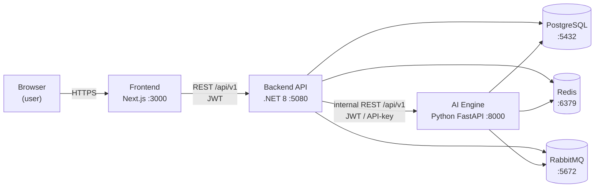
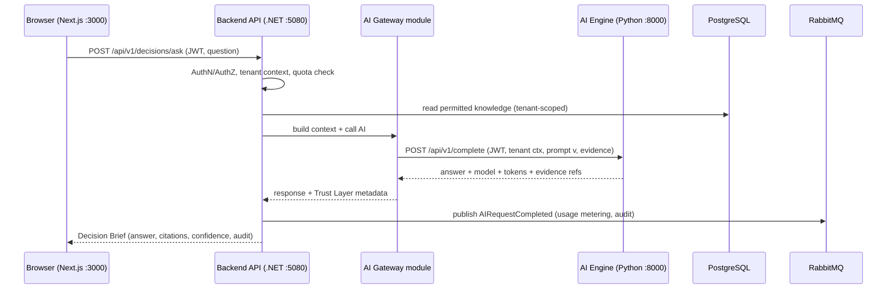

# Project Zero — Developer Guide & System Wiki

> **Read this first.** It explains how every part of Project Zero — the .NET
> backend, the Next.js frontend, the Python AI Engine, PostgreSQL/Redis/RabbitMQ,
> and Docker — fits together and talks to each other. If you are new, you should
> be able to run the whole system and understand the request flow after reading
> this page. Deep design rationale lives in the master documents
> ([`docs/master-documents/`](master-documents/)); this is the practical map.

| | |
|---|---|
| **Audience** | Every new contributor (human or AI) |
| **Status** | Living document — update it in the same PR when connections change |
| **Last structural update** | Sprint 1 (foundation) |

---

## 1. The 30-second mental model

Project Zero is **one product made of three runnable apps plus shared
infrastructure**:



- **Frontend** is the only thing the user's browser talks to. It never talks to
  the AI Engine or the database directly — only to the backend API.
- **Backend (.NET)** owns all business logic, all data, all security. It is the
  single front door (the "API Gateway"). It is the **only** caller of the AI
  Engine.
- **AI Engine (Python)** owns intelligence workloads (LLMs, RAG, embeddings). It
  holds **no business rules** and is never exposed to the browser.
- **PostgreSQL / Redis / RabbitMQ** are shared infrastructure, always reached
  through provider interfaces, never vendor SDKs in business code.

Why split .NET and Python? Enterprise-grade business platform in .NET; the AI
ecosystem is Python-native. See ADR-04 (Architecture Bible §7, §10).

---

## 2. What lives where (repository map)

```
Zero/
├── backend/            # .NET 8 business platform (the API + all modules)
├── frontend/           # Next.js app (the only browser-facing surface)
├── ai-engine/          # Python FastAPI intelligence service
├── shared/             # DTO contracts for the .NET ↔ Python boundary
├── docker/             # docker-compose.yml — the whole stack for machines with Docker
├── infrastructure/     # Kubernetes/IaC (staging & prod — Sprint 23)
├── docs/               # master documents, ADRs, and THIS guide
└── .github/            # CI pipeline + PR template (Definition of Done)
```

Each part in one line:

| Folder | Language / stack | Runs on | Talks to |
|---|---|---|---|
| `backend/` | C# / ASP.NET Core 8 | `:5080` (dev) / `:8080` (Docker) | Frontend (inbound), AI Engine, Postgres, Redis, RabbitMQ |
| `frontend/` | TypeScript / Next.js 14 | `:3000` | Backend API only |
| `ai-engine/` | Python / FastAPI | `:8000` | Postgres, Redis, RabbitMQ; receives calls from backend |
| `shared/` | JSON/DTO contracts | build-time | Consumed by backend + AI Engine |

---

## 3. How the pieces connect (the important part)

### 3.1 Frontend → Backend

- **Protocol:** REST over HTTPS, JSON. All backend routes are versioned under
  `/api/v1/...` (Architecture Bible §24).
- **Auth (from Sprint 4):** the browser sends a **JWT** access token in the
  `Authorization: Bearer` header; refresh tokens rotate the access token.
- **Base URL:** the frontend reads it from `NEXT_PUBLIC_API_BASE_URL`
  (e.g. `http://localhost:5080` in dev). The frontend has **no** database or AI
  credentials — it cannot, by design.
- **Correlation:** every response carries `X-Correlation-Id`; the frontend
  echoes it on retries so one user action is traceable end to end.

### 3.2 Backend → AI Engine (the riskiest boundary — fully specified)

- **Protocol:** internal REST, also under `/api/v1`, on the AI Engine
  (`http://ai-engine:8000` in Docker, `http://localhost:8000` bare-metal).
- **Only one caller:** the backend's **AI Gateway** module. No other module and
  no client ever calls the AI Engine. This is what makes provider-agnosticism
  and governance real.
- **Auth:** JWT or API-key on **every** internal call — the AI Engine trusts no
  unauthenticated traffic even on the internal network (defense in depth).
- **Contracts:** request/response DTOs live in [`shared/`](../shared/) and are
  consumed by both sides; contract changes are reviewed as API changes with
  tests on both sides. (Built out in Sprint 2.)
- **Tenancy:** every internal request carries `OrganizationId` / `WorkspaceId`;
  the AI Engine scopes all retrieval, embeddings, and memory to them.
- **Response metadata:** every AI response returns model used, prompt version,
  token usage, and evidence references — feeding the Trust Layer and cost
  metering.

Full spec: Architecture Bible §11.

### 3.3 Backend / AI Engine → Infrastructure

Everything goes through **provider interfaces** (Architecture Bible §12) so a
vendor swap is configuration, not code:

| Concern | Interface | Dev default | Reached by |
|---|---|---|---|
| Database | (EF Core / Dapper) | PostgreSQL `:5432` | Backend, AI Engine |
| Cache | `ICacheProvider` | Redis `:6379` | Backend, AI Engine |
| Queue / events | `IQueueProvider` | RabbitMQ `:5672` (UI `:15672`) | Backend, AI Engine |
| Object storage | `IStorageProvider` | local files | Backend |
| Email | `IEmailProvider` | Gmail SMTP | Backend |
| AI models | `IAIProvider` | OpenRouter | AI Engine (behind the gateway) |
| Secrets | `ISecretProvider` | appsettings (dev only) | Backend |

Async work (document processing, embeddings, connector sync, notifications)
flows over **RabbitMQ**: the backend publishes an event, a worker consumes it.
This is also the seam that lets modules become separate services later.

### 3.4 Database connection

- The schema is owned by **SQL scripts** in `backend/db/migrations/`
  (ADR-016) — `CREATE` then `ALTER`, run in order by the migrator.
- Data access follows **ADR-017**: EF Core for simple reads/single-entity CRUD;
  stored procedures / parameterized Dapper SQL for bulk work. Raw SQL is always
  parameterized and always filters on `organization_id`/`workspace_id` for
  tenant tables.
- Connection string key: `ConnectionStrings:Database` (env var
  `ConnectionStrings__Database`). If it is empty, the API still runs and the
  readiness probe simply skips the database check — that is how you run the API
  with no local PostgreSQL.

---

## 4. A request, end to end (concrete example)

*"A leader asks a business question in the workspace"* (the flow that exists
once Decision Intelligence ships — shown now so the wiring is clear):



Notice: the browser never sees the AI Engine, the database, or the model
provider. The backend mediates everything and stamps every step with the
correlation id and tenant context.

---

## 5. Run it locally

### 5.1 Fastest path — backend + frontend, no Docker (works on this machine)

```powershell
# Terminal 1 — backend API (runs even without PostgreSQL)
cd backend
dotnet run --project src/ProjectZero.Api
#   → http://localhost:5080/api/v1/platform/info
#   → http://localhost:5080/swagger   (Development only)
#   → http://localhost:5080/health/live  and  /health/ready

# Terminal 2 — frontend
cd frontend
npm install     # first time only
npm run dev
#   → http://localhost:3000  (landing → /login → /register → /dashboard)
```

Point the frontend at the API by creating `frontend/.env.local`:

```
NEXT_PUBLIC_API_BASE_URL=http://localhost:5080
```

### 5.2 Full stack with Docker (machines/CI that have Docker)

```powershell
docker compose -f docker/docker-compose.yml up --build
#   API  → http://localhost:8080
#   PostgreSQL → localhost:5432
#   (Redis, RabbitMQ, AI Engine join this file in Sprint 2)
```

### 5.3 AI Engine (skeleton today; full build Sprint 2)

```powershell
cd ai-engine
python -m venv .venv
.venv\Scripts\activate
pip install -r requirements.txt
uvicorn app.main:app --reload --port 8000
#   → http://localhost:8000/health/live  ·  /docs
```

---

## 6. Ports & environment variables (quick reference)

| Service | Dev port | Docker port | Key env vars |
|---|---|---|---|
| Frontend | 3000 | 3000 | `NEXT_PUBLIC_API_BASE_URL` |
| Backend API | 5080 (http) / 7080 (https) | 8080 | `ASPNETCORE_ENVIRONMENT`, `ConnectionStrings__Database` |
| AI Engine | 8000 | 8000 | `AI_ENGINE__AUTH_KEY` (Sprint 2) |
| PostgreSQL | 5432 | 5432 | `POSTGRES_DB/USER/PASSWORD` |
| Redis | 6379 | 6379 | — (Sprint 2) |
| RabbitMQ | 5672 (mgmt 15672) | 5672 / 15672 | — (Sprint 2) |

Secrets are **never** committed. Dev uses `appsettings.Development.json` and
`.env.local`; production uses a secrets vault via `ISecretProvider`
(Engineering Playbook §13).

---

## 7. Backend internal structure (how a module is wired)

The backend is a **modular monolith**: one deployable, strict module seams. Each
module has four Clean Architecture layers; the API host composes modules through
the `IModule` contract only and never references their internals.

```
backend/src/
├── BuildingBlocks/
│   ├── ProjectZero.SharedKernel/        # Entity, ValueObject, DomainEvent, Result
│   └── ProjectZero.BuildingBlocks.Web/  # IModule, correlation-id + error middleware
├── Modules/
│   └── <ModuleName>/
│       ├── ...Domain/          # pure business rules — depends on NOTHING
│       ├── ...Application/     # use cases + interfaces the infra implements
│       ├── ...Infrastructure/  # EF/Dapper, providers, external calls
│       └── ...Presentation/    # endpoints + module registration (IModule)
└── ProjectZero.Api/            # thin host: wires middleware, maps /api/v1, lists modules
```

**Dependency rule (enforced by architecture tests in CI):** Domain → nothing;
Application → Domain; Infrastructure & Presentation → Application. No ASP.NET or
vendor SDK types in Domain/Application. A violating PR fails the build.

### Adding a new module (the repeatable recipe)

1. Create the four projects under `backend/src/Modules/<Name>/` (copy Platform).
2. Wire references inward (Presentation → Application/Infrastructure → Domain).
3. Implement `IModule` in the Presentation project (`RegisterServices` +
   `MapEndpoints`).
4. Add one line to the `modules` array in `ProjectZero.Api/Program.cs`.
5. Add its schema scripts under `backend/db/migrations/` (ADR-016).
6. Tenant-scope everything; add tests; update this guide if connections change.

The **Platform** module is the worked example to copy.

---

## 8. Where to read more

| Question | Document |
|---|---|
| Why is it built this way? | Architecture Bible (`docs/master-documents/03_...`) |
| What are we building & acceptance criteria? | Product Bible (`02_...`) |
| Coding standards, testing, Definition of Done | Engineering Playbook (`05_...`) |
| Look, theme, the AI face | Experience & Design Bible (`04_...`, v3.1) |
| What ships in which sprint | Sprint Plan (`07_...`) |
| Specific technical decisions | ADRs (`docs/adr/`) |

---

*Keep this guide honest: when you change how two parts connect — a new service,
a new port, a new contract, a new env var — update this file in the same PR.
A new developer's first hour depends on it.*
